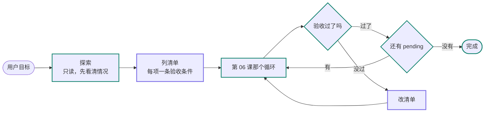

# 10 长任务与计划：目标为什么会漂，清单怎么兜住

> 第 06 课的循环能把一个任务走完，前提是它足够短。步数上到几十轮，模型会在中途悄悄换掉自己在做的事：每一步看着都合理，合起来偏离了最初那句话。这一课讲这个现象怎么来的，以及这两年通行的兜底办法——让模型自己维护一份清单，每轮重新念一遍，再逐项验收。

<details class="case" markdown="1">
<summary>例子：让它把 23 处 print 换成结构化日志，它改了 14 处，然后报告「完成」</summary>

任务是一句话：把 `src/` 下所有 `print` 换成 structlog，每个改动过的模块补一个单元测试。

| 轮次 | 它做了什么 |
|---|---|
| 1–6 | grep 找到 23 处 `print`，分布在 9 个文件 |
| 7–24 | 逐个文件替换，改完 6 个文件、14 处 |
| 25 | 上下文到 78%，触发压缩 |
| 26–31 | 给已改的两个模块补了测试，顺手调整了一个函数的参数顺序 |
| 32 | 回答「已完成 print 到 structlog 的迁移，并补充了测试」 |

交上来的结果：9 个文件改了 6 个，23 处改了 14 处，9 个模块补了 2 个测试。

整段轨迹里没有一次工具失败，没有一次参数错误，预算也没用完。第 25 轮那次压缩是分水岭：压缩之前，最初那句任务还在窗口里；压缩之后，摘要里剩下的是「正在把 print 换成 structlog」，「23 处」「9 个文件」「每个模块补测试」这三个约束一个都没进摘要。它后面做的每一件事，对着那份摘要看全都合理。

!!! note
    这段轨迹是为讲清机制构造的：轮次、比例和压缩触发点都是编的。它描述的失败形态在长任务里很常见，但上面的具体数字不要引用。

</details>

这类失败有个名字：**目标漂移**。特征是没有任何一步出错，模型的注意力却从「完成最初那个任务」慢慢挪到了「让眼前这一步看起来合理」。上下文越长，最初那句话在窗口里的占比越小，漂移就越容易发生。

麻烦的地方在于，第 06 课那套机制一个都接不住它：

- **预算没超。** 32 轮、几十次工具调用，都在上限之内。
- **跑偏检测抓不到。** 它比对的是「工具名 + 规范化参数」的重复，而这段轨迹里每一次调用的参数都不同。
- **失败分类用不上。** 一次失败都没有，没有任何东西需要被分类。

三道防线全部合法通过，因为它们看的都是**单步是否正常**。目标漂移是跨几十步才显形的，它在每一个单步上都无懈可击。

## 学习目标

- 能说清目标漂移和第 06 课跑偏检测的差别，并解释为什么后者抓不到前者
- 能把一份清单接进第 06 课的循环：作为工具写入、作为受保护内容每轮回注、作为事件落进线程
- 能给清单项写出可执行的验收条件，让「完成」由代码判定
- 能列出触发重规划的信号，并解释重规划本身为什么要有上限

## 前置

- [06 Agent 循环与控制流](../agent-loop/README.md)：本课在它上面加一层，循环结构一行不改
- [07 Agent State 与 Runtime](../agent-state-and-runtime/README.md)：清单的每次变更都是一条事件
- [08 Context Engineering](../context-engineering-for-agents/README.md)：每轮回注用的就是那里的受保护内容
- [09 Workflow 还是 Agent](../workflow-vs-agent/README.md)：先判断这件事该不该交给 Agent，再谈要不要上清单

## 怎么理解它



**循环没有变。** 图中间那个「第 06 课那个循环」是原样搬过来的：模型每一轮仍然自己决定下一步，运行时仍然执行、记账、判断该不该继续。这一课加的东西全在循环外面——上下文里多了一份清单，「完成」的判定权从模型手里挪回了代码。

**清单管用的原因是它每轮都重新出现。** 第 08 课讲过窗口是注意力预算：内容一多，中段的召回就开始掉。清单被当作受保护内容，每一轮原样进窗口，等于把「你要做的是这 23 处，还剩 9 处」这句话在模型耳边重复几十遍。它对抗的正是上面那种「最初那句话被稀释掉」。

**这和把任务拆成多个 Agent 是两条路。** 第 06 课给的办法是拆：一个 Agent 管 3～10 步，任务大就切成几个小 Agent，靠确定性代码串起来（第 11 课展开）。这一课给的办法是不拆，靠回注把长任务撑住。任务能干净切块的，拆更省心；切不开、必须一路做下来的，才轮到清单。

## 机制拆解

下面四段代码只为说明机制，省略了适配器、并发控制和类型定义，不能直接运行。

### 一、清单是一个工具，循环一行没改

```python
@dataclass
class TodoItem:
    id: str
    content: str
    status: Literal["pending", "in_progress", "completed"]

def update_todos(thread, items: list[TodoItem]) -> str:
    """模型每次提交完整清单，运行时整份替换。"""
    thread.append("todos_updated", items=[asdict(i) for i in items])
    nxt = next((i for i in items if i.status == "pending"), None)
    if nxt is None:
        return f"{len(items)} 项全部标记完成，等待验收。"
    return f"记下了，共 {len(items)} 项。下一项：{nxt.content}"   # ← 回执里带下一步
```

它就是一个普通工具，走第 05 课那套契约，没有任何特殊地位。模型调它，运行时记一条事件，仅此而已。

**全量提交，不做增量合并。** 模型每次给完整清单，运行时整份替换。增量接口要处理「改哪一项」的歧义，而模型给错 id 是常事；全量提交把这个问题消掉了，代价是每次多几十个 token。

**返回值那一行是这个工具的另一半价值。** 工具结果会进下一轮的上下文，所以「下一项是什么」每轮都被复述一次。少了这句回执，清单就只是一份被写进去、再没人提起的记录。

### 二、清单每轮原样回注

```python
def build_context(thread, budget) -> list[Message]:
    return assemble(
        system=SYSTEM_PROMPT,
        protected=[thread.original_goal(),                # 最初那句话，原文
                   render_todos(thread.latest_todos())],  # 最新清单，原样
        history=trim(thread, budget),
    )
```

第 08 课那个 `protected` 字段在这里派上用场。摘要模型倾向保留「聊过什么」，丢掉「第三步还没做」——开头那个案例被压缩掉的，正是「23 处」「9 个文件」这几个约束。清单和原始目标都不能交给摘要转述，只能原样带。

清单的当前状态从线程里最新那条 `todos_updated` 事件读出来。**别再单独存一份可变清单**，那是第 07 课警告过的两份状态不同步。

### 三、验收把「完成」从模型手里拿回来

第 06 课对 `FINISHED` 的定义是「模型不再要工具」。长任务里这一条不够用：开头那个案例的模型，就是不再要工具了。

```python
@dataclass
class TodoItem:
    id: str
    content: str
    status: Literal["pending", "in_progress", "completed"]
    check: str | None = None      # 一条能跑的命令

def settle(item: TodoItem, run) -> tuple[str, str]:
    if item.check is None:
        return item.status, "no check"           # 没有验收条件，只能信模型
    proc = run(item.check)
    if proc.code == 0:
        return "completed", "ok"
    return "pending", proc.stderr[:200]          # 退回 pending，原因回喂给模型
```

`check` 要写成能跑的东西：`grep -rn "print(" src/ | wc -l` 的输出为 0，或者 `pytest tests/test_logging.py -q` 的退出码为 0。开头那个案例只要有第一条，第 32 轮的「完成」就会被挡下来。

允许 `check` 为空，但要统计这类项的占比。一份全是空 `check` 的清单，勾选仍然是模型的自我报告，只是排版好看了些。

### 四、什么时候该改计划

```python
MAX_REPLANS = 2

def replan_reason(thread, budget, replans: int) -> str | None:
    if replans >= MAX_REPLANS:
        return None                                    # 改够了，转人工
    if thread.last_check_failed_twice():
        return "check_failed_twice"                    # 同一项验收连挂两次
    if budget.spent_ratio() > 0.5 and thread.completed_ratio() < 0.3:
        return "behind_schedule"                       # 钱花一半，活没做三成
    if thread.premise_contradicted():
        return "premise_broken"                        # 工具结果推翻了列清单时的前提
    return None
```

这几个信号都来自运行时已经有的东西：验收结果来自上一节，预算账来自第 06 课，事件线程来自第 07 课。重规划不需要新的基础设施，只需要有人去看这些信号。

**重规划要有上限**，理由和步数上限一样：模型可以反复推翻自己的计划，每一次都显得有道理。到了上限就停下来交给人，走第 07 课那条暂停路径。

改计划这件事本身不需要新事件，`todos_updated` 就够了。计划的演变史留在线程里，第 20 课那棵 trace 树上能看出它在第几步改了主意。

## 常见错误

**三步的任务先列十二步计划。** 清单是有成本的：一轮工具调用、每轮占掉的上下文、以及模型盯着清单而不看真实情况。查询类任务和 3～10 步的任务，照第 06 课那样直接跑就行。

**清单只进界面，不进上下文。** 做成一个漂亮的进度条给人看，模型那边什么都没变。这样它只是一段动画，对模型没有任何约束力。判断方法很简单：把界面关掉，模型的行为会不会变。

**让模型自己勾完成。** 没有 `check` 的清单，勾选是又一次自我报告。开头那个案例里的模型，会心安理得地把 14/23 勾成完成。

**清单另存一份可变状态。** 数据库里的清单和线程里的事件不同步，是第 07 课那个老问题换了个马甲。清单的变更是事件，当前状态从事件读。

**重规划没有上限。** 见上面第四节。三次改计划之后还没收敛的任务，多半一开始就该拆。

## 取舍

- **上不上清单。** 门槛大致在「步数超过十几轮，且中途会触发压缩」。短任务上清单是纯开销；长任务不上清单，开头那种失败迟早会撞上。
- **清单的粒度。** 项太粗（「重构日志模块」）没法验收，太细（每个文件一项）挤占上下文，还会让模型陷在勾选动作里。一个可用的判据是：每一项都能配一条可执行的 `check`，配不出来的项就是太粗了。
- **给清单还是拆 Agent。** 两条路都为长任务而设。拆 Agent 靠隔离上下文，让每个子任务都短，代价是交接、视图计算和多一层 trace（第 11 课）；清单靠回注目标，不拆，代价是上下文里长期占着一块。任务能干净切块的拆，切不开的上清单。
- **谁来列清单。** 让干活的模型顺手列，省一次调用，但它容易列成自己想干的事；单独一次调用专门列清单，贵一点，人也好审。需要人过目的场景，配一个只读模式更稳——模型先读、先搜、先问，拿出清单等人批准之后才允许动手。这个只读模式是权限档位（第 14 课），和清单本身是两件事，只是常常一起出现。

## 工程落地

- **清单进 trace。** 根 span 上记清单项数、完成数、验收通过数、重规划次数。第 20 课那棵树上，「模型说完成但验收没过」是一眼能看出来的一行。
- **压缩之后先看清单还在不在。** 这条断言比什么都便宜：压缩一次，断言最新清单在窗口里逐字未变。
- **重规划次数是个体检指标。** 一个任务改三次计划，通常说明清单一开始就列错了，或者这件事本来就该拆。
- **`check` 覆盖率要盯。** 空 `check` 的项占比越高，「完成」这个信号就越接近模型的自我报告。
- **怎么测。** 用剧本式的假模型，不需要真模型：给一段跑到一半的线程，压缩一次，断言最新清单在窗口里逐字未变；给一个 `check` 注定失败的项，断言它退回 pending 且失败原因回喂给了模型；给一段「预算过半、完成不到三成」的线程，断言 `replan_reason` 返回 `behind_schedule`；把 `MAX_REPLANS` 设成 1，断言第二次触发时任务转人工。四条都是确定性的，一秒内跑完，能进 CI（第 19 课）。

## 框架映射

| 本课概念 | LangGraph | OpenAI Agents SDK | Claude Agent SDK |
|---|---|---|---|
| 清单本身 | 自己在 state 里放一个字段 | 自己写一个工具 | 内置 todo 跟踪 |
| 每轮回注 | 自己在节点里拼 | 自己在 session 里拼 | 随内置压缩一起处理 |
| 验收判定 | 自己写节点 | 自己写 | 自己写 |
| 重规划触发 | 条件边自己接 | 自己写 | 自己写 |

三家里只有 Claude Agent SDK 把清单做成了内置能力，另外两家要自己拼；验收和重规划触发三家都不管，那部分永远是你自己的代码。官方文档：[LangGraph](https://langchain-ai.github.io/langgraph/) · [OpenAI Agents SDK](https://openai.github.io/openai-agents-python/) · [Claude Agent SDK](https://docs.claude.com/en/api/agent-sdk/overview)（核对日期 2026-09-08）。

## 参考实现

参考实现里**没有**这一层。它的 M3 运行时管的是单个任务的循环、预算和确认门，任务本身都足够短，用不上清单。要补的话，落点在 [`runtime/loop.py`](https://github.com/lance2016/ai-app-engineering-ref/blob/main/project/src/aiapp/runtime/loop.py) 旁边加一个工具，加上 [`runtime/context.py`](https://github.com/lance2016/ai-app-engineering-ref/blob/main/project/src/aiapp/runtime/context.py) 里那份受保护内容——这两个文件是这一课两个主要机制的现成挂钩点。

## 延伸阅读

- [Claude Code · Track todos](https://code.claude.com/docs/en/agent-sdk/todo-tracking)（访问日期 2026-09-08）：一套已经上线的清单实现，注意它的三种状态和「每次提交完整清单」的接口选择。
- [OpenAI · Run long horizon tasks with Codex](https://developers.openai.com/blog/run-long-horizon-tasks-with-codex)（访问日期 2026-09-08）：另一家的同类做法，`update_plan` 工具加一个只读的计划模式，正好对照本课「谁来列清单」那一条取舍。
- [ReAct: Synergizing Reasoning and Acting in Language Models](https://arxiv.org/abs/2210.03629)（访问日期 2026-09-08）：第 06 课那个循环的出处。读完它再看本课，能看清楚这一课加的东西全在循环外面。
- [12-factor-agents · factor 10 Small, focused agents](https://github.com/humanlayer/12-factor-agents/blob/main/content/factor-10-small-focused-agents.md)（访问日期 2026-09-04）：另一条路的主张，和本课的清单方案对照着读。

---

[← 上一课 09](../workflow-vs-agent/README.md) · [下一课 11 →](../multi-agent-handoff/README.md)
