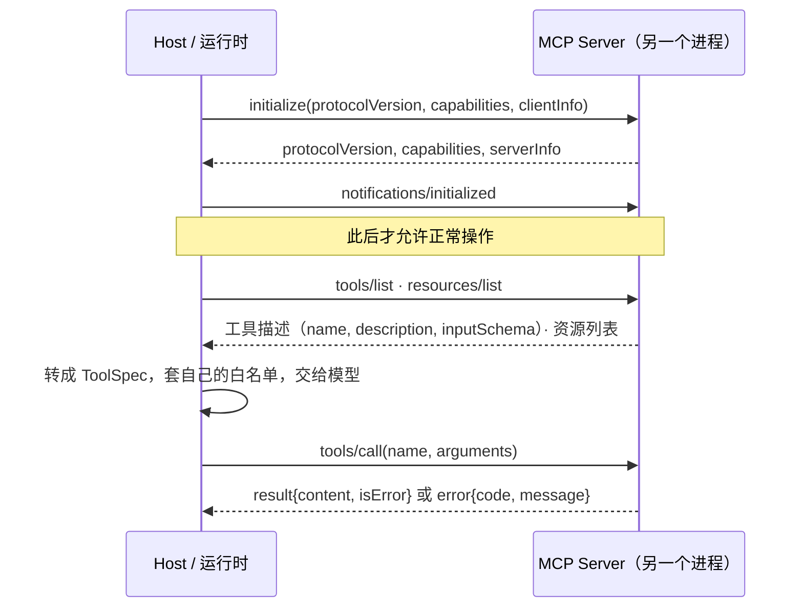
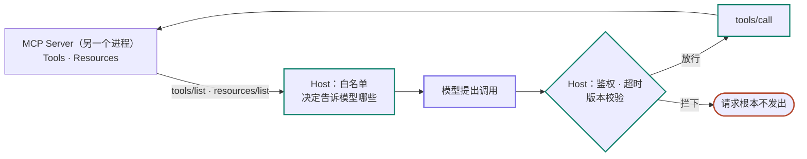

# 12 MCP：模型上下文协议

> 第 05 课的工具是你自己写在进程里的函数，schema 和实现一起改，永远对得上。MCP 的工具在别的进程、别的机器、别人的代码里，它的作者可以在你不知道的时候改掉参数名。这一课讲协议怎么接，以及为什么「接得上」和「能不能用」必须是两件事。

## 工具住在另一个进程里

第 05 课的工具是你自己写的函数：schema 和实现在同一个仓库里，一起改，永远对得上。

MCP 换掉的就是这一条。工具跑在另一个进程里——可能是另一台机器、另一个人的代码——host 通过一个协议把它接进来。一次完整的往返长这样：



这张图上有三件事，这一课后面全靠它们：

- **host 要先问「你有哪些工具」**（`tools/list`），拿回来的是每个工具的名字、说明和参数 schema。这一步之后 host 才知道该告诉模型什么。
- **模型选定之后，host 才发 `tools/call`**，参数按上一步拿到的那份 schema 填。
- **这两步之间可以隔很久。** 长驻进程通常只在启动时问一次，然后把工具列表缓存下来。

第三条是下面那个 bug 的来源。

<details class="case" markdown="1">
<summary>例子：周三 server 把参数 `query` 改名成 `q`，host 还在用周二缓存下来的 schema</summary>

一个长驻的 Agent 进程，接了一个第三方的 `notes` server，按上面第三条的做法在启动时缓存了工具列表。

周二，一切正常：

```jsonc
// → host
{"jsonrpc":"2.0","id":40,"method":"tools/call","params":{
   "name":"search_notes","arguments":{"query":"报销"}}}
// ← server
{"jsonrpc":"2.0","id":40,"result":{
   "content":[{"type":"text","text":"找到 3 条：..."}]}}
```

周三，`notes` server 的作者发了 0.2 版，把参数 `query` 改名成 `q`，另外加了一个必填的 `limit`。host 进程没重启，缓存的工具列表还是 0.1 版的。

```jsonc
// → host（参数按缓存的 0.1 版 schema 填的）
{"jsonrpc":"2.0","id":41,"method":"tools/call","params":{
   "name":"search_notes","arguments":{"query":"报销"}}}
// ← server
{"jsonrpc":"2.0","id":41,"error":{
   "code":-32602,"message":"missing required param: q"}}
```

!!! note "这段往返是构造的教学案例"

    server 名、版本号和参数名都是编的。协议消息的形状和 `-32602` 的语义按 MCP 规范和 JSON-RPC 2.0 写的，两份链接在本课末尾。

这个 bug 难查，因为链上每一环看起来都是对的：

| 环节 | 它做了什么 | 看起来 |
|---|---|---|
| 模型 | 按 host 给它的 schema 填了 `query` | 正常 |
| 第 05 课的守卫 ② | 拿缓存的 0.1 版 schema 校验，通过了 | 正常 |
| host 的日志 | `-32602 参数无效`。按错误码的语义，这是「调用方代码有 bug」 | 指向了错的地方 |
| 模型收到的 | host 不该把协议错误回喂给模型，所以它只拿到「internal error」 | 于是它回答「没找到相关笔记」 |

用户看到的是一个突然不会搜笔记的机器人。日志里那个 `-32602` 会让你去检查自己的调用代码，而代码一个字都没改。

</details>

缓存那一步的代价，是 host 手里的 schema 会和 server 手里的悄悄分叉：那条线只走了一次左半边，之后一直重复右半边。三件事凑在一起就出事——工具列表被缓存了、schema 归另一个进程的人改、协议错误和工具执行失败走两条不同的通道。这一课讲的就是这三件事。

## 学习目标

- 能画出 MCP 的生命周期，并说清为什么 `tools/list` 必须发生在握手之后
- 能分辨「协议错误」和「工具执行失败」两条通道，说出各自该怎么处理
- 能把 MCP server 暴露的工具接进第 05 课的注册表与白名单
- 能处理两种意外：server 进程死掉，和 server 悄悄升级

## 前置

- [05 Tool Calling](../tool-calling/README.md)：ToolSpec、白名单、错误结果。MCP 工具最终都要变成这些东西

## 「接得上」和「能不能用」是两件事

上面那张图只说明了消息怎么走。它没说的是：谁在决定这些工具能不能用、以及这条线断在中间会怎样。三件事都在 host 这一侧。

### 协议只管「怎么接」，不管「能不能用」

server 说它有 `delete_note`，不代表这次请求可以删除。第 05 课的白名单在 host 侧，作用于「把哪些工具告诉模型」这一步。MCP 只是多了一个工具来源。



这张图和上面那张回答的不是同一个问题：上面那张是消息按什么顺序走，这张是哪一侧在做决定。要看的是 `拦下` 那条分支——被白名单挡住的调用不会变成一条 `tools/call`，server 永远不知道有人想删你的笔记。

### 两条错误通道，处理方式相反

参数不合法、方法不存在、没握手就调用，走 JSON-RPC 的 `error` 对象，带标准错误码。工具本身执行失败（比如要删的笔记不存在），走 `result.isError = true`，正文里说明原因。**前者是 host 代码有 bug，后者要回喂给模型让它换办法。** 混在一起，模型就会看到一堆它无法处理的协议错误。

开头那个案例正好卡在这条界线上：它长得像通道 A，根因却在通道 A 管不到的地方。所以 host 侧除了分开处理这两条通道，还要能看出「通道 A 的错误突然变多」这个信号。

### server 是另一个进程

它会崩、会挂起、会在你不知道的时候升级。client 必须能在 stdout 关闭时立刻得到一个错误而不是永远阻塞；重连后要重新握手、重新发现能力，不能假设工具列表和上次一样。

规范里还有很多这里没碰的部分：prompts、sampling、elicitation、resource 订阅、Streamable HTTP 传输、鉴权。它们都建在同一个生命周期上，学会 stdio 上的这一小圈，其余是查文档的事。

## 消息长什么样

MCP 就是 JSON-RPC 2.0 加一套约定好的方法名。看清消息形状，协议就没有神秘感了。

### 一、握手：三条消息

```jsonc
// → 客户端发起
{"jsonrpc":"2.0","id":1,"method":"initialize","params":{
   "protocolVersion":"2026-07-28",
   "capabilities":{},
   "clientInfo":{"name":"my-agent","version":"0.1"}}}

// ← 服务端回应它支持什么
{"jsonrpc":"2.0","id":1,"result":{
   "protocolVersion":"2026-07-28",
   "capabilities":{"tools":{},"resources":{}},
   "serverInfo":{"name":"notes","version":"0.1"}}}

// → 客户端确认（notification，没有 id，不需要回应）
{"jsonrpc":"2.0","method":"notifications/initialized"}
```

**在第三条之前调 `tools/list` 是协议错误**，规范里明确要求 server 拒绝。理由很实际：双方还没就协议版本达成一致，此时交换的任何结构都可能对不上。

`serverInfo.version` 那一行是开头那个 bug 的检测点：握手时记下它，和上次不一样就强制重新 `tools/list`，别信缓存。

server 侧的方法分派就是这样一个状态机：

```python
def handle(self, method, params):
    if method == "initialize":
        self.state = "initializing"
        return {"protocolVersion": PROTOCOL, "capabilities": ..., "serverInfo": ...}

    if method == "notifications/initialized":
        self.state = "ready"
        return None                      # notification 不回应

    if self.state != "ready":            # ← 规范要求的这一道检查
        raise JsonRpcError(-32600, "server not initialized")

    if method == "tools/list":  return {"tools": self.visible_tools()}
    if method == "tools/call":  return self.call_tool(params)
    raise JsonRpcError(-32601, f"method not found: {method}")
```

### 二、工具描述：MCP 的 `inputSchema` 就是 JSON Schema

```jsonc
{"tools":[
  {"name":"search_notes",
   "description":"Search the user's notes.",
   "inputSchema":{"type":"object",
                  "properties":{"query":{"type":"string"}},
                  "required":["query"]},
   "annotations":{"readOnlyHint":true}},        // ← 这个字段很有用
  {"name":"delete_note",
   "description":"Delete a note by uri.",
   "inputSchema":{"type":"object",
                  "properties":{"uri":{"type":"string"}},
                  "required":["uri"]}}
]}
```

转成运行时自己的类型，同时套上白名单：

```python
ALLOWLIST = frozenset({"search_notes"})     # 这次请求不允许删除，无论 server 提供了什么

def specs_from_server(client, allowlist) -> list[ToolSpec]:
    return [ToolSpec(name=t["name"], description=t["description"],
                     parameters=t["inputSchema"])
            for t in client.request("tools/list")["tools"]
            if t["name"] in allowlist]       # (1)!
```

1.  删掉这个过滤，`delete_note` 就直通模型了。白名单在 host 侧，不在 server 侧——server 说它有什么，和这次请求能用什么，是两件事。

`annotations.readOnlyHint` 值得用起来：它可以直接决定这个工具要不要过第 05 课的确认门。没有这个标注的工具，默认当成有副作用。

### 三、两条通道长得不一样

```jsonc
// 通道 A：协议错误 —— 你的代码有 bug，记日志去修
{"jsonrpc":"2.0","id":7,"error":{"code":-32602,"message":"missing required param: query"}}

// 通道 B：工具执行失败 —— 回喂给模型，让它换个办法
{"jsonrpc":"2.0","id":8,"result":{
   "content":[{"type":"text","text":"note not found: notes://nope"}],
   "isError":true}}
```

分派代码要把两者分开：

```python
def dispatch(client, call, allowlist) -> Message:
    if call.name not in allowlist:
        return error_msg(call, f"tool not allowed here: {call.name}")
    try:
        res = client.request("tools/call",
                             {"name": call.name, "arguments": call.arguments})
    except JsonRpcError as exc:
        log.error("MCP protocol error, fix the caller: %s", exc)   # ← 通道 A
        return error_msg(call, "internal error")                   # 别把协议细节喂给模型
    text = " ".join(c["text"] for c in res["content"] if c["type"] == "text")
    return Message(role="tool", tool_call_id=call.id,
                   is_error=res.get("isError", False), content=text)   # ← 通道 B
```

常见的错误码：`-32601` 方法不存在，`-32602` 参数无效，`-32600` 请求无效（比如没握手）。

那行 `log.error` 是开头那个案例唯一留下的痕迹，所以它要能被告警看见。通道 A 的正常水位是零——你的调用代码不该产生参数错误。它一旦开始稳定出现，要么是你改坏了，要么是对面变了。

### 四、断连：EOF 必须变成异常

```python hl_lines="5 6"
def request(self, method, params=None):
    self._write({"jsonrpc": "2.0", "id": next(self._ids),
                 "method": method, "params": params or {}})
    line = self._proc.stdout.readline()
    if not line:
        raise ServerGone("server closed stdout")
    ...
```

`if not line` 那两行是防止整个 Agent 循环挂死的关键。stdout 关掉之后 `readline()` 返回空串，不抛异常；没有这个检查，调用方会一直等下去。

重连就是把生命周期再走一遍：

```python
def call(client, tool):
    for attempt in (1, 2):
        try:
            return client, ok(client.request("tools/call", {...}))
        except ServerGone:
            client.close()                    # 清理子进程，别留僵尸
            if attempt == 2:
                return client, error_msg(tool, "notes server unavailable")
            client = connect()                # ← 新进程，重新 initialize，重新发现能力
```

`connect()` 里必须重新 `initialize` 和 `tools/list`，那一行就是开头那个 bug 的修法。server 升级后 schema 可能变了，沿用旧 schema 会让参数校验通过、执行失败。

## 真实项目不要自己写这些

上面是为了看清协议。实际用官方 Python SDK：server 端 `FastMCP` 一个装饰器把函数变成工具，类型注解自动生成 `inputSchema`；client 端 `stdio_client` 加 `ClientSession`，`initialize()` 之后 `list_tools()` / `call_tool()`。

**MCP Inspector** 是一个网页工具，能连上任何 server 手动发消息看响应。开头那个案例用它三十秒就能看出来：连上 0.2 版的 server，`tools/list` 一看，`q` 和 `limit` 就在那里。排查握手和 schema 问题，它比打日志快得多。

## 常见错误

**把 server 的工具列表原样给模型。** 协议层不替你做权限。删掉那个白名单过滤，server 提供什么模型就能调什么。

**协议错误回喂给模型。** 模型会试图「修正参数」，而问题根本不在它。这类错误应该记日志、报警、改代码。

**读到 EOF 还在等。** 没有 `ServerGone` 那两行，`json.loads("")` 会抛一个和真实原因完全无关的异常，排查方向立刻跑偏。

**缓存了工具列表，却没有让它失效的条件。** 就是开头那个案例。缓存本身没问题，问题是没有任何东西能告诉它「对面变了」。`serverInfo.version` 变化、`listChanged` 通知、进程重启，至少要认一个。

## 接一个 server，还是接一堆

- **stdio 还是 HTTP。** stdio 简单、无网络、无鉴权问题，适合本地工具（文件、shell、本地数据库）。Streamable HTTP 适合远程共享的 server，但要处理鉴权、会话和重连。协议层面两者一样，差别在传输和安全。
- **工具列表缓存多久。** 每次调用前都 `tools/list`，永远不会用错 schema，代价是每次多一个往返。缓存加订阅 `listChanged` 通知是折中，但要接受通知可能丢。启动一次跑几天的 host，缓存必须配一个失效条件；短命进程每次重新发现最省心。
- **一个大 server 还是多个小 server。** 一个 server 暴露 50 个工具，模型的上下文里就是 50 段描述。按领域拆成小 server，host 按任务挑选接哪几个，和第 06 课「一个 Agent 管 3～10 步」是同一个逻辑。第 13 课的 Skill 是在这之上再加一层「什么时候用哪组工具」的说明。

## 从一个假 server 到生产

- **MCP 工具和本地工具走同一套守卫。** 校验、白名单、确认门、幂等，一个都不能少。MCP 只是工具的来源不同。
- **每次 `tools/call` 打一个 span**，记录 server 名、server 版本、工具名、耗时和 `isError`。MCP 引入了一个进程边界，没有 trace 的话「慢」和「错」都定位不到（第 20 课）。把版本也打上去，开头那个案例在 trace 上就是「版本变了、错误率同时起跳」。
- **通道 A 的错误率要有告警。** 它的正常水位是零，见上面第三节。
- **server 进程要有生命周期管理**：启动超时、健康检查、崩溃后的退避重启。别让一个疯狂重启的 server 拖垮整个 host。
- **第三方 server 是供应链风险。** 它能读你传过去的一切参数，而且能在任何时候改自己的行为。接入前要看代码、钉版本、限制它能访问的资源。第 22 课展开。
- **怎么测。** 写一个假 server 就能测四条：握手之前调 `tools/list`，断言被拒；把 server 的 stdout 关掉，断言 client 立刻拿到错误而不是永远阻塞；给它一个返回 `isError: true` 的工具和一个返回 JSON-RPC `error` 的方法，断言前者回喂给模型、后者不回喂；让假 server 在重连后换一份 schema，断言 host 用的是新的那份。最后一条就是开头那个案例的回归测试。四条都不需要真模型（第 19 课）。

## 框架映射

| 本课概念 | LangGraph | OpenAI Agents SDK | Claude Agent SDK |
|---|---|---|---|
| MCP 接入 | LangChain 的 MCP adapter 包 | `mcp_servers=[...]` 参数 | 原生支持，配置里声明 |
| 权限控制 | 自己在节点里过滤 | 自己过滤 | `can_use_tool` 回调 |
| 缓存的 schema 何时失效 | 自己写 | 自己写 | 自己写 |

Claude Agent SDK 对 MCP 的支持最深，因为 Claude Code 本身就是 MCP host。但「缓存的工具列表什么时候该扔掉」三个框架都不替你决定。官方文档：[MCP 规范](https://modelcontextprotocol.io/specification/latest) · [LangGraph](https://langchain-ai.github.io/langgraph/) · [OpenAI Agents SDK](https://openai.github.io/openai-agents-python/) · [Claude Agent SDK](https://docs.claude.com/en/api/agent-sdk/overview)（核对日期 2026-09-05）。

## 参考实现

MCP client 在 [`mcp/client.py`](https://github.com/lance2016/ai-app-engineering-ref/blob/main/project/src/aiapp/mcp/client.py)，走 stdio 上的 JSON-RPC；把外部工具注册进本地注册表的是 [`runtime/mcp_source.py`](https://github.com/lance2016/ai-app-engineering-ref/blob/main/project/src/aiapp/runtime/mcp_source.py)；还有一个能真跑的玩具服务器 [`toy_notes_server.py`](https://github.com/lance2016/ai-app-engineering-ref/blob/main/project/src/aiapp/mcp/toy_notes_server.py)。服务器死了算瞬时错误、重连一次，这些用例在 [`m3/test_mcp.py`](https://github.com/lance2016/ai-app-engineering-ref/blob/main/tests/project/m3/test_mcp.py)。

## 延伸阅读

- [MCP 规范 · 最新版](https://modelcontextprotocol.io/specification/latest)（访问日期 2026-09-04，当前修订版 2026-07-28）：先读 [Lifecycle](https://modelcontextprotocol.io/specification/latest/basic/lifecycle)，再读 [Tools](https://modelcontextprotocol.io/specification/latest/server/tools) 和 [Resources](https://modelcontextprotocol.io/specification/latest/server/resources)。本课的消息形状就是这三页的子集，`listChanged` 通知也在 Tools 那一页。
- [JSON-RPC 2.0 规范 · Error object](https://www.jsonrpc.org/specification#error_object)（访问日期 2026-09-07）：`-32600` 到 `-32603` 各是什么意思。开头那个案例里 `-32602` 的语义是「参数无效」，也就是「调用方错了」，这正是它误导人的地方。
- [modelcontextprotocol/python-sdk](https://github.com/modelcontextprotocol/python-sdk)（访问日期 2026-09-04）：README 里「15 行写一个 server、10 行写一个 client」两段，对照本课看 SDK 替你做了什么。
- [modelcontextprotocol/inspector](https://github.com/modelcontextprotocol/inspector)（访问日期 2026-09-04）：调试任何 MCP server 的第一工具。
- [ai-agents-for-beginners · 11 Agentic Protocols](https://github.com/microsoft/ai-agents-for-beginners/blob/main/11-agentic-protocols/README.md)（访问日期 2026-09-04）：把 MCP、A2A、NLWeb 放在一起讲，适合建立「哪个协议解决哪层问题」的直觉。

---

[← 上一课 11](../multi-agent-handoff/README.md) · [下一课 13 →](../skills-and-capability-layers/README.md)
