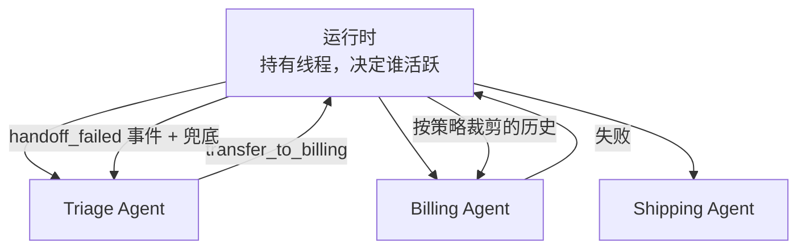

# 10 多智能体、Handoff 与 Racing

> 一个 Agent 管 3～10 步是可靠的上限。任务再大，就拆成几个小 Agent，让运行时把它们串起来或并起来。这一课讲三个具体问题：控制权怎么交接、交接时历史给多少、两个 Agent 并行时谁的输出算数。它们的共同答案是：**由运行时决定，不由任何一个 Agent 决定**。

## 为什么需要

多个 Agent 直接互传上下文，会造成状态归属不明、权限扩大、失败无法回退。交接需要显式事件、最小视图和明确的控制权。

## 学习目标

- 能实现 handoff：把「转交」做成工具调用，由运行时切换活跃 Agent，并按策略决定专家 Agent 看到多少历史
- 能实现 racing：两个模型并行处理同一输入，按规则取舍，其中一个超时时有确定的兜底
- 能说清多 Agent 系统里状态归谁、每个 Agent 看到什么、一个 Agent 失败时控制权怎么回来

## 前置

- [09 Workflow 还是 Agent](../workflow-vs-agent/README.md)：本课是 routing 和 orchestrator-workers 在多 Agent 上的延伸
- [07 Agent State 与 Runtime](../agent-state-and-runtime/README.md)：多个 Agent 共用一个事件线程，靠 `agent` 标签区分

## 怎么理解它



多 Agent 不是让几个模型互相聊天。它是运行时的一个编排层，**Agent 之间不直接通信，所有交接都经过运行时**。这样三件事才有归属：

**Handoff 是工具调用。** Triage Agent 输出 `transfer_to_billing(reason=...)`，和调用任何工具一样经过注册表和校验。运行时收到后把活跃 Agent 换成 billing。

OpenAI Agents SDK 把这叫 handoff，把「把另一个 Agent 当工具调用、结果回给自己」叫 agents-as-tools。两者的区别是**控制权有没有转移**。

**历史给多少是策略。** 全给：专家看到一切，token 最多，容易被无关历史干扰。只给最后一句：便宜、专注，但丢了「用户已经说过订单号」这类上下文。摘要：折中，但摘要本身可能漏。真实系统里这个策略通常按目标 Agent 配置。

**Racing 是并行的 routing。** 第 09 课的 routing 是先分类再处理，串行，慢。语音场景等不了，于是让聊天模型和分类模型同时跑。规则写在代码里，两个模型都不知道对方存在。

**状态归运行时，Agent 拿视图。** 所有 Agent 的输出都进同一个线程，带 `agent` 标签。每个 Agent 调模型时拿到的是运行时算出来的视图。专家 Agent 抛异常，运行时记一条 `handoff_failed`，控制权回到 triage。

## 机制拆解

### 一、Handoff：策略住在运行时的一个过滤器里

```python
def context_for_specialist(history: list[Message], reason: str) -> list[Message]:
    """运行时的 handoff 过滤器。历史策略就住在这里。"""
    if POLICY == "full":
        return history                                  # 全给：贵，容易被干扰

    if POLICY == "last":
        return [m for m in history if m.role == "user"][-1:]   # 只给最后一句用户消息

    if POLICY == "summary":
        summary = (f"Triage handed off. Reason: {reason}. "
                   f"User turns so far: {sum(1 for m in history if m.role == 'user')}.")
        return [Message(role="user", content=summary),
                *[m for m in history if m.role == "user"][-1:]]
```

转交本身就是一次普通的工具调用：

```python
reply = await triage.model.complete([system, *history], tools=[TRANSFER])
call = reply.tool_calls[0]                       # transfer_to_billing(reason="duplicate charge")

specialist_view = context_for_specialist(history, call.arguments["reason"])
answer = await billing.model.complete([billing_system, *specialist_view])
```

注意 `reason` 这个参数。它是 triage 给专家的**交接说明**，比原始历史更浓缩，而且是 triage 自己判断出来的重点。summary 策略把它直接用上了。

三条消息的例子里三种策略看不出差别。二十轮之后，`full` 会让专家的窗口里大部分是和它无关的闲聊。

### 二、Racing：超时必须有确定的兜底

```python
CLASSIFIER_BUDGET = 0.2

async def race(user_text, chat, classifier) -> str:
    history = [Message(role="user", content=user_text)]
    chat_task = asyncio.create_task(chat.complete(history))     # 聊天草稿先跑起来

    try:
        verdict = json.loads((await asyncio.wait_for(
            classifier.complete(history), CLASSIFIER_BUDGET)).content)
    except TimeoutError:
        return f"chat: {(await chat_task).content}"    # ← 分类迟到，用草稿，不让用户等

    if verdict["intent"] == "command":
        chat_task.cancel()                             # 是指令，草稿作废
        return f"execute {verdict['tool']}({verdict['args']})"

    if verdict["intent"] == "both":                    # 两者都有，都要
        return (f"execute {verdict['tool']}({verdict['args']}); "
                f"chat: {(await chat_task).content}")

    return f"chat: {(await chat_task).content}"        # 纯聊天
```

`CLASSIFIER_BUDGET` 那一行是整段的重点。没有它，用户要等最慢的那个模型；有超时但没有兜底，用户拿到一个错误。

`"both"` 那一支容易被忽略：用户说「放点爵士乐，然后跟我讲讲 Miles Davis」，两件事都要做。串行 routing 很难处理这种混合意图，因为它逼你选一条路。

### 三、视图：每个 Agent 只看到该看的

```python
def view_for(thread: Thread, agent: str) -> list[Message]:
    """用户消息共享；assistant 消息只给产出它的那个 Agent 看。"""
    out = []
    for e in thread.events:
        if e.type == "user_message":
            out.append(Message(role="user", content=e.data["content"]))
        elif e.type == "assistant_message" and e.data.get("agent") == agent:
            out.append(Message(role="assistant", content=e.data["content"]))
    return out
```

十行，是第 08 课 ContextBuilder 的多 Agent 版本。用户消息共享是因为那是客观事实；assistant 消息隔离是因为让 billing 看到 triage 的措辞，它容易被带偏。

### 四、失败回退：控制权总能回来

```python
async def handle(thread: Thread) -> str:
    await run_triage(thread)
    thread.append("handoff", source="triage", target="billing")
    try:
        return await run_billing(thread)
    except Exception as exc:
        thread.append("handoff_failed", target="billing", error=str(exc))
        return await run_triage(thread, fallback_note=str(exc))   # 控制权回 triage
```

`handoff` 和 `handoff_failed` 都是线程里的事件，所以「这次对话转交过几次、哪次失败了」事后能查。

triage 的兜底回复要诚实：「我暂时联系不上账务系统，已经记录你的请求，一天内会有人跟进」。比假装处理好了强得多。

## 常见错误

**Agent 之间直接传消息。** 让 triage 的输出直接成为 billing 的输入，中间没有运行时。结果是没有人记录交接发生过，billing 失败时没有地方回退，历史策略也没法配置。

**Handoff 全量带历史。** 默认策略应该是 summary 或 last，**全量是需要理由的选择**，不是默认值。

**Racing 没有超时。** 见上面第二节。还要记录「这次没分类」的比例，分类超时率悄悄涨上去是个重要信号。

**取消了草稿但它已经产生副作用。** 上面被取消的是一个纯文本草稿，取消是安全的。如果聊天模型也能调工具，取消它之前必须确认它没有已执行的调用。这是第 07 课「执行和记录之间不能崩」的另一个形态。

## 取舍

- **拆成多个 Agent 还是一个大 Agent。** 拆的收益：每个 Agent 的上下文小、提示词专、能独立测试和替换。代价：交接策略、视图计算、失败回退都是新代码。经验是先用一个 Agent 加 routing，等某个分支的提示词长到互相打架了再拆。
- **Handoff 还是 agents-as-tools。** 转移控制权适合「接下来的对话都归专家」（客服转接）；当工具调用适合「问一下专家再回来」（让翻译 Agent 翻一段）。前者专家直接面对用户，后者主 Agent 始终在场。**别混用**：一个专家既能被当工具调又能接管控制权，状态会很难讲清楚。
- **Racing 的成本。** 并行意味着两次模型调用都要付钱，被取消的那次也常常已经计费。它换来的是延迟。只在延迟真的重要（语音、实时交互）时用，后台任务用第 09 课的串行 routing。

## 工程落地

- **交接要有超时和次数上限。** A 转给 B，B 又转回 A，这个环要能被检测出来并终止。
- **每个 Agent 的权限是独立的。** billing 能查订单不能改配置，shipping 反过来。第 05 课的白名单按活跃 Agent 取，不是全局一份。
- **视图计算要能 dump 出来。** 排查「专家为什么问了用户已经说过的信息」，靠的是这一份视图快照。
- **失败回退的措辞要预先写好**，不要临时让模型编。「联系不上」和「处理失败」对用户是两种不同的意思。

## 框架映射

| 本课概念 | LangGraph | OpenAI Agents SDK | Claude Agent SDK |
|---|---|---|---|
| handoff | `Command(goto=...)` 或子图 | `handoffs=[...]`，一等公民 | subagent |
| 历史过滤 | 子图有自己的 state schema | `handoff` 的 input filter | 子 agent 独立会话 |
| 并行 racing | 图里的并行分支 | 自己写 `asyncio` | 自己写 |

OpenAI Agents SDK 把 handoff 做成了核心概念，它的 input filter 就是本课的历史策略。官方文档：[LangGraph](https://langchain-ai.github.io/langgraph/) · [OpenAI Agents SDK](https://openai.github.io/openai-agents-python/) · [Claude Agent SDK](https://docs.claude.com/en/api/agent-sdk/overview)（核对日期 2026-09-05）。框架全景见 [reference/frameworks.md](../../reference/frameworks.md)。

## 一线经验

语音机器人项目就是 racing 那一节的来源。一个聊天模型负责自然回复，一个小的意图分类模型并行判断用户是不是在发指令（调音量、放音乐、退出）。三种裁决：只聊天用聊天回复；只指令取消聊天回复去执行；两者都有则执行指令同时用聊天回复。

踩过两个坑，都和多 Agent 本身无关，但正是多模型系统里最容易出的问题：

- 分类模型偶尔输出训练时见过、当前没注册的工具名。最初用提示词压，效果不稳；后来靠第 05 课的注册表兜底：查不到就当「只聊天」。
- 聊天模型的回复正文里偶尔出现格式完美的函数调用 JSON，一度被解析执行。后来只认工具调用通道，正文一律当文本。

**每多一个模型，就多一处需要运行时守卫的地方。**

## 参考实现

想看这一课的机制装进一个真实服务是什么样：参考实现的 [M3 Tool Workflow](https://github.com/lance2016/ai-app-engineering-ref/blob/main/project/m3-tool-workflow/README.md)，可选的 handoff 分支。

## 延伸阅读

- [ai-agents-for-beginners · 08 Multi-agent design patterns](https://github.com/microsoft/ai-agents-for-beginners/blob/main/08-multi-agent/README.md)（访问日期 2026-09-04）：什么场景值得多 Agent，group chat / hand-off / collaborative filtering 三种模式。
- [OpenAI Agents SDK · Handoffs](https://openai.github.io/openai-agents-python/handoffs/)（访问日期 2026-09-05）：handoffs 和 agents-as-tools 的区分，input filter 就是本课的历史策略。
- [12-factor-agents · factor 10 Small, focused agents](https://github.com/humanlayer/12-factor-agents/blob/main/content/factor-10-small-focused-agents.md)（访问日期 2026-09-04）：拆小 Agent 的理由。
- [langchain-academy · module-4 sub-graph](https://github.com/langchain-ai/langchain-academy/tree/main/module-4)（访问日期 2026-09-04）：子图有自己的 state schema、父图只看到它暴露的键，和本课的视图是同一个思想。

---

[← 上一课 09](../workflow-vs-agent/README.md) · [下一课 11 →](../mcp/README.md)
