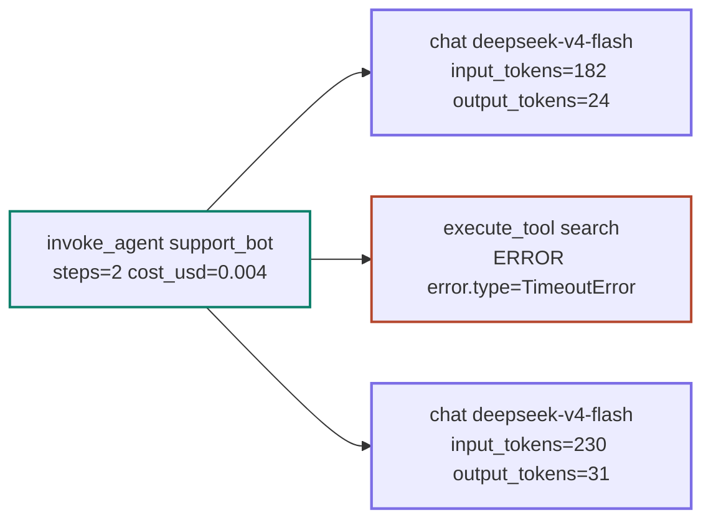
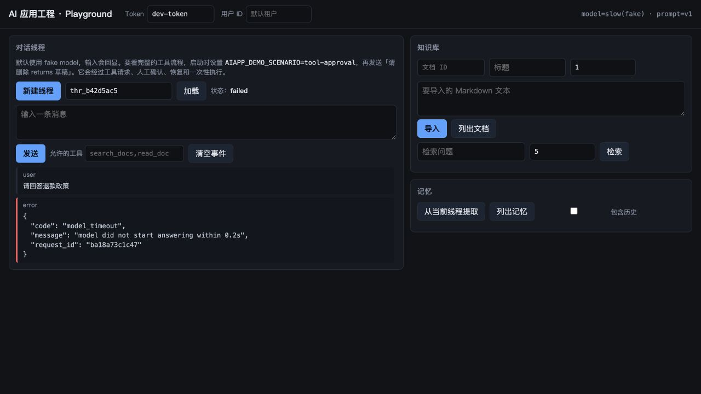

# 20 可观测性：从日志到 LLM Trace

> 一句错误的回答背后可能有八九次调用。日志里只留下最后那句话的时候，排查就变成了猜。这一课用五十行代码造一个 tracer，属性名对齐 OpenTelemetry 的 GenAI 约定，再按 OTLP 发出去。

<details class="case" markdown="1">
<summary>例子：工单只有一句「它答错了」，翻出八行日志，一个问题都答不上来</summary>

工单是这么一句话：

```text
#4471  用户问退货政策，机器人答的是运费政策。已复现，会话 id 有。
```

拿着会话 id 去翻日志，能看到的是这些：

```text
2026-09-07 14:22:11 INFO  正在调用模型...
2026-09-07 14:22:13 INFO  调用完成
2026-09-07 14:22:13 INFO  正在检索...
2026-09-07 14:22:14 INFO  检索完成，返回 5 条
2026-09-07 14:22:16 INFO  正在调用模型...
2026-09-07 14:22:19 INFO  调用完成
2026-09-07 14:22:19 INFO  回复已发送
```

八行日志，一个问题都答不上来：

- 检索回来那 5 条里，有退货政策那一段吗？没有的话是切块的问题还是召回的问题？
- 第二次模型调用的输入里，那 5 条真的进去了吗，还是被上下文预算裁掉了？
- 两次模型调用之间那 2 秒在干什么？
- 这一次回答花了多少钱，够不够贵到需要在意？

!!! note "构造的例子"

    这张工单和这八行日志是为讲清「日志答不了什么」编的。本课 [那两周的静默超时](#那两周的静默超时) 那一节才是作者自己的经历。

</details>

日志答不上来，不是因为记得太少。这类日志记的是「我在做什么」，而每个问题要的是「这一步的输入输出和结果是什么」。行与行之间也没有父子关系，看不出哪一次检索喂给了哪一次调用。

这一课要造的东西，就是让「它答错了」这种工单能在五分钟内定位到链路上的哪一层。

## 排障时先看哪张图

- 能把 print 换成带关联 id 的结构化日志，并说清为什么一行一个 JSON 才能聚合
- 能实现一个最小 tracer，并说出 `record_exception` 和 `set_status` 为什么必须一起调
- 能用 OpenTelemetry GenAI 语义约定的属性名标注模型调用和工具调用
- 能从四种故障的 trace 里指出各自的信号

## 可观测性要读哪些前置

- [07 Agent State 与 Runtime](../agent-state-and-runtime/README.md)：被观测的对象
- [19 评测](../evaluation/README.md)：评测集里的失败案例从 trace 里挑

## 同一次运行，换成一棵树

同样一次运行，如果每一步都开一个 span、并且带上输入输出，它长这样：



根 span 是这次运行，子 span 是每次模型调用和工具调用。这棵树回答四类问题：

- **哪一步慢了**：看每个 span 的耗时，工具超时的 span 耗时正好卡在超时值上。
- **哪一步错了**：看状态是 ERROR 的 span 和它上面的异常事件。
- **花了多少钱**：把 chat span 上的 token 属性加起来。
- **走了什么路**：子 span 的序列就是轨迹，重复的子 span 就是循环。

回到那张「答错了」的工单：这棵树上第二个 `chat` span 的 `gen_ai.input.messages` 里能直接看到检索结果有没有进上下文，`execute_tool search` 的返回体里能看到召回了哪 5 条。两个问题各归一层，不用猜。

日志和 trace 不是二选一。日志是线性的、每条独立、便于 grep 和聚合；trace 有父子关系、便于看一次运行的全貌。两者用同一个 `run_id` 关联，缺一个都不完整。

## 四种故障在 trace 里长什么样

这一节是这一课最实用的部分。下面四棵树按 span 的父子关系缩进，格式是「span 名 / 耗时 / 状态 / 关键属性」。

!!! note "四棵树都是构造的样例"

    属性值是编的，形状不是——每一棵都对着一类真实故障。本课 [那两周的静默超时](#那两周的静默超时) 那一节是作者自己的经历。

**一、工具超时。** 最容易认的一种。

```text
invoke_agent support_bot        2.31s  OK
├─ chat deepseek-v4-flash           0.42s  OK     in=182  out=24
├─ execute_tool search          2.000s ERROR  error.type=TimeoutError
└─ chat deepseek-v4-flash           0.61s  OK     in=230  out=31
```

信号是 `2.000s`：耗时正好等于配置的超时值，是超时而不是慢。注意根 span 仍然是 `OK`——运行时接住了这个失败并继续跑完了，这是对的行为。

**二、模型空输出。** 没有异常，没有超时。

```text
invoke_agent support_bot        0.88s  OK
└─ chat deepseek-v4-flash           0.83s  OK     in=182  out=0
```

整棵树全绿，唯一的信号是 `out=0`。除非运行时主动检查并打属性，否则这次运行在任何仪表盘上都是成功的。加上三行之后：

```text
invoke_agent support_bot        0.88s  ERROR  aiapp.stop_reason=empty_output
└─ chat deepseek-v4-flash           0.83s  ERROR  in=182  out=0  aiapp.empty_output=true
```

**三、成本尖峰。** 信号滞后一轮出现。

```text
invoke_agent support_bot        6.12s  OK     aiapp.cost_usd=0.0412
├─ chat deepseek-v4-flash           0.44s  OK     in=182     out=28
├─ execute_tool list_orders     0.19s  OK     aiapp.tool.result_bytes=168400
└─ chat deepseek-v4-flash           5.31s  OK     in=41920   out=96
```

工具 span 快、绿、看不出问题。异常在**下一个** chat span 的 `in`：从 182 跳到 41920，因为工具返回了一大坨没分页的结果。`aiapp.tool.result_bytes` 是自定义属性，加上它才能把这两行连起来看；只有标准属性时，你只知道贵了，不知道为什么。

**四、循环。** 每一步都成功。

```text
invoke_agent support_bot       11.42s  OK     aiapp.stop_reason=step_limit  steps=5
├─ execute_tool search          0.21s  OK     aiapp.args_sha=9f2a1c
├─ execute_tool search          0.19s  OK     aiapp.args_sha=9f2a1c
├─ execute_tool search          0.22s  OK     aiapp.args_sha=9f2a1c
├─ execute_tool search          0.20s  OK     aiapp.args_sha=9f2a1c
└─ execute_tool search          0.18s  OK     aiapp.args_sha=9f2a1c
```

单看任何一个 span 都没问题。信号有两个，都在 span 之间：同一个 `args_sha` 出现五次，以及根 span 的 `stop_reason=step_limit` 而不是 `completed`。这就是为什么停止原因必须落成一个属性（第 06 课）。

四棵树里有三棵的根 span 是 `OK`。做仪表盘时按根 span 的状态算成功率，会得到一条很好看的曲线，而这四类故障一个都不在上面。

## 决定 trace 有用还是没用的细节

**属性名用标准的。** OpenTelemetry 的 [GenAI 语义约定](https://github.com/open-telemetry/semantic-conventions-genai)给出了 `gen_ai.operation.name`、`gen_ai.provider.name`、`gen_ai.request.model`、`gen_ai.usage.input_tokens` 等推荐名字；模型 span 名推荐写成 `{operation} {model}`（如 `chat deepseek-v4-flash`）。不同框架还会有自己的命名，接入后端前要检查映射，不能假定每个 collector 都会自动识别。

!!! warning "这两个名字已经废弃"

    `gen_ai.system` 换成了 `gen_ai.provider.name`；`gen_ai.usage.prompt_tokens` / `completion_tokens` 换成了 `input_tokens` / `output_tokens`。旧名字发出去不会报错，只是后端不认，仪表盘上是空的。

**出错时两个调用一起做。** `record_exception(exc)` 只是在 span 上加一个事件，`set_status("ERROR", msg)` 才改状态。只做前者，UI 里这个 span 是绿的，异常藏在事件列表里，没人会点开。

**自定义属性负责「这在我的系统里意味着什么」。** 上面四棵树里，`out=0`、`result_bytes`、`args_sha`、`stop_reason` 全都不是标准属性。标准属性给的是「发生了什么」；模型返回空字符串不抛异常、工具返回四千行不报错、同一个工具被调五次每次都成功，这些在 trace 里都是绿的，除非运行时主动打上属性。

## 那两周的静默超时

上面那条 `set_status`，代价是一个语音机器人项目里两周的静默超时：工具 span 调了 `record_exception` 没调 `set_status`，仪表盘全绿，用户在投诉。它是有人去翻一条具体的 trace 时被发现的。

同一个项目里另一件事和事件驱动架构有关：每个处理步骤接收一类事件、产出另一类事件，代码里看不出「当前走到哪」，只有 trace 能回答。**在那个项目里 trace 不是排障工具，是理解系统运行方式的唯一途径。**

顺带一个细节：span 属性里放状态对象时做了白名单，否则后端存储很快撑不住。

## 自己造一个：五十行

### 一、结构化日志：一行一个 JSON

```python
class JsonFormatter(logging.Formatter):
    def format(self, record) -> str:
        payload = {"ts": round(record.created, 3),
                   "level": record.levelname,
                   "event": record.getMessage()}
        payload.update(getattr(record, "fields", {}))    # ← 结构化字段搭 extra 的车
        return json.dumps(payload, ensure_ascii=False)

def log(logger, event: str, **fields) -> None:
    logger.info(event, extra={"fields": fields})
```

调用处：

```python
log(logger, "model.call", run_id=run_id, step=step,
    latency_ms=round(elapsed * 1000, 2),
    input_tokens=reply.usage.input_tokens,
    output_tokens=reply.usage.output_tokens)
```

打出来的一行：

```json
{"ts":1757254933.412,"level":"INFO","event":"model.call","run_id":"r_8f21ac","step":2,"latency_ms":5310.4,"input_tokens":41920,"output_tokens":96}
```

和开头那种「正在调用模型…」的日志比，差别在两处。`event` 是一个稳定的短标识（`model.call`、`tool.call`、`run.finish`），不是一句话——稳定标识才能聚合，「过去一小时 `model.call` 的 p99 延迟」是个能查的问题，「过去一小时打印了『正在调用模型...』的次数」不是。另一处是 `run_id` 每一行都带，有了它，日志流才变成一次运行的故事。

顺带一说：上面这一行就是成本尖峰那棵树的第三个 span，`input_tokens=41920` 在日志里也能 grep 出来。日志和 trace 看的是同一件事，视角不同。

### 二、五十行 tracer

```python
@dataclass
class Span:
    name: str
    span_id: str = field(default_factory=lambda: uuid.uuid4().hex[:16])
    parent_id: str | None = None
    attributes: dict = field(default_factory=dict)
    events: list[dict] = field(default_factory=list)
    status: str = "UNSET"           # UNSET | OK | ERROR
    start: float = field(default_factory=time.time)
    end: float | None = None

    def record_exception(self, exc: BaseException) -> None:
        """只加一个事件。不改状态 —— 那是另一个决定。"""
        self.events.append({"name": "exception",
                            "exception.type": type(exc).__name__,
                            "exception.message": str(exc)})

    def set_status(self, status: str, message: str = "") -> None:
        self.status, self.status_message = status, message
```

Tracer 用 `contextvars` 维护「当前是哪个 span」，这样嵌套关系自动成立：

```python
class Tracer:
    def __init__(self):
        self.spans: list[Span] = []
        self._current = contextvars.ContextVar("span", default=None)

    @contextmanager
    def span(self, name: str, **attributes):
        parent = self._current.get()
        span = Span(name=name,
                    parent_id=parent.span_id if parent else None,
                    attributes=dict(attributes))
        self.spans.append(span)
        token = self._current.set(span)
        try:
            yield span
        finally:
            span.end = time.time()
            self._current.reset(token)
```

用法，以及第一棵树里那个 ERROR 是怎么打上的：

```python
with tracer.span("invoke_agent support_bot",
                 **{"gen_ai.operation.name": "invoke_agent"}) as root:
    with tracer.span("execute_tool search",
                     **{"gen_ai.tool.name": "search"}) as ts:
        try:
            result = await run_tool(args)
        except Exception as exc:
            ts.record_exception(exc)
            ts.set_status("ERROR", str(exc))    # ← 这一行忘了，span 就是绿的
            raise
```

`contextvars` 有个坑：`asyncio.create_task` 会复制当前上下文（所以子任务能看到父 span），但线程池不会自动传播。SSE 生成器跨任务执行时，父 span 也要显式传。

### 三、用 JSON 看懂 OTLP/HTTP

```python
def build_payload() -> dict:
    trace_id = uuid.uuid4().hex
    root = make_span(trace_id, "invoke_agent support_bot", None,
                     {"gen_ai.operation.name": "invoke_agent",
                      "gen_ai.agent.name": "support_bot"}, status=1, ...)
    chat = make_span(trace_id, "chat deepseek-v4-flash", root["spanId"],
                     {"gen_ai.operation.name": "chat",
                      "gen_ai.provider.name": "deepseek",
                      "gen_ai.request.model": "deepseek-v4-flash",
                      "gen_ai.usage.input_tokens": 182,
                      "gen_ai.usage.output_tokens": 24}, status=1, ...)
    return {"resourceSpans": [{
        "resource": {"attributes": [{"key": "service.name",
                                     "value": {"stringValue": "my-agent"}}]},
        "scopeSpans": [{"scope": {"name": "my.tracer"}, "spans": [root, chat]}],
    }]}

# 教学示意：POST 到 {endpoint}/v1/traces，Content-Type: application/json
```

`status.code`：0 UNSET、1 OK、2 ERROR。属性值要包一层类型标签（`stringValue` / `intValue` / `doubleValue` / `boolValue`）。

这段代码只用来拆掉 SDK 的神秘感：OTLP/HTTP 可以用 JSON 表示，但 exporter 也常用 protobuf，不能把这个字典直接当成所有 collector 都接受的报文。真实项目用 `opentelemetry-sdk` 加 `opentelemetry-exporter-otlp`，让 exporter 负责编码；需要保持的是属性名和父子关系。

## 观测为什么会一片绿

前面四棵树讲的是被观测系统怎么坏。这一节讲观测层自己怎么坏。

**只 `record_exception` 不 `set_status`。** 见上面那两周。这是本课唯一一个「代码看起来完全正确」的坑。

**`event` 写成一句话。** `log(logger, f"正在调用 {model}，第 {step} 步")` 语法上没问题，但它产生的是一百万条互不相同的字符串，聚合不了、告警规则也写不出来。可变的部分全部进字段。

**关联 id 断在异步边界。** `contextvars` 在 `create_task` 时会复制、在线程池里不会自动传，需要显式处理。断了之后 trace 会分裂成两棵互不相干的树，比没有 trace 更难查。

**把整个状态对象塞进 span 属性。** 排障时确实方便，但一个大状态对象序列化进去，每个 span 几十 KB，后端存储很快撑不住。要走白名单，只放小的、稳定的字段。

**用统一采样率。** 出问题的那条 trace 正好没被采到是常态。错误的 trace 全采，正常的按比例采。

## 记录多少，保留多久

- **自制 tracer 还是 SDK。** 五十行自制版足够教学和小项目，没有依赖、行为完全可见。缺点是没有采样、批量导出、上下文跨 HTTP 传播这些成熟功能。生产用 SDK，但先用自制版理解它在做什么。
- **记多少内容。** `gen_ai.input.messages` 和 `gen_ai.output.messages` 可以把完整对话放进 span，工单 #4471 那种问题靠它五分钟就能定位。代价是隐私、成本和后端存储。常见做法是默认只记 token 数和长度，按采样率或按用户开关记全文。
- **[Phoenix](https://github.com/Arize-ai/phoenix) 还是 [Langfuse](https://github.com/langfuse/langfuse)。** 两者都吃 OTLP，都能自托管。Phoenix 一条命令起本地实例、和评测结合紧；Langfuse 团队协作和 prompt 管理更强。属性名标准化之后，换后端的成本是配置而不是代码。

## 从五十行到生产

- **成本要能按租户聚合。** `gen_ai.conversation.id` 和自定义的 `tenant_id` 属性都要打上，否则成本尖峰那棵树只能告诉你「有人很贵」。
- **trace 和评测要打通。** 从一条 trace 一键生成 golden case，是评测集能持续长大的关键（第 19 课）。工单 #4471 复现之后，它应该变成一条 golden case。
- **自定义属性要有命名前缀和清单。** 上面用的 `aiapp.*` 那几个（`stop_reason`、`empty_output`、`tool.result_bytes`、`args_sha`）是这个系统的私有词汇，散着加会变成没人认识的字段。和标准属性一样，它们也该有一份文档。
- **怎么测。** 拿一组能确定性触发四种故障的假实现（会超时的工具、返回空串的模型、返回巨大结果的工具、会绕圈的提示），跑一遍，断言 trace 上的信号真的出现了：状态是不是 ERROR、`stop_reason` 对不对、根 span 的 `cost_usd` 有没有算上。观测代码不写测试，坏掉的时候没人会发现——它坏掉的形态就是「一片绿」。

## 在参考项目里跑两次故障

先运行一个会失败的请求：

```bash
uv run python scripts/chaos.py --inject model_timeout
```

输出里会同时出现 `chat ... [ERROR]` 和 `invoke_agent aiapp [ERROR]`。前者说明模型调用在哪一层失败，后者说明这次 Agent 运行最后以什么原因结束。再运行：

```bash
uv run python scripts/chaos.py --inject tool_error --spans
```

这里工具会重试三次，最终 `execute_tool` span 是错误，但 Agent 仍然可以把结构化错误结果交给模型并正常结束。事件和 span 的装配分别在 [`runtime/loop.py`](https://github.com/lance2016/ai-app-engineering-ref/blob/main/project/src/aiapp/runtime/loop.py) 和 [`ops/telemetry.py`](https://github.com/lance2016/ai-app-engineering-ref/blob/main/project/src/aiapp/ops/telemetry.py)。

模型首块超时在 Playground 中会显示为红色结构化错误，并且线程状态变成 `failed`：



本地演练记录（2026-09-10，仓库的 fake adapter）：`uv run python scripts/chaos.py --inject model_timeout` 返回 HTTP 504，线程状态为 `failed`，`chat slow(fake)` 和根 `invoke_agent aiapp` 都是 `ERROR`，并带 `error.type=TimeoutError`。这几项分别来自 HTTP 响应、事件线程和 trace；只看其中一项会漏掉故障发生在哪一层。

## 框架能产出 trace，语义仍归你

| 本课概念 | LangGraph | OpenAI Agents SDK | Claude Agent SDK |
|---|---|---|---|
| 内置 tracing | 有（LangSmith，也可导出 OTEL） | 有（内置 tracing + exporter） | 需要自己接 |
| GenAI 语义约定 | 通过 OTEL 集成 | 自己映射 | 自己映射 |
| 自定义属性 | 自己写 | 自己写 | 自己写 |

LangGraph 和 OpenAI Agents SDK 提供内置 tracing；Claude Agent SDK 要通过自己的回调或观测层接出。即使有内置 tracing，属性名也可能需要映射；上面四棵树里的 `aiapp.*` 属性仍由应用负责。官方文档：[OpenTelemetry GenAI 约定](https://github.com/open-telemetry/semantic-conventions-genai) · [LangGraph](https://langchain-ai.github.io/langgraph/) · [OpenAI Agents SDK](https://openai.github.io/openai-agents-python/)（核对日期 2026-09-05）。

## 参考实现里的 trace 与 chaos

OpenTelemetry 接线在 [`ops/telemetry.py`](https://github.com/lance2016/ai-app-engineering-ref/blob/main/project/src/aiapp/ops/telemetry.py)，结构化日志在 [`logging.py`](https://github.com/lance2016/ai-app-engineering-ref/blob/main/project/src/aiapp/ops/logging.py)，异常同时记录并把 span 标成 ERROR 的那段也在 telemetry 里。用例在 [`m5/test_telemetry_and_api.py`](https://github.com/lance2016/ai-app-engineering-ref/blob/main/tests/project/m5/test_telemetry_and_api.py)；[M5 生产化](https://github.com/lance2016/ai-app-engineering-ref/blob/main/project/m5-production/README.md) 里的故障演练脚本能真的跑出上面那四棵树。

## 从 trace 继续读生产工具

- [OpenTelemetry GenAI semantic conventions](https://github.com/open-telemetry/semantic-conventions-genai)（访问日期 2026-09-04）：`docs/gen-ai/gen-ai-spans.md` 是模型调用 span 的规范，`gen-ai-agent-spans.md` 是 `invoke_agent`、`execute_tool` 的规范。属性名的权威来源。
- [OpenTelemetry 属性注册表 · gen_ai](https://github.com/open-telemetry/semantic-conventions/blob/main/docs/registry/attributes/gen-ai.md)（访问日期 2026-09-04）：查哪些名字已废弃，以及把评测结果挂到 trace 上的 `gen_ai.evaluation.*`。
- [Arize Phoenix](https://github.com/Arize-ai/phoenix)（访问日期 2026-09-04）：`pip install arize-phoenix` 后 `phoenix serve` 就能接收 OTLP，把上面四棵树发进去看一眼，比读规范快。
- [Langfuse](https://github.com/langfuse/langfuse)（访问日期 2026-09-04）：自托管用 docker compose，同样接 OTLP。
- [ai-agents-for-beginners · 10 AI Agents in Production](https://github.com/microsoft/ai-agents-for-beginners/blob/main/10-ai-agents-production/README.md)（访问日期 2026-09-04）：trace 和 span 的概念介绍，以及要跟踪的指标清单。

---

[← 上一课 19](../evaluation/README.md) · [下一课 21 →](../reliability-cost-llmops/README.md)
