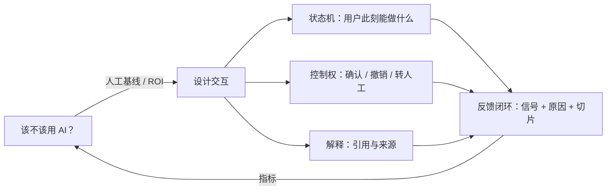
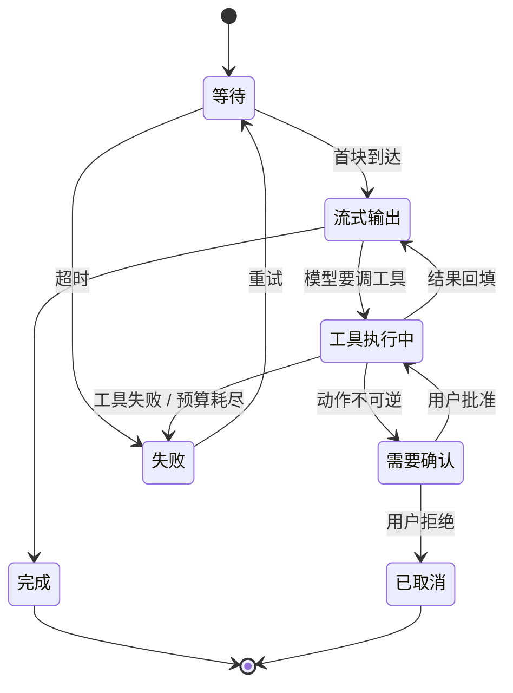

# 24 AI 产品设计与交互

> 前面二十三课都在让 Agent 可靠。这一课讲用户那一侧：界面要把 Agent 的每一种状态表达出来，否则用户会用自己的方式补偿，而补偿的方式往往是再说一遍。

## 少了一个状态，动作执行了两次

一个语音机器人项目的第一版没有「工具执行中」这个状态。

语音场景没有屏幕，所以每个状态都得用声音表达：等待用一个短音效，需要确认时完整复述要做的事。而「正在执行」当时什么都没表达——用户说完指令，机器人沉默，工具在后台跑。

用户的反应是把指令再说一遍。他以为没听见。

于是同一个动作被执行了两次。修法是给 `TOOL_RUNNING` 状态一个可感知的表达，一句「我看一下」，问题就消失了。

这件事值得放在开头，因为它说明界面状态不是装饰。少一个状态，用户会用重复输入来补偿，而第 05 课的幂等键挡不住这种重复：在运行时看来那是两次不同的用户意图，`call.id` 不同，业务确认也不同。**界面这一层的缺陷，会变成执行层的正确性问题。**

## 学习目标

- 能用人工基线和 ROI 判断一个功能该不该上 AI，并说出三种「不该用」的信号
- 能把流式回答建模成显式的 UI 状态机，说清每个状态用户能做什么、看到什么
- 能按可逆性给动作分级，正确选择确认、撤销窗口或直接执行
- 能设计带原因码和切片的反馈闭环

## 前置

- [05 Tool Calling](../tool-calling/README.md)：确认门。本课的「撤销窗口」是它的另一半
- [07 Agent State 与 Runtime](../agent-state-and-runtime/README.md)：事件流。本课 UI 状态机消费的就是那份事件

## 四个问题，一个闭环



### 先问要不要上 AI

人工基线是「现在人怎么做、多久、错多少」。AI 方案只有在成本或质量上明显好于这条线、且失败后果可承受时才值得做。三个「不该用」的信号：

1. 任务有唯一正确答案且已有确定性方案
2. 错误不可逆且无法验证
3. 用户需要的是速度而不是判断

### 流式回答是一个状态机

等待、流式输出、工具执行中、需要确认、完成、失败，每个状态的渲染和可用操作都不同。开头那个案例缺的就是这张图里的 `tooling`。



每个状态要回答同一个问题：用户此刻看到什么、能点什么。答不上来的状态，就是下一个开头那种事故的位置。

### 控制权按可逆性分级

分级由运行时按动作的声明决定，不由模型判断。这和第 05 课确认门是同一条原则的两面。

### 反馈要能定位问题

一个总体的「点赞率 85%」什么都说明不了。

## 从转移表到界面

### 一、UI 状态机：先写转移表

```python
class UIState(StrEnum):
    IDLE               = "idle"
    WAITING            = "waiting"              # 请求发出，还没回 -> 转圈，可取消
    STREAMING          = "streaming"            # 文本在来 -> 追加，可停止
    TOOL_RUNNING       = "tool_running"         # 在用工具 -> 说明用哪个，之前的文字保持可见
    NEEDS_CONFIRMATION = "needs_confirmation"   # 副作用待批 -> 显示批准 / 拒绝
    DONE               = "done"
    FAILED             = "failed"

TRANSITIONS: dict[UIState, set[UIState]] = {
    UIState.IDLE:      {UIState.WAITING},
    UIState.WAITING:   {UIState.STREAMING, UIState.TOOL_RUNNING,
                        UIState.NEEDS_CONFIRMATION, UIState.DONE, UIState.FAILED},
    UIState.STREAMING: {UIState.STREAMING,       # ← 自转移，这就是增量文本
                        UIState.TOOL_RUNNING, UIState.NEEDS_CONFIRMATION,
                        UIState.DONE, UIState.FAILED},
    UIState.TOOL_RUNNING:       {UIState.STREAMING, UIState.NEEDS_CONFIRMATION,
                                 UIState.DONE, UIState.FAILED},
    UIState.NEEDS_CONFIRMATION: {UIState.TOOL_RUNNING, UIState.STREAMING,
                                 UIState.DONE, UIState.FAILED},
    UIState.DONE:   {UIState.WAITING},           # 只能由用户发起下一轮
    UIState.FAILED: {UIState.WAITING},
}
```

**先写表，再写渲染。** 「工具跑了十秒界面卡住」和「断线后文字全没了」这类问题会在转移表上暴露出来，而不是在用户投诉里。开头那个案例在这张表上是一眼能看见的：`TOOL_RUNNING` 这一行如果不存在，`WAITING` 就直接连到 `STREAMING`，中间那段时间没有任何状态负责。

想加一个「用户打断」状态？先改表。

视图对象是一个 reducer 的产物，关键是 `text` 独立于 `state`：

```python
@dataclass
class ReplyView:
    state: UIState = UIState.IDLE
    text: str = ""                   # ← 不随状态清空
    tool_label: str = ""
    pending_action: str = ""
    error: str = ""
    citations: list[str] = field(default_factory=list)

    def go(self, new: UIState) -> None:
        if new not in TRANSITIONS[self.state]:
            raise RuntimeError(f"非法状态转移 {self.state} -> {new}")
        self.state = new
```

渲染每个状态的头部，正文永远是 `self.text`：

```python
head = {
    UIState.WAITING:      "[ 思考中...            (取消) ]",
    UIState.STREAMING:    "[ 回答中...            (停止) ]",
    UIState.TOOL_RUNNING: f"[ 正在使用 {self.tool_label}...  (取消) ]",
    UIState.NEEDS_CONFIRMATION: f"[ 确认执行 {self.pending_action}？ (批准) (拒绝) ]",
    UIState.FAILED:       f"[ 失败：{self.error} ] (重试) —— 以下是已生成的部分",
}[self.state]
return f"{head}\n  {self.text or '(还没有内容)'}"
```

`TOOL_RUNNING` 那一行就是开头那个案例的修法在屏幕上的形态。语音场景没有这一行可写，所以它变成了一句「我看一下」——载体不同，位置相同。

断线时进入 `FAILED`，但 `text` 保留，界面明确说「以下是部分回答」。用一个不断变长的字符串代表回答，断线时它会被清空重来，用户看到已经出现的文字消失了，这比什么都没有更让人困惑。

### 二、撤销窗口：可逆动作不必确认

```python
@dataclass(frozen=True)
class Action:
    name: str
    reversible: bool          # ← 运行时按这个字段选路径，不问模型
    undo_name: str = ""

UNDO_WINDOW_S = 5.0

async def perform(action: Action, approve_fn) -> Outcome:
    if action.reversible:
        do(action)                                  # 先做
        show(f"{action.name} 完成。[撤销] 可用 {UNDO_WINDOW_S:.0f} 秒")
        try:
            await asyncio.wait_for(user_pressed_undo(), timeout=UNDO_WINDOW_S)
        except TimeoutError:
            return Outcome(action, committed=True)  # 窗口过了，真正提交
        do(action.undo_name)
        return Outcome(action, committed=False)

    # 不可逆：先问
    if not await approve_fn(action):
        return Outcome(action, committed=False, note="用户拒绝")
    do(action)
    return Outcome(action, committed=True)
```

**确认是稀缺资源。** 每个动作都弹确认，用户很快学会无脑点确定，确认就失效了。归档对话直接做加撤销窗口；支付必须确认。

有外部副作用的动作（发邮件）**窗口结束前根本不该发出去**——这要求后端支持延迟提交，不是前端假装等一下。

### 三、反馈：信号 + 原因码 + 切片键

```python
class Signal(StrEnum):
    ACCEPT   = "accept"      # 原样用了
    EDIT     = "edit"        # 改了再用
    REJECT   = "reject"      # 点踩 / 重新生成
    ESCALATE = "escalate"    # 转人工

class Reason(StrEnum):
    WRONG_FACT    = "wrong_fact"
    TOO_LONG      = "too_long"
    MISSED_INTENT = "missed_intent"
    UNSAFE_ACTION = "unsafe_action"

@dataclass(frozen=True)
class Feedback:
    thread_id: str
    event_index: int      # 指向具体哪条 assistant_message
    intent: str           # 切片键，由运行时的路由填
    signal: Signal
    reason: Reason | None = None
```

三个字段各有用处：

- `event_index` 让反馈挂在具体的一次回答上，能回溯到那次的 trace 和检索结果。
- `reason` 让负反馈可归因。「不好」没法改，「事实错误」能改。
- `intent` 让你能切片。

切片有多重要，看这张表：

| slice | n | accept | edit | reject | escalate | 主要原因 |
|---|---:|---:|---:|---:|---:|---|
| **ALL** | 88 | **75%** | 6% | 9% | 10% | |
| faq | 45 | 89% | 11% | 0% | 0% | too_long |
| order_status | 23 | 87% | 0% | 13% | 0% | wrong_fact |
| **refund** | 20 | **30%** | 0% | 25% | **45%** | unsafe_action |

总体 75% 的接受率看着还行。`refund` 场景 45% 在转人工——**这是产品的一个洞，被总体数字盖住了**。

!!! note "这张表的数字是编的"

    每一行正好合计 100%，四个格子恰好是 0%，真实的反馈数据不会这么齐。要紧的是形状：
    总体那一行看着还行，某个切片已经塌了。拿自己的反馈表按 `intent` 分组跑一遍，才知道洞在哪。

### 四、引用要能点开

引用列表放在回答末尾、点不开、和正文没有对应关系，等于没有。引用要能回到原文的具体位置——第 15 课讲了怎么在检索层保留 `chunk_id` 和位置信息，本课只是把它带到界面：

```python
citations: list[str]     # ["refund-policy#0", "shipping#2"]
```

界面上每条引用是可点的，点开显示那个 chunk 的原文和它在文档里的位置。用户要能验证，不只是被告知有来源。

## 常见错误

**漏掉一个状态。** 就是开头那个案例。判断方法是拿转移表逐个状态问「用户此刻看到什么」，答不上来的那个状态就是漏的。最常漏的是工具执行中，因为它在代码里确实什么都没发生。

**用一个不断变长的字符串代表回答。** 断线时清空重来，用户看着已经出现的文字消失。`text` 要独立于 `state`，进 `FAILED` 也不清。

**每个动作都弹确认。** 用户三分钟后就开始无脑点同意，确认门等于没有。按可逆性分级：可撤销的直接做加撤销窗口，不可逆的才问。

**引用做成装饰。** 点不开、和正文没有对应关系的引用列表，只是在暗示有来源。用户要能自己验证那一句话。

**只收点赞点踩。** 没有原因码，负反馈无法归因；没有切片键，看不出哪个场景在坏。上面那张表如果只有第一行，你会以为产品挺好。

## 透明到什么程度，确认到什么密度

- **透明还是简洁。** 显示模型正在用什么工具、引用来自哪里，会增加界面噪音。原则是默认折叠、可展开，关键动作前展开。
- **撤销窗口的长度。** 太短用户来不及反应，太长动作迟迟不生效。多数界面用 5～10 秒。
- **确认的密度和话术。** 语音场景的确认比屏幕场景多得多，因为物理动作（移动、播放）几乎都不可逆或代价高。但话术要短，否则用户会打断它——**用户打断确认本身又是一个需要处理的状态**，这一条在上面那张转移表里还没有。
- **转人工的时机。** 早转浪费人力，晚转用户已经生气。信号可以是连续两次负反馈、用户重复同一个问题、或者模型自己请求（第 07 课的 `request_human_input`）。把阈值做成配置，按场景调。

## 从转移表到能上线

- **状态机的定义前后端共享。** 后端事件类型和前端状态一一对应，加状态时两边同步改。定义分叉是这类 bug 的主要来源。
- **反馈要能反查 trace。** 用户点踩的那一刻，你要能拿到那次运行的完整 trace 和检索结果，否则改不了。
- **「部分完成」要有明确表达。** Agent 做了三步中的两步就失败了，界面要说清哪两步做了、哪一步没做。「失败」两个字会让用户不知道要不要重来。
- **A/B 的粒度是场景，不是全局。** 新提示词在 faq 上更好、在 refund 上更差是常态。按切片看，不按总体看。
- **怎么测。** 状态机写成一张转移表，测试就在表上跑，不用碰界面：断言每个状态都有出边（没有死状态）、断言 `TOOL_RUNNING` 存在且从 `WAITING` 和 `STREAMING` 都能到（开头那个案例的回归测试）、断言任何通向不可逆动作的路径上一定经过确认状态。三条都是确定性的，能进 CI（第 19 课）。

## 框架映射

| 本课概念 | LangGraph | OpenAI Agents SDK | Claude Agent SDK |
|---|---|---|---|
| 事件流 → UI 状态 | `astream_events` 的事件类型 | `run_streamed` 的 stream events | 消息流 |
| 审批交互 | `interrupt` 的 payload 驱动 UI | `needs_approval` 的中断 | 权限回调 |
| 状态机本身 | 自己写 | 自己写 | 自己写 |

框架给的是事件，状态机是你自己的。事件类型到 UI 状态的映射表，是这一层唯一需要认真设计的东西。官方文档：[LangGraph](https://langchain-ai.github.io/langgraph/) · [OpenAI Agents SDK](https://openai.github.io/openai-agents-python/) · [Claude Agent SDK](https://docs.claude.com/en/api/agent-sdk/overview)（核对日期 2026-09-05）。

## 延伸阅读

- [Google PAIR · People + AI Guidebook](https://pair.withgoogle.com/guidebook)（访问日期 2026-09-04）：按用户需求、心智模型、解释与信任、反馈与控制、错误与优雅失败组织，每章有可直接用的设计模式。
- [Microsoft HAX Toolkit](https://www.microsoft.com/en-us/haxtoolkit/)（访问日期 2026-09-04）：18 条人机交互指南加设计模式库。「make clear what the system can do」和「support efficient correction」两条对应本课的状态机和撤销；开头那个案例对应的是「make clear why the system did what it did」的前一半，系统正在做什么。
- [generative-ai-for-beginners · 12 Designing UX for AI Applications](https://github.com/microsoft/generative-ai-for-beginners/blob/main/12-designing-ux-for-ai-applications/README.md)（访问日期 2026-09-04）：可用性、可靠性、可访问性、愉悦四个维度，加信任与透明、协作与反馈两节。
- [ai-agents-for-beginners · 06 Building Trustworthy AI Agents](https://github.com/microsoft/ai-agents-for-beginners/blob/main/06-building-trustworthy-agents/README.md)（访问日期 2026-09-04）：系统提示框架、五类威胁与缓解、人工介入。

## 参考实现

能点的那个界面是 [`api/routes/playground.py`](https://github.com/lance2016/ai-app-engineering-ref/blob/main/project/src/aiapp/api/routes/playground.py)：纯 HTML 加 JavaScript，没有构建步骤，调的是客户端会调的同一套 `/v1` 接口，所以批准工具、灌文档、看记忆都不绕过鉴权。起完服务开 `http://localhost:8000/playground` 就能试。反馈闭环的设计记在 [M6 综合设计](https://github.com/lance2016/ai-app-engineering-ref/blob/main/project/m6-platform-design/README.md)（还是草稿）。

---

[← 上一课 23](../model-adaptation-finetuning-inference/README.md) · [下一课 25 →](../voice-agents/README.md)
