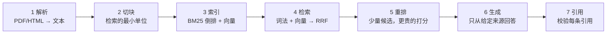
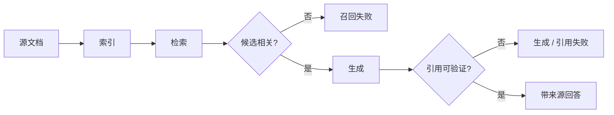

# 14 RAG 端到端

> RAG 是七个步骤串成的一条流水线：解析、切块、索引、检索、重排、生成、引用。每一步都有一种自己独有的坏法，而用户看到的永远只是「答错了」。这一课的目标不是把七步做得多好，而是让你能对任何一次答错说出「坏在第几步」，并且有数据证明。

## 为什么需要

用户只看到「答错了」，但原因可能是解析、切块、召回、重排、生成或引用任一步。把链路拆成可测的阶段，才能做有证据的优化。

## 学习目标

- 能画出七步流水线，并为每一步说出一种典型失败和检测它的方法
- 能说清 BM25、向量检索、RRF 融合、引用校验各自解决什么问题
- 能用一个 golden set 算 Recall@k，改一个参数后判断哪一步变好、哪一步变坏

## 前置

- [04 Embedding 与向量检索基础](../embeddings-and-vector-search/README.md)：隔了九课，三条结论这一课直接要用——归一化之后余弦就是点积；切块大小决定召回粒度，改切块等于改召回；换 embedding 模型必须重建全部向量。忘了先回去翻一遍那一课的「怎么理解它」
- [05 Tool Calling](../tool-calling/README.md)：引用校验的思路和「模型输出是建议」一脉相承

## 怎么理解它



| 步 | 典型坏法 | 怎么发现 |
|---|---|---|
| 解析 | 表格变成乱序文字、页眉页脚混进正文 | 抽样看解析结果，不看最终答案 |
| 切块 | 太大：噪音多，分数平；太小：答案被撕开 | golden 短语是否还在同一块里；Recall@k 随块大小的变化 |
| 索引 | 文档更新了索引没更；权限字段没进索引 | 版本号和删除演练，第 16 课 |
| 检索 | 词法找不到同义改写；向量找不到精确数字和型号 | 分别算 BM25 和向量的 Recall@k，看各自漏什么 |
| 重排 | 重排器和检索器口径不一致，把对的排下去 | 重排前后 Recall@k 对比 |
| 生成 | 模型用了自己的知识而不是来源；来源里没有答案时硬编 | 引用率；「来源不含答案」的 golden 用例 |
| 引用 | 编造不存在的引用 id；引用和句子对不上 | 代码校验 |

**有些文档根本没有文本层。** 扫描件、截图、拍下来的表格，抽取出来是空的或一堆乱码，后面六步全都白做。三条路：OCR 转成文字后照常走流水线；版面解析把表格和阅读顺序还原成结构（跨行跨列的表格尤其需要，OCR 会把它拍平成一行行碎字）；或者把整页图直接交给视觉模型。**前两条把图变成可检索、可引用、可缓存的文本，第三条不行**——图片进不了 BM25 索引，也给不出「这句话来自哪一块」。

**检索这一步要两条腿走路。** BM25 匹配精确词，擅长型号、数字、专有名词，对同义改写无能为力。向量匹配语义，擅长改写，但对「3 到 5 天」和「1 到 2 天」这种只差数字的句子分辨力弱。

**引用是生成阶段的校验。** 模型说「来源 `[refund-policy#0]` 支持这句话」，这和第 05 课模型说「我调用了工具」是同一类陈述：一个建议，需要代码去核实。

**Agentic RAG 是这条流水线加上第 06 课的循环。** 模型看到检索结果觉得不够，改写查询再查一次，或者换一个数据源。它没有改变七步里任何一步的坏法，只是让流水线可以跑多轮。**先把单轮做对。**



## 机制拆解

### 一、切块要看语义边界，不只看长度

```python
SENTENCE = re.compile(r"(?<=[.!?])\s+")

def units(text: str, max_chars: int) -> list[str]:
    """按段落切；单个段落超长时，退到句子级。"""
    out = []
    for para in (p.strip() for p in text.split("\n\n")):
        if not para or para.startswith("#"):
            continue
        out += SENTENCE.split(para) if len(para) > max_chars else [para]
    return out

def chunk_document(doc, text, max_chars, overlap_units=1) -> list[Chunk]:
    """把整段（或整句）攒到 max_chars，末尾几个单位带进下一块作为重叠。"""
    chunks, current = [], []
    for unit in units(text, max_chars):
        if current and len("\n\n".join(current + [unit])) > max_chars:
            chunks.append(Chunk(f"{doc}#{len(chunks)}", doc, "\n\n".join(current)))
            current = current[-overlap_units:] if overlap_units else []
        current.append(unit)
    if current:
        chunks.append(Chunk(f"{doc}#{len(chunks)}", doc, "\n\n".join(current)))
    return chunks
```

关键在 `units()`：**永远以完整的段落或句子为最小单位**，`max_chars` 只是攒够多少就切。固定字符数硬切会把「1 到 2 个工作日」切成「1 到」和「2 个工作日」——两边都答不了问题。

`overlap_units=1` 让相邻块共享一个段落。代价是索引变大约 20%，收益是跨段落的答案不会被切口吞掉。

`Chunk.id` 用 `"<doc>#<n>"` 的形式，因为它最后要变成给用户看的引用。

### 二、BM25：二十几行，值得亲手写一遍

```python
class BM25:
    def __init__(self, chunks, k1=1.5, b=0.75):
        self.k1, self.b = k1, b
        self.docs = [Counter(tokenize(c.text)) for c in chunks]
        self.lengths = [sum(d.values()) for d in self.docs]
        self.avg_len = sum(self.lengths) / max(1, len(self.lengths))
        df = Counter(term for d in self.docs for term in d)
        n = len(self.docs)
        self.idf = {t: math.log(1 + (n - f + 0.5) / (f + 0.5)) for t, f in df.items()}

    def score(self, query, i) -> float:
        d, dl = self.docs[i], self.lengths[i]
        s = 0.0
        for t in tokenize(query):
            if t not in d:
                continue
            tf = d[t]
            s += self.idf[t] * tf * (self.k1 + 1) / (
                 tf + self.k1 * (1 - self.b + self.b * dl / self.avg_len))
        return s
```

两个参数的含义值得记住：`k1` 控制词频饱和（一个词出现 10 次不该比出现 5 次强一倍），`b` 控制文档长度惩罚（长文档天然含更多词，要打折）。默认 1.5 / 0.75 在多数语料上够用。

生产里用 PostgreSQL 的 `tsvector` 或 Elasticsearch，不用自己写。但知道它在算什么，才能解释「为什么这篇明明包含关键词却排在后面」。

### 三、RRF：只看名次，不看分数

```python
def rrf(*rankings: list[int], k: int = 60) -> list[int]:
    """Reciprocal Rank Fusion：每个文档的得分是各排名倒数之和。"""
    scores = defaultdict(float)
    for ranking in rankings:
        for rank, doc_id in enumerate(ranking, start=1):
            scores[doc_id] += 1.0 / (k + rank)
    return sorted(scores, key=scores.get, reverse=True)
```

BM25 的分数是几点几，余弦相似度是 0 到 1，两者没法直接加。RRF **只用名次**，所以完全不需要把两种分数拉到同一尺度——这是它成为默认融合方法的原因。

`k=60` 是论文里的经验值。它的作用是压平头部差距：第 1 名和第 2 名的分差不会大到让另一个检索器完全说不上话。

### 四、重排：候选少了，可以用更贵的打分

```python
def rerank(query, candidates, top_n=3) -> list[Chunk]:
    """真实系统用 cross-encoder；这里用二元组重叠做示意。"""
    q = tokenize(query)
    bigrams = {(a, b) for a, b in zip(q, q[1:])}

    def score(c):
        t = tokenize(c.text)
        hits = sum(1 for a, b in zip(t, t[1:]) if (a, b) in bigrams)
        return hits + 0.01 * sum(1 for w in q if w in t)   # 二元组为主，单词为辅

    return sorted(candidates, key=score, reverse=True)[:top_n]
```

重排的价值在于**它能看整个查询和整段文本的交互**，而检索阶段的向量是各自独立编码的。真实的 cross-encoder 把查询和候选拼在一起过一遍模型，每个候选都要一次推理——所以候选数必须先被检索压到几十个。

### 五、引用校验：id 存在还不够

```python
CITATION = re.compile(r"\[([a-z-]+#\d+)\]")

def verify(answer: str, ctx: list[Chunk]) -> list[str]:
    by_id = {c.id: c for c in ctx}
    problems = []
    for sentence in re.split(r"(?<=[.!?])\s+", answer):
        for cid in CITATION.findall(sentence):
            if cid not in by_id:
                problems.append(f"[{cid}] 根本没被检索到")     # 编造的引用
                continue
            words = set(tokenize(CITATION.sub("", sentence))) - STOPWORDS
            if len(words & set(tokenize(by_id[cid].text))) < 2:
                problems.append(f"[{cid}] 支撑不了这句话: {sentence!r}")   # 挂错了
    if not CITATION.search(answer):
        problems.append("完全没有引用")
    return problems
```

**只检查 id 存在是不够的。** 模型可以把任何一句话挂在任何一个真实 id 后面，看起来有据可查，实际上是拼贴。第二道检查（词汇重叠）虽然粗糙，但能挡住绝大多数这种情况。

系统提示词那边要配合：

```python
system = ("Answer only from the sources below. After each sentence cite the "
          "source id in square brackets. If the sources do not contain the "
          "answer, say so.")
```

最后那句「来源里没有就直说」必须有，否则模型会用自己的知识补全。

### 六、Recall@k：所有调参的前提

```python
def recall_at_k(retriever, golden, chunks, ks=(1, 3, 5)) -> dict[int, float]:
    hits = {k: 0 for k in ks}
    for g in golden:                      # {"q": "...", "must_contain": "关键短语"}
        ranked = retriever(g["q"])
        for k in ks:
            if any(g["must_contain"] in chunks[i].text for i in ranked[:k]):
                hits[k] += 1
    return {k: hits[k] / len(golden) for k in ks}
```

用一个 10 题的 golden set，三种检索器在 450 字符块大小下的实测：

| 检索器 | R@1 | R@3 | R@5 |
|---|---|---|---|
| bm25 | 0.80 | 1.00 | 1.00 |
| 向量（玩具） | 0.50 | 0.90 | 0.90 |
| hybrid | 0.70 | 0.90 | 1.00 |

把块大小降到 120，向量的 R@3 掉到 0.70，hybrid 掉到 0.80。

**这张表是这一课最重要的产出。没有它，任何一次调参都是猜。**

## 常见错误

**用弱向量得出「hybrid 更好」的结论。** 上表里 hybrid 的 R@1 比纯 BM25 还低——因为玩具向量把 how、is 这些词也算进相似度，噪音拖累了融合。这不是 RRF 的问题，是融合一个弱检索器的必然结果。换成真实 embedding 模型后结论通常反转，但**你必须重新测**，不能沿用别人的结论。

**切块只看大小不看边界。** 见第一节。

**对着没有文本层的 PDF 调切块参数。** 解析出来就是乱的，块怎么切都不对。「怎么理解它」那张表第一行说的就是这件事：抽样打开解析结果看一眼，比调三天参数快。

**引用校验只检查 id 存在。** 见第五节。

**golden set 里只有能答的问题。** 真实系统必须有几个「来源里没有答案」的用例，看模型是不是老实说不知道。只测能答的问题，等于没测幻觉。

## 取舍

- **块大小。** 小块检索精确、上下文少；大块上下文全、分数平。经验起点是 300～800 字符加一段重叠，然后用 Recall@k 调。**没有通用最优值，每个语料不同。**
- **图表和表格：转成文本，还是保留原图。** 转文本便宜、可检索、能给到块级引用，但复杂表格和图示会丢信息；保留原图交给视觉模型信息最全，代价是每次都要重看一遍图（贵且慢），引用只能到页。常见做法是两者都留：文本进索引负责召回，命中之后需要时再把原图一起给模型。
- **BM25 还是向量还是都要。** 只有 BM25，同义改写会漏；只有向量，型号和数字会混。都要就多一套索引和一次融合。语料里精确标识符多的（法规、技术手册）BM25 权重要高。
- **重排的代价。** cross-encoder 把候选数从几十压到几个，质量提升明显，但每个候选都要过一次模型。候选取多少是延迟和召回的直接权衡，通常 20～50。
- **pgvector 还是专用向量库。** pgvector 让一个库同时放业务数据和向量，少一个组件，权限过滤可以用 SQL 的 `WHERE`。到千万级向量、或者需要复杂过滤加近邻组合时，再评估专用库。

## 工程落地

- **每次检索都要留证据**：查了什么、召回了哪些块、融合前后的名次、最终给模型看的是哪几块。回答错了，这份证据决定你去修哪一步。
- **怎么测：检索和生成分开量。** 检索层看 Recall@k（该召回的召回了几成）和 Hit@k（前 k 条里至少有一条对的吗），这两个数字回答的不是同一个问题，别混用：单文档问答 Hit@5 很好看，多文档汇总就得看 Recall@5。生成层看引用是否真的支撑了那句话。哪一层掉了先修哪一层。
- **Recall@k 进 CI 门禁。** 设一个阈值（比如 R@5 ≥ 0.85），跌破就不合并。切块参数、embedding 模型、检索权重都是会被人「顺手优化」的东西。
- **引用校验的结果要落库**，不只是拦截。引用失败率的趋势是模型质量的一个先行指标。
- **权限必须进索引**。检索时用 `WHERE tenant_id = ?` 过滤，不要检索完再在应用层筛——后者会让 top-k 被无权访问的文档占满。

## 框架映射

| 本课概念 | LangGraph | OpenAI Agents SDK | Claude Agent SDK |
|---|---|---|---|
| 检索管线 | LangChain 的 retriever + 图节点 | 内置 file search，或自写检索工具 | MCP 检索 server 或自写工具 |
| 混合检索 | `EnsembleRetriever` | 自己写 | 自己写 |
| 引用校验 | 自己写 | 内置 file search 带引用 | 自己写 |

托管的 file search 省事，但你看不到切块策略和检索参数，也算不了自己的 Recall@k。数据是核心资产时，这一层建议自己掌控。官方文档：[LangGraph](https://langchain-ai.github.io/langgraph/) · [OpenAI Agents SDK](https://openai.github.io/openai-agents-python/) · [Claude Agent SDK](https://docs.claude.com/en/api/agent-sdk/overview)（核对日期 2026-09-05）。

## 参考实现

想看这一课的机制装进一个真实服务是什么样：参考实现的 [M4 RAG 与 Memory](https://github.com/lance2016/ai-app-engineering-ref/blob/main/project/m4-rag-and-memory/README.md)，混合检索、引用与 Recall@k。

## 延伸阅读

- [Lewis 等 · Retrieval-Augmented Generation for Knowledge-Intensive NLP Tasks](https://arxiv.org/abs/2005.11401)（访问日期 2026-09-04）：RAG 一词的出处。读摘要和图 1 就够，理解「检索器和生成器是两个可以分别评测的组件」。
- [Okapi BM25](https://en.wikipedia.org/wiki/Okapi_BM25)（访问日期 2026-09-04）：公式和 `k1`、`b` 两个参数的含义。上面那段代码就是这一页的直译。
- [pgvector](https://github.com/pgvector/pgvector)（访问日期 2026-09-04）：索引类型（HNSW、IVFFlat）和距离函数。
- [docling](https://github.com/docling-project/docling)（访问日期 2026-09-06）与 [marker](https://github.com/datalab-to/marker)（访问日期 2026-09-06）：两个把 PDF 转成结构化 Markdown 的开源项目，拿自己的脏文档各跑一遍，比读任何解析器对比都直接。
- [generative-ai-for-beginners · 15 RAG and Vector Databases](https://github.com/microsoft/generative-ai-for-beginners/blob/main/15-rag-and-vector-databases/README.md)（访问日期 2026-09-04）：通识版的七步，附一个 notebook。
- [ai-agents-for-beginners · 05 Agentic RAG](https://github.com/microsoft/ai-agents-for-beginners/blob/main/05-agentic-rag/README.md)（访问日期 2026-09-04）：多轮检索的动机、失败模式和边界。读完本课再看，你会发现它讨论的所有问题都能落到七步中的某一步。

---

[← 上一课 13](../agent-harness/README.md) · [下一课 15 →](../memory/README.md)
