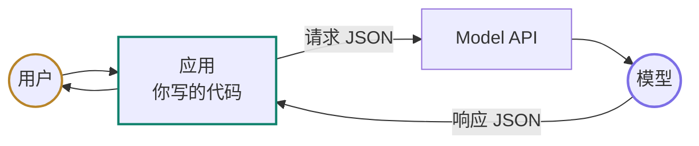
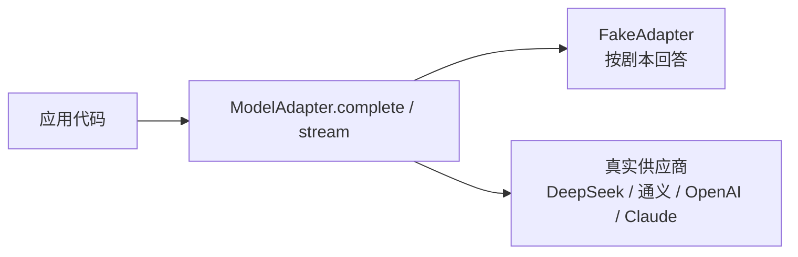

# 00 起步：怎么读这门课，怎么接第一个模型

> 先把一条请求跑通，再拆开它的输入、输出和工具回传。你会看到 Chat Completions、Responses、Claude Messages 的形状差异，也会知道为什么要把供应商 SDK 藏在适配器后面。

<details class="case" markdown="1">
<summary>例子：把 Chat Completions 的 role=tool 消息发给 Claude，第二次请求返回 400</summary>

第一次请求在 OpenAI 兼容接口上返回一个工具调用。应用照原样拼下一轮请求：

```json
{
  "messages": [
    {"role": "assistant", "tool_calls": [{"id": "call_1", "type": "function"}]},
    {"role": "tool", "tool_call_id": "call_1", "content": "{\"temp_c\":31}"}
  ]
}
```

Claude Messages 只接受 `user` 和 `assistant` 两种消息角色，工具结果要放在 `user` 消息的 `tool_result` 内容块里。接口因此拒绝这次请求。修正后的形状见本课「同一件事在 Claude 上的写法」。

!!! note "构造的例子"
    请求和 400 是为说明角色映射构造的；真实接口的错误文本会随供应商和版本变化。Claude 的工具往返规则见[官方 Tool use 文档](https://platform.claude.com/docs/en/agents-and-tools/tool-use/overview)（访问日期 2026-09-10）。

</details>

## 先把一次调用跑通，再谈抽象

打开任何一家模型厂商的文档，第一页都是「几行代码调通」。照着抄能跑，但换一家就得重抄一遍，也说不清哪些差异是本质的、哪些只是命名——各家的字段名不一样，OpenAI 自己还有新旧两套。

所以这一课分两步：先让一次调用跑起来，再把请求和响应的形状看清楚。后面的消息、工具结果和状态章节都会用到这几个形状。

## 跑通第一调用后要看懂什么

- 能跑通一次真实的模型调用，并说出请求体里那几类字段各是干什么的
- 能画出一次模型调用里应用、接口、模型各站在什么位置，各自负责什么
- 知道课文里的代码是示意还是可运行，不会去找一个不存在的仓库目录
- 能说出 Chat Completions、Responses、Claude Messages 三套接口的关键差异，以及各自该在什么场景选
- 能说清「模型适配器」这个抽象为什么值得从第一天就有

## 一条请求里谁负责什么

### 一个 AI 应用最小的样子



这条链上只有应用是你的。从应用视角，模型端点接收结构化输入，返回文本或结构化事件；鉴权、状态、工具执行和业务校验仍由接口或应用层负责。

应用要明确负责的事，定义了这门课后面在讲什么：

| 默认不会替你做 | 通常由谁负责 | 哪几课 |
|---|---|---|
| 自动保留完整对话状态 | 应用，或使用接口提供的会话状态 | 07 · 08 · 15 |
| 执行客户端工具 | 应用；模型只返回工具调用请求 | 05 |
| 证明输出符合业务规则 | 应用，按 schema 和业务规则校验 | 02 |
| 读取你的业务数据 | 应用，检索后放进请求里 | 04 · 14 |

表里那个「工具」先按字面理解：**你写好的一个函数，把它的名字、用途和参数格式告诉模型，模型就能在回答里说「我要调它，参数是这些」**。这里说的是客户端工具；网页搜索等服务端工具由供应商执行，协议和权限边界要单独看文档。第 05 课整课讲客户端工具，本课第三节先看一眼它长什么样。

同样的输入，模型两次的回答可以不一样。它是一个概率性的外部部件，不是一个函数。单靠「写好断言、跑通就对了」不够，所以第 19 课会讲评测。

工具、循环、状态、上下文会在后面逐层加进来；现在先把应用和模型之间的调用跑通。

### 课文里的代码是哪一种

一门课里的代码有三种。这门课只有前两种：

| 形态 | 用途 | 本课程 |
|---|---|---|
| 示意代码 | 说明一个机制，省略掉所有噪音 | 每课的「机制拆解」小节都是这个 |
| 可复制的最小例子 | 你想亲手验证时，复制到自己的环境里跑 | 只在少数几课出现，明确标注 |
| 项目代码 | 一个真实服务的完整实现 | **不在这里**，见[参考实现仓库](https://github.com/lance2016/ai-app-engineering-ref) |

看到 `## 机制拆解` 下面的代码，默认它跑不起来——它引用的类型和函数是为了让你看懂逻辑而虚构的。这是刻意的：把 import、日志、错误处理都塞进去，一段二十行能讲清的机制会变成两百行。

## 从 HTTP 请求到适配器

这一课的代码是全课唯一的例外：**第一段能直接复制去跑**，后面几段接着第一段的 `client` 写，单独拿走会缺东西。为让示例少受供应商 SDK 差异影响，这里用 DeepSeek 的 OpenAI 兼容端点；可以在 <https://platform.deepseek.com> 申请 key（访问日期 2026-09-10）。

```bash
python -m pip install openai
export DEEPSEEK_API_KEY=sk-...
```

### 一、先把话说通

八行代码，确认 key、网络和模型名都对：

```python
import os
from openai import OpenAI

client = OpenAI(api_key=os.environ["DEEPSEEK_API_KEY"],
                base_url="https://api.deepseek.com")

resp = client.chat.completions.create(
    model="deepseek-v4-flash",                                   # ← 模型名会过期，以官方文档为准
    messages=[{"role": "user", "content": "一句话说说深圳的天气"}],
)
print(resp.choices[0].message.content)
```

打印出一句话，这一课的动手部分就完成了。**注意 `messages` 是一个列表**：模型不记得任何东西，你每次都要把完整历史发过去，多轮对话就是往这个列表里追加。第 08 课整课都在讲这个列表该怎么裁。

换供应商只改两行：通义千问是 `base_url="https://dashscope.aliyuncs.com/compatible-mode/v1"` 加 `model="qwen-plus"`，OpenAI 去掉 `base_url` 即可。它们走的都是 Chat Completions 协议。

### 二、这次调用里到底发了什么

刚才那八行里，`client.chat.completions.create(...)` 通常会发出一次 HTTP POST。不管用哪家 SDK，底层都要把结构化请求发到一个 URL；非流式调用收回一个响应对象，流式调用则会收到一串事件。SDK 负责拼请求体、带上 key、把响应转成对象，重试和超时还可能让一次业务调用对应多次网络请求。

请求体的主干是四类东西：对话内容（历史消息）、可用的工具（一组 JSON Schema）、抽样参数（temperature、输出上限）、模型名。响应的主干是两类：模型说的话，或者模型想调的工具。

主干之外还有各家自己加的：图片和音频输入、推理力度、服务端内置工具、缓存和用量元数据。这些各不相同，而且还在长；上面那四类和两类是稳定的部分，先认它们。

分歧全在字段名和嵌套结构上。

### 三、预告：模型想调一个工具的时候

这一段不用背，看形状就行——它是第 05 课的内容，放在这里只是让你知道「模型请求调用工具」长什么样。下面是示意代码，省略了导入、完整消息序列化和错误处理，不能直接运行。

```python
WEATHER = {
    "type": "function",
    "function": {
        "name": "get_weather",
        "description": "Current weather for a city.",
        "parameters": {"type": "object",
                       "properties": {"city": {"type": "string"}},
                       "required": ["city"]},
    },
}

messages = [{"role": "user", "content": "深圳现在天气怎么样？"}]
reply = client.chat.completions.create(
    model="deepseek-v4-flash", messages=messages, tools=[WEATHER]
).choices[0].message

if reply.tool_calls:                      # ← 模型没有执行任何东西，它只是请求
    call = reply.tool_calls[0]
    result = '{"temp_c": 31, "condition": "sunny"}'   # 你的代码去查，这里写死
    messages += [reply,
                 {"role": "tool", "tool_call_id": call.id, "content": result}]
    print(client.chat.completions.create(
        model="deepseek-v4-flash", messages=messages).choices[0].message.content)
```

要留意的只有一件事：**在客户端工具这条路径上，`tool_calls` 出现时，外部世界还没有变化。** 模型返回的是一段「我想调 get_weather，参数是这个」的 JSON，查天气、校验参数、决定要不要执行，全是你的代码的事。这是第 05 课的起点。

真实系统里这里是个循环——模型可能连着调好几轮工具才给出答案，所以要有步数上限和停止条件。那是第 06 课，这里先不展开。

### 四、三套接口，一件事

同一个请求——「用简洁的语气回答深圳天气」——三套接口的写法：

=== "OpenAI Chat Completions"

    ```python
    from openai import OpenAI

    client = OpenAI()
    resp = client.chat.completions.create(
        model="gpt-5",
        messages=[
            {"role": "system", "content": "You are terse."},   # ← 系统提示是消息列表里的一条
            {"role": "user", "content": "深圳现在天气怎么样？"},
        ],
    )
    print(resp.choices[0].message.content)
    ```

=== "OpenAI Responses"

    ```python
    from openai import OpenAI

    client = OpenAI()
    resp = client.responses.create(
        model="gpt-5",
        instructions="You are terse.",        # ← 顶层快捷写法；也可在 input 条目中表达
        input="深圳现在天气怎么样？",           # ← 单轮可以直接给一个字符串
    )
    print(resp.output_text)                   # ← 帮你把返回条目里的文本拼好了
    ```

=== "Claude Messages"

    ```python
    from anthropic import Anthropic

    client = Anthropic()
    resp = client.messages.create(
        model="claude-opus-5",
        max_tokens=1024,                      # ← 这个字段必填，漏了直接 400
        system="You are terse.",              # ← 系统提示是顶层字段
        messages=[{"role": "user", "content": "深圳现在天气怎么样？"}],
    )
    print("".join(b.text for b in resp.content if b.type == "text"))
    ```

差异摊开看：

| | Chat Completions | Responses | Claude Messages |
|---|---|---|---|
| 端点 | `POST /v1/chat/completions` | `POST /v1/responses` | `POST /v1/messages` |
| 对话输入 | `messages` 列表 | `input`，字符串或条目列表 | `messages` 列表 |
| 系统提示 | 列表里 `role="system"` 的一条 | 顶层 `instructions`，也可放进 `input` 条目 | 顶层 `system` |
| 返回 | `choices[0].message` | `output` 条目列表，`output_text` 是快捷方式 | `content` 块列表 |
| 工具定义 | `{"type": "function", "function": {…}}`，嵌一层 | `{"type": "function", "name": …, "parameters": …}`，平铺 | `{"name": …, "input_schema": …}` |
| 工具结果回传 | 一条 `role="tool"` 消息，认 `tool_call_id` | 一个 `function_call_output` 条目，认 `call_id` | 一条 **`role="user"`** 消息里的 `tool_result` 块，认 `tool_use_id` |
| 输出上限字段 | `max_completion_tokens`，可选 | `max_output_tokens`，可选 | `max_tokens`，**必填** |
| 续接对话 | 默认按请求处理，不靠 response id 续接 | `store` 与 `previous_response_id`（具体状态语义看服务端） | 不存为可续接的会话，每次重发全部 |

Chat Completions 在较新的 OpenAI 模型上还支持 `developer` 角色；不少兼容服务仍只接受 `system`。表里的示例用 `system`，因为它在跨供应商场景更常见，接入具体模型时要按该模型的消息角色要求调整（OpenAI 文档核对日期 2026-09-10）。

最后两行最容易写错。**Claude 把工具结果算成用户说的话**，因为它的协议里只有 user 和 assistant 两种角色；工具结果是「外部世界带回来的信息」，所以挂在 user 那边。适配器如果按 OpenAI 的习惯造一条 `role="tool"`，Claude 直接报错。

**为什么 OpenAI 有两套。** [Chat Completions](https://platform.openai.com/docs/api-reference/chat) 早已成了事实标准——DeepSeek、通义千问等兼容服务都实现了它，所以「OpenAI 兼容」这四个字才有意义。[Responses](https://platform.openai.com/docs/api-reference/responses) 是后来的端点，在 OpenAI API 里提供 `previous_response_id` 和网页搜索、文件检索、代码执行等内置工具（核对日期 2026-09-10）。OpenAI 当前仍维护 Chat Completions，同时在新项目提示中推荐先评估 Responses；这表示产品方向变化，不等于兼容服务可以不加核对地互换。

一些兼容服务也提供 Responses 端点，但可能只实现字段形状，不实现服务端状态或内置工具。比如 [DeepSeek 的 Responses API 文档](https://api-docs.deepseek.com/api/create-response/)明确写着接口无状态，多轮请求要在 `input` 里重发完整历史（访问日期 2026-09-10）。**用之前查它自己的文档，别按 OpenAI 的字段表想当然。**

选型先看两个约束：要不要跨供应商，以及是否依赖供应商提供的会话状态或内置工具。需要跨供应商时，Chat Completions 的兼容范围通常更宽；只用 OpenAI 且需要 `previous_response_id` 或内置工具时，再考虑 Responses；使用 Claude 原生 API 时则是 Messages。这门课后面的示意代码统一用 Chat Completions 的形状，因为它最通用。

### 五、同一件事在 Claude 上的写法

机制一样，形状不一样。只看工具结果怎么回传。下面是示意代码，省略了请求初始化、导入和错误处理，不能直接运行：

```python
messages.append({"role": "assistant", "content": response.content}) # ← 原样带回，别拍平成字符串
messages.append({"role": "user", "content": [{                     # ← 工具结果算「用户说的话」
    "type": "tool_result",
    "tool_use_id": tool_use.id,    # ← 不叫 tool_call_id
    "content": json.dumps(result),
}]})
```

判断有没有工具调用也换了地方：OpenAI 看 `reply.tool_calls` 是不是空，Claude 看 `resp.stop_reason == "tool_use"`。

把第三节那段 OpenAI 的写法和这一段并排读一遍，适配器要抹平的到底是什么就具体了：不是「协议不同」这种空话，是六七个字段名和一个角色归属的判断。

### 六、所以适配器要在第一天就有



`ModelAdapter` 的最小协议有两个入口：`complete` 返回完整响应，`stream` 返回增量片段。两者都接收一串消息和可选的工具列表，响应里要么是文本，要么是一组工具调用请求。上面那张表里的差异，全部关在这一层里面消化。

对会持续迭代的服务，这层可以隔离供应商变更。第 12 条工程原则就是「模型是可替换的适配器」：模型换代的速度远快于业务代码，直接调用供应商 SDK 的地方都要跟着改。

**也有不必要的时候。** 一个跑一次就删的脚本、一次性的数据清洗，直接调 SDK 更省事——这一层的收益要等「换模型」「加 fake 写测试」「同时接两家」出现才兑现。判断标准是问一句：这段代码会不会活过下一次模型换代。

**参考项目里的第一个实现是一个按剧本回答的 fake。** 不需要 key，行为确定，可以写断言，还能让模型「按要求犯错」。代价是它不会思考——讲机制用 fake，看效果用真模型，这是贯穿全课的做法。怎么用它搭评测是第 19 课的事，这里只要知道适配器这层一旦有了，fake 就能复用。

## 第一次调用通常坏在哪里

- **`RuntimeError: DEEPSEEK_API_KEY is not set`**：环境变量没设，或者设在了另一个终端窗口里。
- **`openai.AuthenticationError`**：key 和 base URL 不是同一家的。DeepSeek 的 key 只能配 `https://api.deepseek.com`。
- **`Model Not Exist` 或者 400**：模型名过期了。各家都会下线老模型，`deepseek-chat` 就是一例。课文里的模型名有保质期，报这个错先去官方的模型列表核对，别怀疑代码。
- **拿 Responses 的字段去调兼容接口**：`client.responses.create` 在越来越多的兼容服务上能通了，但支持程度参差——同一个字段在这家生效、在那家被忽略，比直接 404 更难查。跨供应商就老实用 Chat Completions。把本该放在 `instructions` 的内容改成普通 `user` 消息，接口可能接受，但指令优先级已经变了。
- **`resp.content[0].text` 在 Claude 上取到空字符串**：`content` 是块列表，开了思考的模型第一块是 thinking 块，正文在后面。按 `b.type == "text"` 过滤，不要按下标取。
- **`ImportError: Using SOCKS proxy, but the 'socksio' package is not installed`**：终端里设了 `all_proxy=socks5://...`，httpx 会跟着走代理。DeepSeek 和通义都不需要代理，跑的时候去掉即可：`env -u all_proxy -u http_proxy -u https_proxy python x.py`。
- **401 但 key 是从别处复制来的**：先用 `curl` 直接打接口确认 key 有效，再怀疑代码。写这一课时就踩过一次，环境变量里放着一个早已失效的 key。
- **模型没调工具，直接回答了**：`description` 写得不够明确，或者模型判断不需要。这是正常现象，第 05 课讲怎么写工具描述。

## 什么时候值得加适配器

**服务端存历史省带宽，代价是状态不在你手里。** Responses 的 `previous_response_id` 让你不用每轮重发全部历史，长对话省下的 token 很可观。但历史长什么样、裁掉了哪些，你看不见也改不了——而第 08 课整课都在讲「上下文该由运行时自己裁」。要精细控制上下文的系统，宁可自己存。

**选 DeepSeek 做默认是可访问性的取舍，不是能力判断。** 不同供应商在工具调用上的行为有差异：参数 JSON 偶尔不合法、是否支持一轮返回多个调用、`description` 多长会被截断。这些差异是第 05 课校验守卫存在的理由。

**用 fake 换确定性，失去真实行为。** 讲机制时这笔交易划算；判断「这个提示词效果好不好」时，fake 一点用都没有。

## 框架把模型放在哪一层

这一课的概念在框架里的位置：

| 本课概念 | LangGraph | OpenAI Agents SDK | Claude Agent SDK |
|---|---|---|---|
| 模型适配器 | `init_chat_model` / LangChain 的 chat model | model provider | SDK 直接绑 Claude |
| 接口选择 | 由 chat model 实现决定，调用方无感 | 可切 Chat Completions 或 Responses | 只有 Messages |
| 剧本式 fake | 自己实现一个 chat model | 自己实现 `Model` 协议 | 伪造 transport 层 |

官方文档：[LangGraph](https://langchain-ai.github.io/langgraph/) · [OpenAI Agents SDK](https://openai.github.io/openai-agents-python/) · [Claude Agent SDK](https://docs.claude.com/en/api/agent-sdk/overview)（核对日期 2026-09-06）。

## 不申请 key，先跑通项目里的 fake adapter

参考项目把模型协议包在同一个 `ModelAdapter` 接口后面，默认的 fake adapter 不需要供应商 key。这样可以先观察健康检查、SSE 和事件线程，再回到本课前面的三家 API 对照。

```bash
cd ai-app-engineering-ref
uv sync
uv run uvicorn aiapp.api.app:create_app --factory --port 8000
```

打开 `http://localhost:8000/playground`，Token 填 `dev-token`，发送一句话。页面会收到 `user_message`、`run_started`、若干 `assistant_delta` 和 `run_finished`。真实实现见 [`adapters/base.py`](https://github.com/lance2016/ai-app-engineering-ref/blob/main/project/src/aiapp/adapters/base.py) 与 [`adapters/fake.py`](https://github.com/lance2016/ai-app-engineering-ref/blob/main/project/src/aiapp/adapters/fake.py)。

## 参考实现里的 fake adapter

这一课的 fake adapter 在参考实现的 [M1 API 骨架](https://github.com/lance2016/ai-app-engineering-ref/blob/main/project/m1-api-skeleton/README.md)里，代码是 [`adapters/fake.py`](https://github.com/lance2016/ai-app-engineering-ref/blob/main/project/src/aiapp/adapters/fake.py)，[`base.py`](https://github.com/lance2016/ai-app-engineering-ref/blob/main/project/src/aiapp/adapters/base.py) 定义了全课共用的 `ModelAdapter` 协议。M0 的 [并发实验](https://github.com/lance2016/ai-app-engineering-ref/blob/main/project/m0-concurrency/README.md)是另一条起步线，先用标准库演示等待、超时和取消，不包含模型适配器。

## 从第一调用继续读模型接口

- [OpenAI · Chat Completions API 参考](https://platform.openai.com/docs/api-reference/chat)（访问日期 2026-09-06）：事实标准的完整字段表。看清楚它，才看得懂「OpenAI 兼容」承诺了什么。
- [OpenAI · Responses API 参考](https://platform.openai.com/docs/api-reference/responses)（访问日期 2026-09-06）：重点看 `previous_response_id` 和内置工具那两节，这是它和老接口真正的分界。
- [Anthropic · Messages API 参考](https://platform.claude.com/docs/en/api/messages)（访问日期 2026-09-06）：注意 `system` 和 `max_tokens` 是顶层字段，以及 `content` 的块结构。
- [DeepSeek · 模型与价格](https://api-docs.deepseek.com/quick_start/pricing)（访问日期 2026-09-06）：跑不通先查这里，模型名会下线。
- [DeepSeek API 文档 · Function Calling](https://api-docs.deepseek.com/guides/function_calling)（访问日期 2026-09-04）：确认它的工具调用格式和 OpenAI 一致。
- [Anthropic · Tool use overview](https://platform.claude.com/docs/en/agents-and-tools/tool-use/overview)（访问日期 2026-09-04）：看 `tool_use` → 执行 → `tool_result` 那一个往返，和上面 DeepSeek 那篇对着读。

---

[下一课 01 →](../how-llms-work/README.md)
