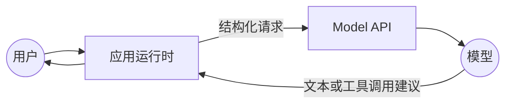
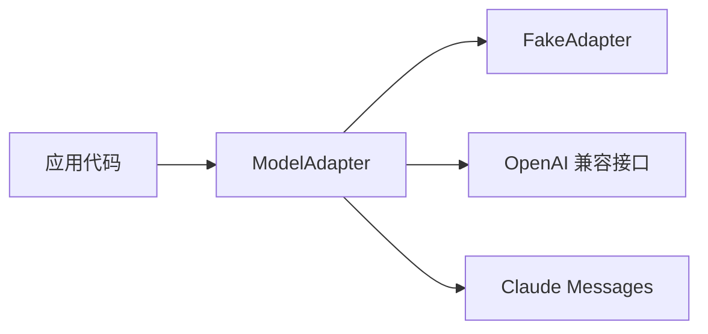

# 00 起步：先把一次模型调用看懂

> 这一课只建立一张图：应用把什么交给模型，模型返回什么，哪些事情仍然必须由代码负责。三家接口的完整字段表和排错细节放在[模型接口参考](../../reference/model-interfaces.md)，不放在主线里逐项背。

<details class="case" markdown="1">
<summary>例子：把 Chat Completions 的 role=tool 消息发给 Claude，第二次请求返回 400</summary>

OpenAI 兼容接口的工具结果通常是 `role="tool"` 消息，Claude Messages 则要求把 `tool_result` 放进 `role="user"` 的内容块。应用如果把前一种形状原样发给后一种接口，第二次请求就会被拒绝。

这不是模型能力问题，而是适配器没有完成角色和字段映射。完整对照见[模型接口参考](../../reference/model-interfaces.md)。

!!! note "构造的例子"
    请求和 400 是为说明角色映射构造的；真实接口的错误文本会随供应商和版本变化。规则见 [Anthropic Tool use 文档](https://platform.claude.com/docs/en/agents-and-tools/tool-use/overview)（访问日期 2026-09-10）。

</details>

## 先记住四个边界

一次调用里有四个角色：

1. **应用**组装输入、保存状态、校验结果、执行工具。
2. **API**负责鉴权、协议和传输，不自动理解你的业务规则。
3. **模型**根据输入生成文本或工具调用建议，不直接改变外部世界。
4. **业务系统**保存订单、文件、权限等事实，不能把模型的话当成事实。

模型是概率性部件。同样的输入可能得到不同输出，所以“请求成功”不等于“业务正确”。正确性要靠代码校验和评测集确认。

如果 `async`、HTTP/JSON 还不熟，先看[工程能力索引](../../prerequisites/engineering-foundations/README.md)里的“最小开工组合”。不用读完整个前置组。

## 一次调用的最小闭环



应用发送的输入通常包含四类信息：消息或指令、可用工具、抽样参数、模型名。模型返回文本，或者返回“我建议调用某个工具”的结构化结果。模型不会替你查数据库、发邮件或修改订单。

### 先跑通一次

下面是本课唯一的可复制最小例子。它使用 OpenAI 兼容接口；模型名和价格会变化，运行前以供应商文档为准。

```bash
python -m pip install openai
export DEEPSEEK_API_KEY=sk-...
```

```python
import os
from openai import OpenAI

client = OpenAI(
    api_key=os.environ["DEEPSEEK_API_KEY"],
    base_url="https://api.deepseek.com",
)
response = client.chat.completions.create(
    model="deepseek-v4-flash",
    messages=[{"role": "user", "content": "用一句话解释什么是 token"}],
)
print(response.choices[0].message.content)
```

这段代码只验证三件事：密钥可用、网络可达、响应能被 SDK 解析。它没有解决多轮状态、工具执行和业务校验，那些是后面的课。

### 模型想调用工具时

模型返回 `tool_calls` 时，外部世界仍然没有变化。运行时要检查工具名、校验参数、检查权限，再决定是否执行。工具返回结果后，运行时把结果放回下一次请求。

```python
reply = model.complete(messages, tools=available_tools)

if reply.tool_calls:
    call = reply.tool_calls[0]       # 模型提出建议
    args = validate(call.arguments)  # 代码校验参数
    result = run_tool(call.name, args)  # 代码决定是否真的执行
    messages.append(tool_result(call.id, result))
```

这段代码只为说明边界，省略了异步调用、错误分类和确认门，不能直接运行。第 05 课讲工具守卫，第 06 课讲多轮循环。

## 三套接口只先记三处差异

不要先背几十个字段。跨供应商时，先检查下面三件事：

| 要检查的地方 | Chat Completions | Responses | Claude Messages |
|---|---|---|---|
| 输入形状 | `messages` 列表 | `input` 或条目列表 | `messages` 列表，`system` 独立 |
| 工具结果 | `role="tool"`，配 `tool_call_id` | `function_call_output`，配 `call_id` | `role="user"` 中的 `tool_result`，配 `tool_use_id` |
| 多轮状态 | 默认由应用重发历史 | 可用 `previous_response_id`，语义看服务端 | 通常由应用重发历史 |

这三处决定了最常见的 400 和状态误判。Responses 的服务端状态、Claude 的内容块、各家模型的特殊字段属于参考细节，不是本课的核心结论。

## 适配器放在哪里

应用代码不应该到处读取某一家 SDK 的字段。给应用留一个自己的边界即可：输入是消息和工具，输出是统一的文本、工具调用、用量和错误。



适配器值得保留的理由有三个：

- **隔离协议差异**：角色、字段名、错误类型只在一层转换。
- **支持离线验证**：fake adapter 可以按剧本返回确定结果。
- **集中替换成本**：换供应商时，业务代码不需要跟着改。

但适配器不保证模型行为相同。上下文上限、工具调用稳定性、价格和输出质量仍要用同一份评测集重新验证。一次性脚本可以直接调 SDK；会持续迭代的服务再加这层。

## 怎么测自己真的懂了

完成下面三件事就够：

1. 跑通上面的最小调用，并能指出消息、模型名和响应文本分别在哪里。
2. 看到一个工具调用时，能说清为什么它只是建议，以及哪几步必须由代码执行。
3. 面对 OpenAI 和 Claude 的工具结果，能指出角色、配对 ID 和内容块的差异。

这三条分别对应本课的调用闭环、工具边界和适配器职责。后续每课会把其中一条展开，并留下更具体的验证方法。

## 第一次调用常见的四类失败

- **401 或鉴权错误**：密钥、`base_url` 和供应商不匹配。
- **模型不存在或 400**：模型名已下线，先查供应商的模型列表。
- **工具结果被拒绝**：把一家接口的角色或配对 ID 原样发给另一家。
- **模型没有调用工具**：工具描述不清，或者模型判断直接回答更合适；不能把“出现工具调用”当成必然结果。

更完整的字段差异、Responses 的状态语义、代理环境和各家错误形状，放在[模型接口参考](../../reference/model-interfaces.md)。

## 参考实现与下一步

课程正文只讲机制，参考实现才提供可运行服务。先看[参考项目路线](../../reference/project-playbook.md)里的 fake adapter，再按需要运行真实模型。对应代码在 [ai-app-engineering-ref 的 M1 API 骨架](https://github.com/lance2016/ai-app-engineering-ref/tree/main/project/m1-api-skeleton)，核对日期 2026-09-10。

下一课 [01 从模型到应用](../how-llms-work/README.md)继续回答：模型能力、成本和选型怎么比较。

---

[下一课 01 →](../how-llms-work/README.md)
