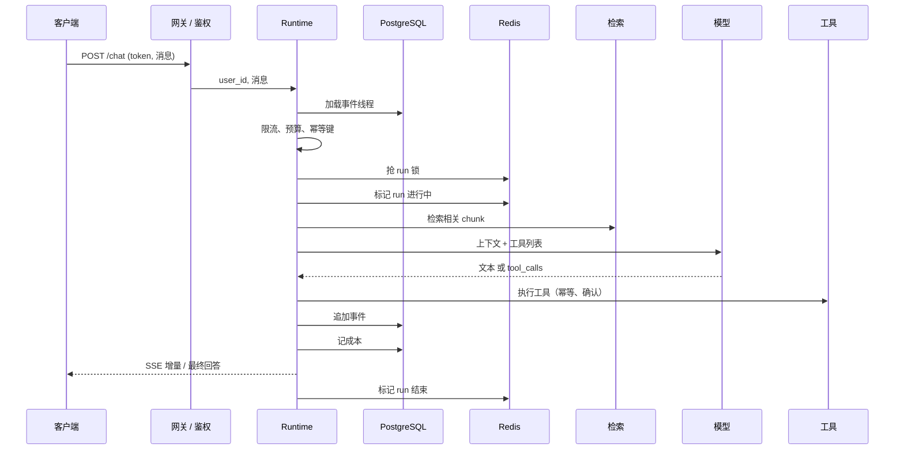

# 18 AI 应用系统架构与端到端数据流

> 前面十几课各讲一个部件。这一课把它们放回一条完整的请求链里：从客户端发出请求，经过网关、会话、上下文、模型、工具、检索，再回到客户端。看清每一跳做什么、耗时在哪、状态归谁，你就知道该往哪加东西、出了问题该去哪看。

<details class="case" markdown="1">
<summary>例子：用户说「越来越慢」，四个团队各看各的面板，四个面板都是绿的</summary>

一个 Agent 应用，用户反馈首字要等四五秒。四个人分头查：

| 谁 | 看的东西 | 结论 |
|---|---|---|
| 网关 | p95 延迟 38ms | 不是这一跳 |
| 检索 | 向量查询 p95 62ms | 不是这一跳 |
| 模型 | 首 token 480ms | 不是这一跳 |
| 前端 | 收到第一个 SSE 事件就渲染 | 不是这一跳 |

四个数字加起来不到 0.6 秒。用户等的那四五秒在哪，没有一个面板回答得了。

后来是在一次请求上逐跳打时间戳才看出来：加载事件线程 1.9 秒（这个会话攒了 700 多条事件，每次全量读出来重算一遍），上下文组装 0.4 秒，检索之前还串着一次权限查询 0.3 秒。

这三跳不属于任何一个团队：它们算不上一个「服务」，只是 runtime 里三段没人计时的代码。每个部件都有自己的指标，链路本身没有。

!!! note "构造的例子"
    这四个数字和那次逐跳计时是为讲清端到端数据流编的。本课 [事件驱动之后，trace 成了唯一地图](#事件驱动之后trace-成了唯一地图) 那一节才是作者自己的经历。

</details>

## 一次请求为什么会在系统里走丢

部件单独看都能工作，组合后却常在边界处出问题：请求、流、状态、后台任务和数据存储的生命周期不同。端到端数据流是排障地图。

## 系统图要能回答什么

- 能画出一次 AI 应用请求的完整链路，标出每一跳的职责和它读写的状态
- 能说清同步请求、SSE 流式、长任务三种形态各适用什么场景
- 能划出 Redis 和 PostgreSQL 的边界，并用「把缓存清空」这个实验证明边界画对了

## 系统图需要哪些零件

- [07 Agent State 与 Runtime](../agent-state-and-runtime/README.md)：事件线程和事件流，本课的持久化就是存它
- [15 RAG 端到端](../rag-end-to-end/README.md)：检索这一跳的内部

## 先沿着一条请求走一遍

### 一条请求链



每一跳回答一个问题：网关回答「你是谁、能不能进来」，线程加载回答「之前发生过什么」，检索回答「这次需要哪些外部知识」，模型回答「下一步做什么」，工具回答「外部世界怎么变了」，持久化回答「这次发生了什么」。

模型调用只是链路中的一跳。鉴权、状态、工具、持久化和错误处理同样决定用户能不能拿到可重复的结果；不要用一个项目的工时比例去推断另一个项目。

### 三种形态

| 形态 | 客户端拿到什么 | 适合 | 代价 |
|---|---|---|---|
| 同步 | 等到最后拿一个完整回答 | 短请求、内部 API、批处理 | 用户盯着空白等 |
| [SSE](https://developer.mozilla.org/en-US/docs/Web/API/Server-sent_events/Using_server-sent_events) 流式 | 边生成边收增量，最后一个 done 事件 | 对话界面 | 代理和负载均衡要配成不缓冲 |
| 长任务 | 立刻拿到 task id，之后轮询或订阅 | 超过几十秒的工作、批量、定时 | 要有任务表、worker、结果通知 |

三种形态**共用同一个 runtime 和同一条事件线程**，差别只在「什么时候把什么交给客户端」。

### 存储边界

| 放 Redis | 放 PostgreSQL |
|---|---|
| run 进行中的标记 | 事件线程 |
| 限流计数器 | 用户、会话、任务表 |
| 最近消息的热拷贝 | 长期记忆 |
| 幂等键的短期去重 | 文档 chunk 和向量（pgvector） |
| 任务队列 | 审计记录 |

判断标准只有一条：**这个东西丢了能不能重建**。能重建的放 Redis，不能的放 PostgreSQL。热拷贝可以同时放两边，但权威只有一个。

## 入口、状态、模型和外部系统如何接上

### 一、每一跳是一个小函数，自带计时

```python
class Hop:
    """给一跳计时，并作为运行时事件记进线程。"""
    def __init__(self, thread, name):
        self.thread, self.name = thread, name

    async def __aenter__(self):
        self.t0 = time.perf_counter()
        return self

    async def __aexit__(self, *exc):
        ms = (time.perf_counter() - self.t0) * 1000
        self.thread.append("hop", name=self.name, ms=round(ms, 1))

async def gateway_auth(thread, token) -> str:
    async with Hop(thread, "gateway/auth"):
        return verify(token)          # 身份只解析一次，之后往下传

async def retrieve(thread) -> str:
    async with Hop(thread, "retrieval"):
        return await hybrid_search(...)

async def call_model(thread, model, context) -> ModelResponse:
    async with Hop(thread, "model"):
        return await model.complete(thread.to_messages() + [system(context)], tools=tools)
```

`hop` 事件是第 20 课 trace 的雏形。**每一跳都记时间，从第一天开始。** 事后加计时要动每一个函数，一开始就有则几乎零成本。

不要把某个项目的耗时分布当成基准。模型首块、检索、数据库和排队时间都要在自己的请求上实测；**优化方向由这张表决定**，不是靠猜。

### 二、三种形态共用一条链

```python
async def run_sync(model) -> str:
    thread = Thread()
    user = await gateway_auth(thread, token)
    await load_session(thread, user)
    ctx = await retrieve(thread)
    reply = await call_model(thread, model, ctx)
    thread.append("assistant_message", content=reply.content)
    await persist(thread)
    return reply.content              # 全做完才返回

async def run_stream(model) -> AsyncIterator[str]:
    ...                               # 前面完全一样
    async for delta in model.stream(...):
        yield delta                   # 边生成边给
    thread.append("assistant_message", content=full_text)
    await persist(thread)             # 持久化在流结束之后

async def run_task(model) -> str:
    task_id = new_id()
    asyncio.create_task(worker(task_id, model))   # 后台做
    return task_id                                # 立刻返回
```

三者可以复用同一条 runtime 链，但交付语义不同：同步请求要等结果，SSE 要处理断线和部分结果，长任务还要有任务状态和 worker。复用核心逻辑，别复用错误的超时和持久化策略。

流式那支要注意：`persist` 在流结束之后。如果客户端中途断开，已经生成的部分要不要存？多数场景要存（用户刷新页面还能看到），所以更稳的做法是边流边增量落库。

### 三、SSE 端点的两个头

```python
@app.get("/chat")
async def chat(q: str) -> StreamingResponse:
    return StreamingResponse(
        agent_events(q),
        media_type="text/event-stream",
        headers={"Cache-Control": "no-cache",
                 "X-Accel-Buffering": "no"},      # ← 不加这个，Nginx 会缓冲整个响应
    )

async def agent_events(question: str) -> AsyncIterator[str]:
    async for i, delta in enumerate_deltas(question):
        yield f"id: {i}\nevent: delta\ndata: {json.dumps(delta)}\n\n"
    yield "event: done\ndata: {}\n\n"
```

SSE 的帧格式就这么简单：`event:` 一行、`data:` 一行、空行结束。`id:` 可选，但加上之后浏览器断线重连会带 `Last-Event-ID` 头，你可以从那里续传。

`X-Accel-Buffering: no` 是给 Nginx 看的。不加它，本地测试完全正常，上了生产变成「等很久然后一次全出来」——这是流式最常见的上线事故。Nginx 侧还要配 `proxy_buffering off`。

### 四、用「清空缓存」验证存储边界

```python
def handle_turn(thread, cache, repo, text):
    cache.set(f"run:{thread.thread_id}", "in_progress", ttl=30)   # 便宜、可重建
    thread.append("user_message", content=text)
    thread.append("assistant_message", content=answer)

    repo.save(thread)                                    # ← 权威在这里
    cache.set(f"thread:{thread.thread_id}", thread.to_json())     # 热拷贝，只是加速

    cache.set(f"run:{thread.thread_id}", "idle", ttl=30)

def load_thread(thread_id, cache, repo) -> Thread | None:
    hot = cache.get(f"thread:{thread_id}")
    if hot:
        return Thread.from_json(hot)
    return repo.load(thread_id)         # 缓存没有就落到事实来源
```

验证方法就一句话：**跑两轮对话，清空缓存，再加载一次。**

- 对话还在 → 边界画对了。
- 对话没了 → 历史只存在缓存里，Redis 一重启用户的对话就全没了。

这个错误在原型阶段特别常见，因为「先放 Redis 快」。写这个五分钟的测试，比上线后处理数据丢失便宜得多。

## 分层之后，故障会藏在哪里

**历史只在缓存里。** 见第四节。

**SSE 被代理缓冲。** 见第三节。

**长任务用 HTTP 长连接硬等。** 一个 90 秒的任务用同步请求做，客户端超时、网关超时、负载均衡超时三个地方都可能先断。

**每一跳都自己连数据库。** 网关查一次用户，runtime 再查一次，工具又查一次。连接数和延迟都翻倍。**用户身份在网关解析一次后作为参数往下传。**

## 单体、队列和事件流怎么选

- **单体 vs 拆服务。** 一条链上的跳先放在一个进程里，用模块边界隔开。等某一跳（通常是检索或工具执行）需要独立扩容或独立部署时再拆。过早拆服务换来的是网络调用和分布式状态，不是可维护性。
- **SSE vs WebSocket。** SSE 单向、走普通 HTTP、浏览器原生支持自动重连，对话界面够用。WebSocket 双向，语音这类需要客户端持续上行的场景才需要。
- **热拷贝放不放。** 每次都从 PostgreSQL 读线程，简单但慢；加 Redis 热拷贝快，但多一个要保持一致的地方。判断它是不是缓存有个简单办法：把 Redis 清空，系统应该只是变慢；如果会丢数据或者行为变了，那它就不是缓存，是第二个事实来源。

## 把边界画成可检查的接口

- **每一跳的超时要分别设。** 一个总超时会让你分不清是检索慢还是模型慢。分开设，超时异常里带上是哪一跳。
- **`hop` 事件要能开关采样率。** 全量记录在高 QPS 下是可观的写入压力。
- **长任务要有状态查询接口和取消接口。** 只能提交不能查、不能取消的任务系统，运维起来非常痛苦。
- **健康检查要分层**：`/healthz` 只看进程活着，`/readyz` 要探数据库和 Redis。两者混在一起会让滚动发布把还没连上数据库的实例放进流量。
- **怎么测。** 上面那个「把 Redis 清空」的实验就是一条测试，写下来：清空缓存，断言请求仍然成功、只是变慢。另外两条：断言每一跳的超时异常里带了是哪一跳（否则排障时分不清检索慢还是模型慢），以及断言数据库连不上时 `/readyz` 真的返回失败而 `/healthz` 仍然通过。三条都不需要模型（第 19 课）。

## 框架只编排局部，系统边界仍归你

| 本课概念 | LangGraph | OpenAI Agents SDK | Claude Agent SDK |
|---|---|---|---|
| 请求链 | 图 + checkpointer + 自己包 API | `Runner` + session + 自己包 API | SDK client + 自己包 API |
| 流式 | `astream_events` | `run_streamed` | 消息流 |
| 长任务 | LangGraph Platform 提供托管 | 自己做 | 自己做 |

**HTTP 这一层三个框架都不管**，网关、鉴权、SSE、任务队列全是你自己的代码——这也是本课存在的理由。官方文档：[LangGraph](https://langchain-ai.github.io/langgraph/) · [OpenAI Agents SDK](https://openai.github.io/openai-agents-python/) · [Claude Agent SDK](https://docs.claude.com/en/api/agent-sdk/overview)（核对日期 2026-09-05）。

## 事件驱动之后，trace 成了唯一地图

语音机器人项目是一个「两个进程通过 PostgreSQL、Redis 和实时音视频通道通信」的系统。

一个真实的架构教训：早期把「当前处于哪个子 Agent」这个状态放在 Redis。进程重启后状态丢了，但 PostgreSQL 里的对话历史还在，两边不一致，机器人「忘了自己在玩游戏」。按本课的边界表，这个状态要么从历史推导，要么落 PostgreSQL，**唯独不能只在 Redis**。

另一个和三种形态相关的经验：语音场景的模型输出是流式的，但设备端的动作指令必须等一个完整的工具调用才能下发。所以同一条响应里文本走流式、指令走「攒够再发」——两种形态在一个请求里并存。

## 用一条请求检查整条链

参考项目的完整编排把应用、PostgreSQL、Redis 和 Phoenix 放在一起：

```bash
cd ai-app-engineering-ref
docker compose --profile full up -d --build --wait
curl http://localhost:8000/healthz
curl http://localhost:8000/readyz
```

打开 `http://localhost:8000/playground` 发一条消息，再到 `http://localhost:6006` 看同一次请求的 span。`/healthz` 只回答进程是否活着，`/readyz` 会分别检查 PostgreSQL、Redis 和模型；这两个接口正好对应上面说的存储边界和分层健康检查。结束后运行 `docker compose --profile full down`，不要加 `-v`，这样可以保留本地数据卷。

参考实现当前只有一条面向对话的 SSE 消息接口，没有实现长任务队列。请求进入 [`routes/threads.py`](https://github.com/lance2016/ai-app-engineering-ref/blob/main/project/src/aiapp/api/routes/threads.py) 后，先做租户限流和日预算检查，再处理 `Idempotency-Key`、抢线程锁；模型首块到达前发生超时会返回错误状态，之后每个事件写入 PostgreSQL，流结束时记成本。这个顺序就是图中「控制面在模型之前、事实写入在流式过程中」的一个可运行例子。

## 参考实现里的服务装配

整条请求链在 [`api/app.py`](https://github.com/lance2016/ai-app-engineering-ref/blob/main/project/src/aiapp/api/app.py) 装配，租户与依赖注入在 [`deps.py`](https://github.com/lance2016/ai-app-engineering-ref/blob/main/project/src/aiapp/api/deps.py)，一次消息从进来到 SSE 出去的全过程在 [`routes/threads.py`](https://github.com/lance2016/ai-app-engineering-ref/blob/main/project/src/aiapp/api/routes/threads.py)。想对着这一课的图找代码，[参考实现总览](https://github.com/lance2016/ai-app-engineering-ref/blob/main/project/README.md) 那张课程到文件的映射表最快。

## 从服务装配继续读部署

- [ai-agents-for-beginners · 16 Deploying Scalable Agents](https://github.com/microsoft/ai-agents-for-beginners/blob/main/16-deploying-scalable-agents/README.md)（访问日期 2026-09-04）：「From Prototype to Production」那张七行的对照表和「Scaling Strategies」一节是通用的。
- [MDN · Using server-sent events](https://developer.mozilla.org/en-US/docs/Web/API/Server-sent_events/Using_server-sent_events)（访问日期 2026-09-04）：SSE 帧格式和浏览器端 `EventSource` 的重连行为。
- [FastAPI · Custom Response](https://fastapi.tiangolo.com/advanced/custom-response/)（访问日期 2026-09-04）：`StreamingResponse` 的用法。
- [Redis · Data store 入门](https://redis.io/docs/latest/develop/get-started/data-store/) 与 [PostgreSQL · 事务](https://www.postgresql.org/docs/current/tutorial-transactions.html)（访问日期 2026-09-04）：两边各看一页，理解「能丢」和「不能丢」的差别在哪。

---

[← 上一课 17](../data-engineering/README.md) · [下一课 19 →](../evaluation/README.md)
