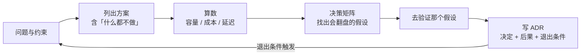

# 26 系统设计与技术决策

> 前面的课教你怎么把每一层做对。这一课教你在还没动手之前做决定：自建还是买、检索还是微调、Workflow 还是 Agent、单体还是平台。**决定的质量不取决于你知道多少方案，取决于你能不能把假设写出来、算出来、并给它一个退出条件。**

<details class="case" markdown="1">
<summary>例子：向量检索自建还是买，会开了三周；白板上算了十分钟，方案自己出局了</summary>

一派说托管服务贵、还有数据出境问题；一派说自建要人、要运维、要处理分片。会开了三周，没有一个人算过数。

后来在白板上花了十分钟，把假设一条条写出来：

| 假设 | 值 | 从哪来 |
|---|---|---|
| 日活 | 3000 | 产品给的一年目标 |
| 每人每天问几次 | 4 | 内部试用的实测 |
| 文档 chunk 总数 | 40 万 | 现有知识库切完的量 |
| 向量维度 | 1024 | embedding 模型已经定了 |
| 峰值是均值的几倍 | 6 | 用量集中在上班时段 |
| 托管方案报价 | 按上面这个量向两家问的价，取贵的那个 | 报价单，不是估的 |
| 运维谁做 | 现有后端团队顺手带，不新招人 | 团队负责人口头确认 |

算出来：平均 QPS 0.14，峰值不到 1；原始向量常驻内存 40 万 × 1024 维 × 4 字节 ≈ 1.6G，近似索引本身还要再占一块，量级上按 2G 出头准备。一台机器绰绰有余，托管方案一年的订阅费不够付半个人的工资。

按这几个假设，自建赢。但结论只在假设成立时成立，两条要盯住：**「日活 3000」是产品目标，不是已经发生的事实**——日活 3 万，两边的数字全部重算；**「运维顺手带」也是一句口头承诺**——真要专人值班、做备份和升级，人力成本就该记到自建这一侧，那一栏现在是空的。

所以这份记录最后一行写的是退出条件：**日活过 1 万，或者 chunk 数过 300 万，或者这套索引需要专人值班，这个决定重开。**

三周的争论里，没有一句话是关于这个数的。

!!! note "构造的例子"
    这张假设表和算出来的数字是为讲清「算数是决策的产出物」编的。本课 [第二个退出条件真的被触发过](#第二个退出条件真的被触发过) 那一节才是作者自己的经历。

</details>

## 选型争论为什么总是没有结果

技术选型不是列出最多方案，而是找出会改变结论的假设。没有容量、成本、威胁和退出条件的方案，无法被团队复盘，也无法被安全地替换。

## 技术决策要留下什么

- 能用同一套框架处理四类常见决策，并写出可被推翻的假设
- 能为一个 AI 服务做容量与成本估算，说清 Little's law 的适用条件，以及为什么峰值加 p95 只是它的一个保守用法
- 能针对模型并发、SSE 连接、数据库连接池、工作进程分别定容量，而非拿同一个数去填所有池子
- 能写一份带备选方案和退出条件的 ADR

## 技术决策从哪条请求链开始

- [18 系统架构与端到端数据流](../system-architecture/README.md)：本课的估算落在那条请求链的每个环节上
- [09 Workflow 还是 Agent](../workflow-vs-agent/README.md)：本课把那一课的架构选择放进更大的决策框架

## 先写假设，再比较方案



**决策是一份可以被推翻的文档，不是一次会议。** 五步，每步一个产出物：

1. **写清约束**：数据边界、合规、团队规模、预算、上线时间。**约束比目标更能筛掉方案。**
2. **列方案时永远包括「不做」和「最简单的那个」。** 很多时候人工加规则就够，AI 方案要证明自己比它好。
3. **算数。** 日请求量、峰值 RPS、并发运行数、每日 token、每日花费、数据库写入。数不用精确，但要有，且每个数字能追溯到一个假设。
4. **决策矩阵的真正产出是敏感性。** 哪一个权重挪 10% 结论就翻？那就是你现在最该去验证的假设，而不是继续开会。
5. **ADR 记决定，更记后果和退出条件。**

四类决策的常见翻盘点：

| 决策 | 通常的默认 | 会翻盘的假设 |
|---|---|---|
| Build vs Buy | 核心差异化自建，通用能力买 | 供应商的数据驻留或退出成本；你的 trace 格式是否被支持 |
| 模型 vs RAG vs 微调 | 知识用 RAG，行为用提示词，两者都不够再微调 | 知识更新频率；删除义务；是否需要引用 |
| Workflow vs Agent | 能枚举步骤就 Workflow | 路径是否真的不可枚举；失败代价是否允许探索 |
| 单体 vs 平台 | 第二个团队出现之前是单体 | 有没有真实的第二个消费者；配额和隔离是否已经成为事故来源 |

## 从容量算式到退出条件

### 一、容量估算：假设是一张表，不是一段话

```python
@dataclass(frozen=True)
class Assumptions:
    daily_active_users: int
    turns_per_user_per_day: float
    input_tokens_per_turn: int        # 系统提示 + 历史 + 检索结果
    output_tokens_per_turn: int
    tool_calls_per_turn: float
    peak_factor: float                # 峰值 RPS / 平均 RPS
    p95_turn_seconds: float
    price_in_per_mtok: float
    price_out_per_mtok: float
    cache_hit_ratio: float = 0.0      # 命中前缀缓存的输入 token 占比
    cheap_route_share: float = 0.0    # 路由到便宜模型的轮次占比
```

推导：

```python
def estimate(a: Assumptions) -> Estimate:
    turns   = a.daily_active_users * a.turns_per_user_per_day
    avg_rps = turns / 86_400
    peak_rps = avg_rps * a.peak_factor

    # Little's law 是 L = λ × W：稳态下平均在途数 = 平均到达率 × 平均停留时间。
    # 这里代入峰值 rps 和 p95，两个都往大取，算出来是峰值时段的保守上界。
    concurrent_peak = peak_rps * a.p95_turn_seconds

    tok_in  = turns * a.input_tokens_per_turn
    tok_out = turns * a.output_tokens_per_turn

    effective_in_price = a.price_in_per_mtok * (
        (1 - a.cache_hit_ratio) + a.cache_hit_ratio * CACHED_PRICE_RATIO)
    blended = (1 - a.cheap_route_share) + a.cheap_route_share * CHEAP_PRICE_RATIO
    cost = (tok_in / 1e6 * effective_in_price
          + tok_out / 1e6 * a.price_out_per_mtok) * blended

    # 一轮写入：user_message、assistant_message、tool_result 若干、run_finished
    writes_per_turn = 3 + 2 * a.tool_calls_per_turn
    return Estimate(turns, avg_rps, peak_rps, concurrent_peak,
                    tok_in, tok_out, cost, peak_rps * writes_per_turn)
```

**这一行要说清它是什么。** Little's law 写成 L = λ × W，三个前提都在字面上：稳态下，系统里的平均在途请求数，等于平均到达率乘以平均停留时间。上面代入的是峰值 rps 和 p95 停留时间，两个都刻意往大取了，所以出来的数已经不是定律里那个平均在途数了，它给的是「峰值那几分钟大概要备多少并发」的一个上界。做容量规划要的正是这个上界，但它是两次放大之后的工程估计，不是一条定律算出来的准确值。真要算平均在途数，λ 用 `avg_rps`、W 用平均耗时，两个数会小很多。

改 `p95_turn_seconds` 看并发数怎么变，你会明白**第 21 课的延迟优化同时也是容量优化**：把 p95 从 8 秒降到 4 秒，需要的并发容量直接减半。

**这个数不能拿去填所有的池子。** 每种资源的停留时间不一样，同一个 λ 配不同的 W，得到的 L 差很远：

| 要定的数 | 该用哪个停留时间 | 为什么 |
|---|---|---|
| 模型并发调用数 | 一次模型调用的耗时 | 一轮里可能调好几次模型，中间还夹着等工具的时间 |
| HTTP / SSE 连接数 | 整轮，加上连接建立和收尾 | 流式连接从建立到关闭全程占着，比模型调用长 |
| 工作进程 / 协程数 | 整轮里实际占着执行单元的那部分 | 异步实现等 IO 时不占，同步实现全程占 |
| 数据库连接池 | 每轮实际握着连接的毫秒数 | 通常是整轮的百分之几，照整轮算会大出几十倍 |
| 队列长度与消费者数 | 由到达率和消费速率的差决定 | 和上面几行不是同一个公式，属于排队模型那一套 |

拿整轮的 p95 去申请数据库连接池，是这张表里最常见的错：池子大出几十倍，白占内存，还可能把数据库的连接上限先撞穿。

一组示例数字。假设全部摊开，为的是让这张表能被复算：5 万日活、每人 6 轮、每轮 6000 输入 token 和 300 输出 token、每轮 1.2 次工具调用、峰值是均值的 4 倍、p95 8 秒、输入 0.5 输出 1.5 USD 每百万 token、缓存命中部分按原价一折、便宜模型按两折算。

| 场景 | 轮次/天 | 峰值 rps | 并发 | 输入 tok/天 | USD/天 | 写入/秒 |
|---|---:|---:|---:|---:|---:|---:|
| 基线 | 300,000 | 13.9 | 111 | 1800M | 1,035 | 75 |
| + 前缀缓存 60% | 300,000 | 13.9 | 111 | 1800M | 549 | 75 |
| + 50% 走便宜模型 | 300,000 | 13.9 | 111 | 1800M | 329 | 75 |

**两个杠杆都只动成本，不动容量。** 想动容量就得动 `p95_turn_seconds` 或 `input_tokens_per_turn`。这张表把「该优化什么」变成一个能回答的问题。

### 二、ADR：多两个字段

[Nygard](https://cognitect.com/blog/2011/11/15/documenting-architecture-decisions) 的原始格式是标题、上下文、决定、状态、后果。这门课坚持再加两个：

```python
@dataclass(frozen=True)
class ADR:
    number: int
    title: str
    status: str                  # proposed | accepted | superseded
    context: str
    options: list[Option]        # ← 加一：被否决的方案，连同它们的优缺点
    decision: str
    consequences: list[str]
    exit_criteria: list[str]     # ← 加二：什么观察结果应该让你重开这个决定
    decided_on: date
```

一个真实形态的 ADR（节选）：

> **ADR-007：租户知识用检索，不用微调**
>
> **上下文**：每个租户上传 200–5000 份文档，每周变化，合规要求 24 小时内可删除。回答必须带引用。团队两个人，没有 GPU 预算。
>
> **备选方案**
> - *每租户微调一个模型*：(+) 推理快，无检索跳 (−) 每周每租户重训 / 无法按要求删除某个事实 / 没有引用 / GPU 成本
> - *共享模型 + 每租户 RAG 索引*：(+) 删除 = 删 chunk (+) 引用天然有 (+) 只运维一个模型 (−) 检索质量封顶了回答质量 (−) 每轮多一跳延迟和 token
> - *长上下文：把全部文档塞进提示*：(+) 代码最简单 (−) 成本随语料线性涨 (−) 一千份以上装不下 (−) 无法归因来源
>
> **决定**：共享模型 + 每租户 RAG 索引（pgvector + BM25），租户 id 作为每次查询的硬过滤。
>
> **后果**
> - 需要带文档版本和删除的入库管线（第 17 课）
> - 上线前需要每租户 golden set 上的 Recall@k（第 19 课）
> - 回答延迟预算多一跳检索（p95 约 +150ms）
>
> **退出条件（任一为真就重开这个决定）**
> - 某个租户需要检索无法表达的风格 / 行为变化
> - 两轮切块和重排优化之后，检索召回率仍低于 0.8
> - 检索上下文带来的每轮 token 成本超过账单的 40%

**写不出退出条件，通常说明还没想清楚为什么选它。** 退出条件把「要不要改」从立场问题变成观测问题。

### 三、决策矩阵：真正的产出是敏感性

```python
CRITERIA = [
    Criterion("首次交付时间",      0.25),
    Criterion("和我们 trace 格式的契合度", 0.25),
    Criterion("数据驻留 / 合规",    0.20),
    Criterion("三年总成本",        0.15),
    Criterion("离开时的迁移成本",   0.15),
]
SCORES = {                       # 1..5
    "自建":       [1, 5, 5, 2, 5],
    "买 SaaS":    [5, 3, 2, 3, 2],
    "自托管开源": [3, 4, 5, 4, 4],
}
```

加权求和只是第一步。真正有用的是这个：

```python
def flips(step: float = 0.10) -> list[str]:
    """把 step 的权重从一个准则挪到另一个，看赢家变不变。"""
    base = [c.weight for c in CRITERIA]
    winner = rank(base)[0][0]
    found = []
    for i, src in enumerate(CRITERIA):
        for j, dst in enumerate(CRITERIA):
            if i == j or base[i] < step:
                continue
            w = base.copy()
            w[i] -= step
            w[j] += step
            if rank(w)[0][0] != winner:
                found.append(f"把 {step:.0%} 权重从『{src.name}』挪到『{dst.name}』-> 赢家变成 {rank(w)[0][0]}")
    return found
```

结果的读法：

- **几乎任何 10% 的挪动都不翻盘** → 结论稳健，可以定了。
- **一个 10% 的挪动就翻盘** → 你其实还没决定。去验证那个权重到底该是多少，而不是继续开会。

这是决策矩阵唯一不容易被滥用的用法。先有答案再填分数，矩阵就只是装饰。

## 设计决策最容易漏掉什么

**估算没有假设表。** 只有结论「需要 20 台机器」，没人能复核。假设要是一个数据结构，每个数字有名字，改一个看全局。

**决策矩阵用来证明已有结论。** 见第三节。

**ADR 没有退出条件。** 决策变成教条，情况变了没人敢改。

**平台化太早。** 第一个消费者还没稳定就抽象成平台，抽象层按想象中的第二个消费者设计，第二个真出现时发现不匹配。默认是单体，等真实的第二个团队来提需求。

## 可逆性、速度和锁定成本

- **精确 vs 及时。** 估算的目的是决策，误差在两倍以内就够用。花一周把误差压到 10%，往往不如先按两倍余量上线再用真实数据修正。
- **可逆决策与不可逆决策。** 换一个 reranker 是可逆的，直接试；选数据库、选多租户隔离模型是不可逆的，值得写 ADR 和做验证。精力花在不可逆的那几个上。
- **自建的隐性成本。** 自建的账面成本是工程时间，隐性成本是维护、值班、安全补丁和「没人敢改」。Buy 的隐性成本是退出成本和数据出境。矩阵里两者都要有一列。

## 让 ADR 能被复算和监控

- **ADR 进代码仓库**，和代码一起 review、一起版本化。放在 wiki 里的 ADR 半年后没人找得到。
- **容量估算要复盘。** 上线三个月后拿真实数据对一遍假设表，看哪个假设错得最离谱。下次估算会准很多。
- **退出条件要有人盯。** 写进 ADR 还不够，最好能对应到一个仪表盘或一条告警。
- **「什么都不做」要真的评估。** 它是唯一零成本、零风险的方案，很多时候被跳过是因为它不够有趣，而不是因为它不够好。
- **怎么测。** 估算部分能测：把假设表写成代码里的常量，断言 `concurrent_peak` 那一步算出来的数和手算一致，断言把 p95 减半时它跟着减半，改一个假设时哪些结论跟着变也就看得见了。ADR 部分测不了，但退出条件可以：每条退出条件对应一条告警，那条告警本身要有测试，否则条件被触发时没人知道。

## 选框架本身也是一次决策

选框架本身就是一次本课讲的决策。三个候选的翻盘点：

| 假设 | 如果为真 | 倾向 |
|---|---|---|
| 系统大部分是确定性流程，少数节点交给模型 | 图模型贴合 | LangGraph |
| 需要多个专家 Agent 互相交接 | handoff 是内置能力 | OpenAI Agents SDK |
| 只用 Claude，且需要深度 MCP / Skill 集成 | 生态最完整 | Claude Agent SDK |
| 需求还在变，或者要保留换供应商的能力 | 框架的抽象反而是负担 | 直接调 API |

官方文档：[LangGraph](https://langchain-ai.github.io/langgraph/) · [OpenAI Agents SDK](https://openai.github.io/openai-agents-python/) · [Claude Agent SDK](https://docs.claude.com/en/api/agent-sdk/overview)（核对日期 2026-09-05）。更完整的对比见 [reference/frameworks.md](../../reference/frameworks.md)。

## 第二个退出条件真的被触发过

语音机器人项目里的一个决策实例：意图分类最初用大模型直接做，延迟和成本都高。备选是微调一个小模型专做分类，或者用规则加关键词。最终选了微调小模型加大模型兜底的双模型方案。

当时写下的退出条件是两条：「小模型分类准确率在新意图上线后两周内跌破阈值」和「两个模型的结果冲突率超过某个比例」。

**后来第二个条件真的被触发过一次**，团队据此调整了冲突时的裁决规则，而不是争论方案对错。当时没有人需要先说服谁。

## 用 M6 RFC 对照 ADR

参考项目把这一课的产物放在 [`m6-platform-design`](https://github.com/lance2016/ai-app-engineering-ref/tree/main/project/m6-platform-design)：先读多租户平台 RFC，再看每个 ADR 的备选、假设、容量数字和退出条件。它当前是设计稿，不能当成已经上线的架构；读者要检查的是一条决定能否被复算、被监控、被撤回。

## 参考实现里的 M6 决策

这一课的产物是文档，不是代码。[M6 综合设计](https://github.com/lance2016/ai-app-engineering-ref/blob/main/project/m6-platform-design/README.md) 是照这套框架写的一份多租户平台 RFC，四个 [capstone](https://github.com/lance2016/ai-app-engineering-ref/blob/main/project/capstones/README.md) 也都要求先写一页设计再动手。

## 从 ADR 继续读容量估算

- [Michael Nygard · Documenting Architecture Decisions](https://cognitect.com/blog/2011/11/15/documenting-architecture-decisions)（访问日期 2026-09-04）：ADR 的原始提议。本课加了备选方案和退出条件两节。
- [ADR GitHub organization](https://adr.github.io/)（访问日期 2026-09-04）：各种 ADR 模板和工具的汇总。
- [12-factor-agents · README](https://github.com/humanlayer/12-factor-agents/blob/main/README.md)（访问日期 2026-09-04）：把十二条当作设计评审清单，逐条问「这个方案违反了哪条、为什么可以接受」。
- [Anthropic · Building effective agents](https://www.anthropic.com/engineering/building-effective-agents)（访问日期 2026-09-04）：「从最简单的方案开始，只在需要时增加复杂度」，是 Workflow vs Agent 决策的出发点。
- [Little's law](https://en.wikipedia.org/wiki/Little%27s_law)（访问日期 2026-09-05）：容量估算里那一行的出处。

---

[← 上一课 25](../voice-agents/README.md) · [读完了？12 条工程原则是一张对照清单 →](../../principles/README.md)
