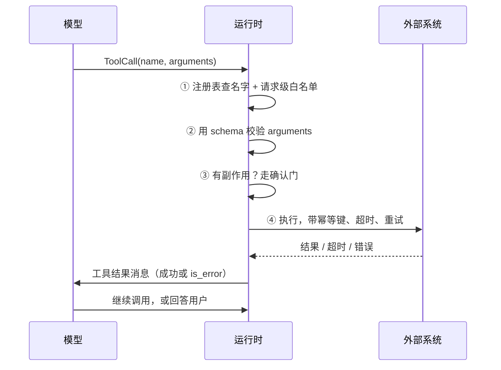

# 05 Tool Calling：从 Schema 到副作用

> 前四课的模型只会说话：给它文本，它回文本或者向量。这一课是它第一次能让外部世界真的发生变化——转一笔账、删一个文件、发一封邮件。而这些事它一件也做不了，中间那段代码全是你写的。

## 模型只能「请求」调一个工具

工具调用的机制只有三步。你把一组函数的名字、说明和参数 schema 一起发给模型；模型想用某个的时候，输出一段结构化 JSON，说「我想调 `refund`，参数是这些」；然后**你的代码**去查这个名字、校验参数、决定要不要真的执行。

要紧的是第二步和第三步之间那条缝。模型输出的那段 JSON 只是一个请求：那一刻账上的钱没动，文件没删，邮件没发。第 00 课[那段工具调用的示意代码](../setup/README.md)演示过这个往返，这一课要讲的全部内容，就是那条缝里应该有什么。

先看它缺东西的时候会怎样。

## 一次退款，两笔出账

一个客服 Agent，工具是 `refund(order, amount)`。运行时已经做了幂等：每次工具调用派生一个键，超时重试时带同一个键。下面是一次真实形态的出账记录。

!!! note "这段时间线是构造的教学案例"

    order 号、call id 和耗时都是编的，用来把两种「重复」摆在同一条线上看。本课的 [这个项目里真实发生过的](#这个项目里真实发生过的) 那一节才是作者自己的经历，两者不要混。

| 时刻 | 谁 | 发生了什么 |
|---|---|---|
| `T+0.00` | 用户 | 「把这笔 300 退给我」 |
| `T+0.31` | 模型 | `tool_call id=call_a1  refund(order="A-8871", amount=300)` |
| `T+0.34` | 运行时 | `POST /refunds`，`Idempotency-Key: toolcall:call_a1` |
| `T+0.44` | 网关 | 无响应。运行时 100ms 超时 |
| `T+0.44` | 运行时 | 重试，**同一个** key |
| `T+0.51` | 网关 | `200 {"refund_id": "rf_77", "replayed": true}` |
| `T+0.52` | 运行时 | 工具结果回喂模型 |
| `T+1.02` | 用户 | 「退了没？我没收到通知」 |
| `T+1.08` | 模型 | `tool_call id=call_b2  refund(order="A-8871", amount=300)` |
| `T+1.10` | 运行时 | `POST /refunds`，`Idempotency-Key: toolcall:call_b2` |
| `T+1.19` | 网关 | `200 {"refund_id": "rf_78"}` |

看 `T+0.51` 那一行：`replayed: true`，幂等键生效了，超时重试没有变成两笔。这一层是对的。

问题在 `T+1.08`。模型重新发起了一次退款，`call.id` 是新生成的 `call_b2`，从它派生的键也是新的，网关看到一个没见过的 key，于是老老实实又退了一笔。账上现在是 `rf_77` 和 `rf_78`，600 块。

**同一次调用的重试，和同一个业务意图被发起两次，是两件事，要用两个不同的键挡。** 只做前者，就会得到上面这张表。这是本课第四个守卫要解决的问题，也是三个主流框架都不替你做的那一项。

## 学习目标

- 能说出一次工具调用里，哪几步是模型的责任，哪几步只能是确定性代码
- 能写出四个守卫，并说清每个挡的是哪一种失败
- 能拿一段出错的调用记录，判断问题出在选工具、填参数还是执行

## 前置

- [02 模型调用、结构化输出与流式](../model-api-structured-output-streaming/README.md)：JSON Schema 怎么约束模型输出

## 四个守卫，各防一种失败

那条缝里，运行时要做四件事：



四个守卫各防一种失败。开头那张表挂在第四个上：

| 守卫 | 防什么 | 失败时怎么办 |
|---|---|---|
| ① 注册表与白名单 | 模型编造了不存在的工具名，或调了这个场景不该碰的工具 | 回一个 `is_error` 结果，不抛异常 |
| ② Schema 校验 | 参数缺字段、类型错、枚举值不在范围内 | 把校验错误原文回给模型，让它修 |
| ③ 确认门 | 用户没明确要求的副作用被执行 | 暂停，问用户；拒绝也是一个正常结果 |
| ④ 幂等键 | 副作用发生两次：一次调用的重试，或模型重发同一意图 | 两层键，一层从 `call.id` 派生，一层从业务确认派生 |

① 和 ② 的错误都是回给模型，不是抛给用户。模型拿到 `unknown tool: delete_user_data` 之后，通常会换一个存在的工具；拿到 `unit must be celsius or fahrenheit` 之后，通常会改参数。运行时不替它猜。

还有一条不在图里：动作只从工具调用通道取。模型在正文里写的任何 JSON，哪怕格式完美，都只是文本。用正则从回答里捞「函数调用」出来执行，是最常见的事故来源之一。

## 四个守卫怎么写

四段代码。它们的返回值永远是一条工具结果消息，成功和失败只差一个 `is_error`，所以调用方不需要写 try/except。

### ① 注册表：白名单在「告诉模型」时就生效

```python
class ToolRegistry:
    def specs(self, allowlist: frozenset[str]) -> list[ToolSpec]:
        """只把这次请求允许用的工具告诉模型。看不见的它选不了。"""
        return [t.spec for name, t in self._tools.items() if name in allowlist]

    def dispatch(self, call: ToolCall, allowlist: frozenset[str]) -> Message:
        tool = self._tools.get(call.name)
        if tool is None:
            return error(call, f"unknown tool: {call.name}")        # 编造的名字
        if call.name not in allowlist:
            return error(call, f"tool not allowed here: {call.name}")  # 存在但这里不许用
        return Message(role="tool", tool_call_id=call.id,
                       content=tool.handler(call.arguments))
```

`specs(allowlist)` 那一步是关键：白名单要在「告诉模型有什么」这一步就生效，不是等它选完再拒绝。把全部工具都发给模型，等于让它在只读场景里也能看见 `delete_doc`。

`dispatch` 里还要再查一遍，因为模型可能凭训练记忆调出一个你从没发过的工具名。两层都要有。

### ② Schema：一份用两次，错误回喂

```python
class GetWeatherArgs(BaseModel):
    city: str
    unit: Literal["celsius", "fahrenheit"] = "celsius"

WEATHER_SPEC = ToolSpec(
    name="get_weather",
    description="Current weather for a city.",
    parameters=GetWeatherArgs.model_json_schema(),   # ← 一份 schema，给模型看
)

def run_tool(call: ToolCall) -> Message:
    try:
        args = GetWeatherArgs.model_validate(call.arguments)   # ← 同一份，做校验
    except ValidationError as exc:
        return Message(role="tool", tool_call_id=call.id, is_error=True,
                       content=f"invalid arguments: {exc.errors()[0]['msg']}")
    return Message(role="tool", tool_call_id=call.id, content=get_weather(args))
```

模型返回 `{"unit": "kelvin"}` 时，它收到的是 `invalid arguments: Input should be 'celsius' or 'fahrenheit'`，下一轮通常就改对了。和第 02 课结构化输出是同一个套路：一份 schema 用两次。

### ③ 确认门：拒绝是正常结果

```python
SIDE_EFFECTING = frozenset({"delete_doc"})

async def run_tool(store, call: ToolCall) -> Message:
    if call.name in SIDE_EFFECTING and not await ask_user(call):
        return Message(role="tool", tool_call_id=call.id, is_error=True,
                       content="user declined; nothing was changed")
    return Message(role="tool", tool_call_id=call.id,
                   content=store.delete(call.arguments["doc_id"]))
```

拒绝要回给模型，让它体面回应（「好的，我把 doc_1 留着了」），而不是抛异常或者假装做了。

这里的 `ask_user` 是个同进程的假占位。真实场景里用户可能十分钟后才点确认，那时 HTTP 请求早就断了。把它变成能跨请求暂停恢复的状态，是第 07 课的内容。

### ④ 幂等键：开头那张表，缺的是第二层

第一层挡重试。同一次工具调用超时后重试，不能变成两笔。

```python
def retry_key(call: ToolCall) -> str:
    """一次工具调用一个键。call.id 是模型这次生成的，重试时不变。"""
    return f"toolcall:{call.id}"

async def run_refund(gateway, call, attempts=2, timeout=0.1) -> Message:
    key = retry_key(call)
    for attempt in range(1, attempts + 1):
        try:
            result = await asyncio.wait_for(
                gateway.refund(idempotency_key=key, **call.arguments), timeout)
            return ok(call, result)
        except TimeoutError:
            pass          # ← 用同一个 key 重试；网关会识别出这是重放
    return error(call, "refund status unknown after retries")
```

超时的语义是「不知道做没做」，不是「没做」。带同一个键重试，网关返回 `replayed: True`，账本里仍然只有一笔。开头那张表的 `T+0.44` 到 `T+0.51` 走的就是这一段，它是对的。

第二层挡重复意图。`T+1.08` 那次调用 `call.id` 是新的，所以上面这个键完全挡不住。用户点两次发送、Agent 恢复后重放一段历史，都会走到这里。

```python
def business_key(confirmation_id: str, call: ToolCall) -> str:
    """同一个业务意图只能发生一次，跨轮、跨会话重发都撞同一个键。"""
    canonical = json.dumps(call.arguments, sort_keys=True, separators=(",", ":"))
    return hashlib.sha256(f"{confirmation_id}:{call.name}:{canonical}".encode()).hexdigest()[:16]
```

这一层的键不能从 `call.id` 派生，只能从业务侧真正稳定的东西派生：这一次用户确认的 id、这个订单号、这个审批单号。`sort_keys=True` 在这里才有意义——两次生成的参数字典顺序可能不同，但只要值一样就该被认成同一个意图。

把这个键接上，开头那张表的最后三行就变成：

```
T+1.10  运行时 → 网关   Idempotency-Key: 3f9a1c...（confirmation_id 派生，与第一次相同）
T+1.17  网关  200 {"refund_id": "rf_77", "replayed": true}
T+1.18  运行时 → 模型  工具结果：这笔退款已经完成，refund_id rf_77
```

模型拿到的是「已经退了」，于是它去回答用户「已经退款成功，编号 rf_77」，而不是再退一笔。

两层各防各的。副作用重的工具两层都要有：只做第一层，模型重发就多一笔；只做第二层，同一次调用的网络重试可能因为参数序列化的细微差别漏过去。

## 这个项目里真实发生过的

一个语音机器人项目的模式（去掉了业务细节）：一个小模型专门做意图分类并输出工具调用，另一个大模型负责聊天。

小模型偶尔会输出训练时见过、但当前没注册的工具名，也会漏掉必填参数。早期的修法是改提示词，效果不稳定。后来的修法就是守卫 ① 和 ②：注册表查不到就当作「没有命令」回喂，参数校验失败就把错误回给它重试一次。**提示词一个字没改，问题消失了。**

另一个教训：大模型在聊天正文里偶尔会写出格式完美的函数调用 JSON，一度被运行时解析执行。修法是只认工具调用通道，正文一律当文本。

这两件事都不涉及幂等，因为那个项目的设备控制指令绝大多数是可重复的（调音量、切歌）。开头那张退款表是构造的，正是因为项目里没有资金类工具的事故可讲。

## 常见错误

**只用 `tool_call.id` 做幂等键。** 就是开头那张表。键里必须混入工具名和规范化后的参数，并且从业务侧稳定的 id 派生：同样的意图得到同样的键。

**把校验错误抛成异常。** 删掉守卫 ② 里那个 `except`，程序直接崩。模型本来有能力在下一轮修正参数，现在它连知道自己错了的机会都没有。

**给模型看全部工具。** 模型选不了它看不见的东西。白名单在展示阶段就该生效。

**用正则从回答里提取「函数调用」。** 一旦开了这个口子，模型在文本里的任何表演都会变成动作。上面四段代码没有任何一处解析 `reply.content`，这是刻意的。

## 松一点还是紧一点

守卫的强度是可调的，往哪边调没有通用答案。

- **校验严格到什么程度。** 严格校验让模型多跑一轮修参数，多花一次调用的延迟和 token。宽容解析（自动把 `"kelvin"` 改成 `"celsius"`）省了这一轮，但运行时替模型做了决定，出错时没人知道为什么。默认严格，只对确定无歧义的归一化（去空格、大小写）放宽。
- **幂等键放在哪一层。** 由运行时派生并传给外部系统最省事，但要求外部系统支持幂等键。不支持时只能在运行时自己维护「已执行」记录，这就引入了状态持久化的问题，见第 07 课。
- **确认门问多少次。** 这一条的判断依据（按可逆性分级）和第 13、21、23 课是同一套，那里讲得更全。这一课只留结论：涉及资金和删除的必须问。

## 从四段代码到能上线

- **请求级幂等和工具级幂等是两层**，各管一件事。请求级挡的是「用户点了两次发送」，工具级挡的是本课那两层。三层都要有。
- **确认状态必须持久化。** 用户可能关掉页面、十分钟后从手机上回来确认。存在内存里的 pending 状态一次重启就没了。
- **每次工具执行落一条审计记录**：谁、什么时候、调了什么、参数是什么、结果是什么、两个幂等键分别是什么。开头那张表能被复原出来，靠的就是这张审计表。
- **白名单来自请求上下文**，不是全局配置。同一个 Agent 在不同租户、不同场景下能用的工具集合不同。
- **怎么测。** 断言不看模型说了什么，看它调了什么：工具名对不对、参数过不过 schema、有副作用的调用有没有走确认门、模型在下一轮重发同一意图时业务键有没有撞上。最后一条就是开头那张表的回归测试。四条写成测试，就是第 19 课轨迹评测的最小形态。

## 框架映射

| 本课概念 | LangGraph | OpenAI Agents SDK | Claude Agent SDK |
|---|---|---|---|
| 工具定义 | `@tool` 装饰器 + Pydantic schema | `function_tool` 自动推 schema | MCP 工具或内置工具 |
| 参数校验 | LangChain 自动校验 | SDK 自动校验 | MCP server 侧校验 |
| 审批门 | 节点里 `interrupt()` | `needs_approval=True` | `can_use_tool` 权限回调 |
| 幂等 | 自己写 | 自己写 | 自己写 |

三个框架都做了 schema 和校验，都不管幂等。开头那张表在任何一个框架里都会照样发生。官方文档：[LangGraph](https://langchain-ai.github.io/langgraph/) · [OpenAI Agents SDK](https://openai.github.io/openai-agents-python/) · [Claude Agent SDK](https://docs.claude.com/en/api/agent-sdk/overview)（核对日期 2026-09-05）。

## 参考实现

工具契约在 [`runtime/registry.py`](https://github.com/lance2016/ai-app-engineering-ref/blob/main/project/src/aiapp/runtime/registry.py)，六道守卫按固定顺序排在 [`runner.py`](https://github.com/lance2016/ai-app-engineering-ref/blob/main/project/src/aiapp/runtime/runner.py) 的 `ToolRunner.run()` 里：名字、白名单、参数、确认、幂等、执行，每一道失败都变成回喂给模型的错误结果，不抛异常。每道守卫的用例在 [`m3/test_runner.py`](https://github.com/lance2016/ai-app-engineering-ref/blob/main/tests/project/m3/test_runner.py)，装配见 [M3 Tool Workflow](https://github.com/lance2016/ai-app-engineering-ref/blob/main/project/m3-tool-workflow/README.md)。

## 延伸阅读

- [12-factor-agents · factor 01: Natural Language to Tool Calls](https://github.com/humanlayer/12-factor-agents/blob/main/content/factor-01-natural-language-to-tool-calls.md)（访问日期 2026-09-04）：一页讲清「工具调用只是把自然语言变成结构化对象」。
- [12-factor-agents · factor 04: Tools are just structured outputs](https://github.com/humanlayer/12-factor-agents/blob/main/content/factor-04-tools-are-structured-outputs.md)（访问日期 2026-09-04）：模型决定做什么，代码决定怎么做。
- [Stripe · Idempotent requests](https://docs.stripe.com/api/idempotent_requests)（访问日期 2026-09-07）：幂等键在一个真实支付 API 上的语义，包括键的保留期和「同一个键换了参数」时的行为。开头那张表里网关的反应就是按这一套写的。
- [Anthropic · Tool use overview](https://platform.claude.com/docs/en/agents-and-tools/tool-use/overview)（访问日期 2026-09-04）：`tool_use` → 执行 → `tool_result` 的完整往返，以及 `is_error` 字段的语义。
- [ai-agents-for-beginners · 04 Tool Use](https://github.com/microsoft/ai-agents-for-beginners/blob/main/04-tool-use/README.md)（访问日期 2026-09-04）：把工具调用系统拆成六个组件，适合对照检查自己漏了哪一块。后半部分绑微软框架，可跳过。

---

[← 上一课 04](../embeddings-and-vector-search/README.md) · [下一课 06 →](../agent-loop/README.md)
