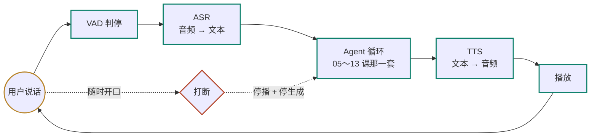

# 25 语音应用：链路、延迟预算与打断

> 把前面所有机制放进一个需要实时回应、用户看不见文字、还随时会打断你的形态里。语音链路会重新定义延迟、确认和取消的边界，不能只在聊天页面旁边加一个麦克风。

<details class="case" markdown="1">
<summary>例子：一通两分钟的电话里连着坏三次——等太久、插不进话、金额听掉一位</summary>

一个在网页上跑得好好的 Agent，接上电话之后：

| 时刻 | 用户 | 系统那一侧 |
|---|---|---|
| `00:04.0` | 「帮我给张伟转四万一」 | 判停等了 800ms，ASR 700ms，模型首 token 900ms |
| `00:06.5` | 「喂？帮我给张伟转四万一」 | 还没出声。用户以为断线了 |
| `00:07.0` | —— | 两句话叠成同一轮进了模型 |
| `00:09.0` | 「不用说这么长——」 | 正在念一段确认话术，没停 |
| `00:14.0` | —— | 整段念完才反应过来用户插过话 |
| `00:15.0` | —— | 模型按「整段都被听到了」继续往下问 |

而 ASR 给出的那句是「帮我给张伟转四万」。工具参数照单全收，`amount=40000`。

用户从头到尾不知道系统听到的是什么。屏幕上打错字自己看得见，电话里没有这一层。

三件事：延迟、打断、输入可信度。文本应用还能靠屏幕和重试补救，电话里同样的缺口可能直接让这一轮对话失败。

!!! note "构造的例子"
    这张时间线和这些毫秒数是为讲清延迟预算编的，不是某次真实通话的记录。

</details>

## 电话里三秒和网页里三秒不是一回事

一个在网页上跑得好好的 Agent，接上电话之后通常坏在三个地方：等待没有反馈，用户会再说一遍；打断被当成异常，系统念完了才停；识别结果直接进了工具参数，而用户看不见系统听到了什么。

这三件事分别是延迟、打断和输入可信度。文本应用能用可见的中间结果和按钮补救，语音应用要在声音和事件里把这些边界表达出来。

## 语音体验要先量哪三个数

- 能为一个语音场景写出一张延迟预算表，把「用户说完到听见第一个音」拆到每一段，并指出哪一段最先该优化
- 能设计打断的处理路径，说清打断之后对话历史里该记什么
- 能判断哪些槽位必须回读确认，并解释语音链路的输入为什么比文本输入更不可信

## 语音这课复用哪些文本机制

- [02 模型调用、结构化输出与流式](../model-api-structured-output-streaming/README.md)：那条流式的两个消费者，在这一课变成 TTS 和工具执行器
- [07 Agent State 与 Runtime](../agent-state-and-runtime/README.md)：double texting 的三种策略，打断是它在语音里的形态
- [24 AI 产品设计与交互](../product-design-ux/README.md)：UI 状态机和确认与撤销，这一课把它们搬到没有屏幕的场景

## 把一轮语音拆成可测的链路



**级联和端到端是两条不同的路。** 上面这张图是级联：VAD、ASR、Agent 和 TTS 依次连接，每一段都能单独观察、评测和替换。[端到端语音模型](https://platform.openai.com/docs/guides/realtime)把中间步骤放进一次会话，可能减少转换等待并让语气更连贯，代价是中间文本不再是唯一的事实来源——trace、评测、审计和工具参数校验都要重新设计。级联适合作为第一版基线；当真实测量显示它达不到目标时，再比较端到端方案。

**延迟是这类应用的第一约束，而且它是个预算，不是一个指标。** 可以先把一秒级目标当成预算草案，用真实用户和链路数据修正；超过目标时，用户可能重复说话或以为断线。这一秒要分给判停、识别、模型首 token、语音合成首包和网络往返，每一段都要留下可测的上限。第 01 课那笔成本账在这里换成了时间账：先列预算，再选模型。

**打断是正常流程，不是异常。** 用户开口的那一刻要同时做三件事：停播放、停生成、记下**实际播出到了哪里**。第三件最容易漏——模型以为整段话都被听到了，而用户只听到前六个字，后面的对话全建立在一个假的前提上。

**ASR 的输出要按不可信输入处理。** 文本输入里用户打错字自己看得见，语音里用户不知道系统听成了什么。识别结果进工具参数之前要过一道校验，金额、日期、人名、地址这类槽位要回读确认。这是第 05 课确认门在语音里的样子，触发条件从「动作不可逆」扩展到「**输入不可信 + 动作不可逆**」。

## 延迟、打断和回读如何配合

下面三段代码只为说明机制，省略了音频编解码、重采样和网络传输，不能直接运行。

### 一、延迟预算：先分配，再选型

```python
@dataclass(frozen=True)
class TurnBudget:
    """一轮的目标：用户说完最后一个字，到听见第一个音。单位毫秒。"""
    vad_silence: int = 300      # 判停：等多久算「说完了」
    asr_tail: int = 150         # 尾包送完到出最终文本
    llm_first_token: int = 350  # 模型首 token
    tts_first_chunk: int = 150  # 合成首包
    network: int = 100          # 两端往返

    def total(self) -> int:
        return (self.vad_silence + self.asr_tail
                + self.llm_first_token + self.tts_first_chunk + self.network)

def check(b: TurnBudget, ceiling: int = 1000) -> list[str]:
    over = []
    if b.total() > ceiling:
        over.append(f"总预算 {b.total()} 超了 {ceiling}")
    if b.vad_silence > 400:
        over.append("判停太久，用户会以为没听见")      # ← 最容易被忽略的一段
    return over
```

!!! note "构造的预算"
    `300 / 150 / 350 / 150 / 100` 和 `1000` 是演示用的起始值，不是通用 SLA。真实项目应按接入方式、语言和用户测试重新分配。

`vad_silence` 是这张表里最反直觉的一项：它常常是最大的一块，却经常没人管。**判停调短，用户体验立刻变好，代价是句中停顿会被误判成说完了**——中文里报数字、报地址时停顿很多，这个参数要按场景调，不能取一个全局默认值。

另外注意 `llm_first_token`：高延迟推理模型通常很难塞进这一版预算（第 01 课）。如果业务仍需要它，可以先播放「我查一下」之类的进度提示，再把推理放到异步路径；这会改变交互，不会让模型本身变快。

### 二、打断：停掉，并且记下实际说了多少

```python
async def speak(text: str, session) -> None:
    session.spoken = ""                       # 本轮实际播出的部分
    try:
        async for sentence in split_sentences(text):     # 按句切，首包才快
            audio = await tts(sentence)
            await player.play(audio)                     # 播完这一句才继续
            session.spoken += sentence
    except asyncio.CancelledError:
        await player.stop()
        raise

async def on_user_speech(session):
    session.generation.cancel()               # ← 停生成：别再往下算了
    session.speech.cancel()                   # ← 停播放：立刻安静
    await session.speech                      # 等 CancelledError 走完，拿到 spoken
    session.history.append(
        Message(role="assistant", content=session.spoken + "（被用户打断）"))
```

关键是最后那两行：**写进历史的是 `session.spoken`，不是模型生成的全文**。用户只听到了前半句，下一轮上下文就该以这段已播内容为准。把全文记进去，系统接下来可能引用用户从没听过的话。

按句切分（`split_sentences`）同时解决两件事：首包延迟低，以及打断的粒度是一句而不是一整段。**这就是第 02 课「一条流两个消费者」的语音版**：TTS 消费者按句号切，工具执行器仍然要等完整参数。

### 三、不可信输入：置信度低的槽位要回读

```python
CRITICAL = {"amount", "account", "date", "address"}

def needs_readback(slots: dict, asr_conf: float, action_reversible: bool) -> list[str]:
    if action_reversible and asr_conf > 0.9:
        return []                                    # 可撤销 + 听得清，不打扰
    return [k for k in slots if k in CRITICAL]       # ← 只回读关键槽位，不是全部

def readback(slots: dict, keys: list[str]) -> str:
    parts = [f"{LABEL[k]}{spell_out(slots[k])}" for k in keys]
    return "我确认一下：" + "，".join(parts) + "，对吗？"

keys = needs_readback(slots, asr_conf, action_reversible)
prompt = readback(slots, keys) if keys else ""
```

`spell_out` 是这段里最不起眼、最该有的一个函数：金额要念成「一万四千元整」而不是「14000」，账号要一位一位念。**回读的目的是让用户听出识别错误，念成一串数字就等于没回读。**

`0.9` 只是示例阈值，且不是每个 ASR 都提供校准过的置信度。如果供应商没有这个字段，可以用 N-best 结果、重复识别的一致性或关键槽位重问作为代理信号；不要把缺失值当成高置信度。

判断条件里同时看了两件事：动作可不可逆（第 05 课）和输入可不可信。语音链路把第二项加了进来——同样一个查询动作，文本输入下不用确认，语音输入下如果识别置信度很低，也值得确认一次。

## 语音链路最容易坏在哪里

**用文本应用的延迟标准做语音。** 「三秒内返回」在网页上是及格线，在电话里是事故。延迟预算要在选型之前定下来，它会直接否掉一批模型和一批架构（比如中间再加一跳网关）。

**打断后把整段回答记成说过了。** 见第二节。这是语音应用里最难查的一类问题：日志、trace、模型输出全都正常，只有用户觉得「它在胡说」。

**把 ASR 文本当可信输入直接填参数。** 识别错误不会报错，它会安安静静地变成一个合法的工具参数。没有回读时，识别错误可能直接变成错误订单；金额类操作应把回读、拒绝和重新录入作为验收条件。

**TTS 等整段生成完再合成。** 首包延迟会接近整段生成时间，预算表上那 150 毫秒可能变成三秒。按句流式合成通常更适合作为第一版方案，但仍要用实际音频质量和打断测试验证。

**在句中停顿处抢答。** VAD（voice activity detection，判断这一刻用户是在说话还是停顿）的阈值调得太激进，用户报手机号中间喘口气就可能被判成说完。这个参数和上一条是一对矛盾，只能按场景实测，不能直接抄别人的默认值。

## 级联、端到端和确认频率

- **级联还是端到端。** 级联每一段可观测、可替换、可单独评测，中间的文本还能直接喂给工具和审计；端到端延迟低、语气自然，但你失去了中间那层文本，trace、评测、参数校验都要重做。先级联，把延迟预算逼到极限之后再考虑换。
- **判停快还是判停准。** 短的 `vad_silence` 让对话流畅，长的让报数字不被打断。折中做法是按对话状态动态调：普通闲聊短一点，正在收集数字槽位时长一点。
- **回读哪些槽位。** 每个都读，用户会觉得拖沓；一个都不读，识别错误就可能直接进入副作用。按「不可逆 + 关键槽位 + 置信度」三者组合来决定，这三个条件都在运行时手里，不在模型手里。
- **延迟用话术填还是硬扛。** 需要查库存、调接口时，可以先播一句「我查一下」，把两秒的空白填住。代价是这句话本身占掉几百毫秒，而且用多了会显得敷衍。**它是产品决定，不是技术决定**（第 24 课）。

## 项目边界：文本 SSE 是音频链路的起点

参考项目当前只实现文本消息和 SSE，没有把 ASR、TTS、VAD 或电话接入写成假功能。[语音协议说明](https://github.com/lance2016/ai-app-engineering-ref/blob/main/project/demos/voice-agents.md)把音频适配器、运行时事件和失败演练的边界写出来。可以先运行 [`M1 API 骨架`](https://github.com/lance2016/ai-app-engineering-ref/tree/main/project/m1-api-skeleton) 的线程测试，确认事件顺序和取消边界，再把音频帧接到同一个运行时协议上：

```bash
cd ai-app-engineering-ref
uv run pytest tests/project/m1/test_threads.py -q
```

这条测试不能证明语音延迟达标；语音部分仍要用真实链路录音，按本课的 p95 预算单独评测。

## 把音频事件留成可复盘的记录

- **每一轮都要留一份带时间戳的记录**：ASR 最终文本与置信度、判停耗时、模型首 token 与总耗时、TTS 首包、实际播出时长、有没有被打断、打断发生在第几个字。这些字段是排查语音问题的关键证据（第 20 课）。
- **音频要留样，但要按合规留。** 排查识别问题需要原始音频或等价的脱敏证据。留多久、谁能听、怎么脱敏，在上线前就要定（第 22 课）。
- **电话链路有它自己的约束**：以 [Twilio Media Streams](https://www.twilio.com/docs/voice/media-streams/websocket-messages) 为例，双向媒体负载是 8 kHz、单声道的 μ-law 音频（访问日期 2026-09-10）；其他供应商和接入方式可能不同。在 16 kHz 干净录音上测出来的识别率，不能直接当作电话链路的结果，**评测集要包含真实链路录的音频**。
- **打断要能穿透每一层。** 取消信号要一路传到 TTS 和播放器；任何一层吞掉它，用户就可能听到本应停止的片段。这条在事件驱动架构里尤其容易漏。
- **怎么测。** 用真实录音做回归集，每条音频配三层断言：ASR 文本是否命中关键词、槽位提取是否正确、各段延迟的 p95 是否还在预算内。前两层结果确定，适合进 CI；延迟那层要在接近生产的链路上跑（第 19 课）。

## 通用 Agent 框架管不到音频管道

| 本课概念 | LangGraph | OpenAI Agents SDK | Claude Agent SDK |
|---|---|---|---|
| 语音输入输出 | 不涉及，自己接 ASR/TTS | Agent 层接收转写结果；Realtime 音频会话另行接入 | 不涉及 |
| 打断与取消 | 自己在节点外做取消 | 会话层可取消，播放侧仍要自己接 | 会话中断由调用方处理 |
| 延迟预算 | 三家都不管 | 三家都不管 | 三家都不管 |

**延迟预算和音频打断通常不在通用 Agent 框架的抽象里**——它们更关注对话逻辑。语音专用框架会把这部分放进管道：[Pipecat](https://github.com/pipecat-ai/pipecat) 和 [LiveKit Agents](https://github.com/livekit/agents) 都提供了管道、打断和时间戳相关构件，读过它们的模型再决定自己写多少。官方文档：[LangGraph](https://langchain-ai.github.io/langgraph/) · [OpenAI Agents SDK](https://openai.github.io/openai-agents-python/) · [Claude Agent SDK](https://docs.claude.com/en/api/agent-sdk/overview)（核对日期 2026-09-06）。

## 从文本 SSE 继续读音频管道

- [OpenAI · Realtime API](https://platform.openai.com/docs/guides/realtime)（访问日期 2026-09-06）：端到端语音链路的一个具体实现，重点看它怎么表达打断和会话事件。
- [OpenAI · Speech to text](https://platform.openai.com/docs/guides/speech-to-text) 与 [Text to speech](https://platform.openai.com/docs/guides/text-to-speech)（访问日期 2026-09-06）：级联链路两端的接口形态，注意流式和非流式的区别。
- [Pipecat](https://github.com/pipecat-ai/pipecat)（访问日期 2026-09-06）：开源的语音管道框架，它的 frame 与 pipeline 模型是理解「打断怎么穿透每一层」最快的材料。
- [LiveKit Agents](https://github.com/livekit/agents)（访问日期 2026-09-06）：另一套实现，附带电话接入的完整示例。
- [Twilio · Voice 文档](https://www.twilio.com/docs/voice)（访问日期 2026-09-06）：电话侧的约束——编码、采样率、拨号流程，做外呼或接入呼叫中心时绕不开。

---

[← 上一课 24](../product-design-ux/README.md) · [下一课 26 →](../system-design-decisions/README.md)
