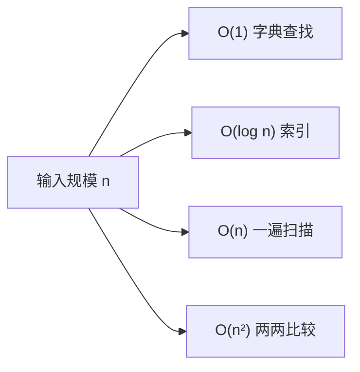

# A00 复杂度：用 token、延迟和钱来度量

> Big-O 在这门课里不是面试题，是估算工具。attention 的 O(n²)、每轮重发历史的 O(n)、向量索引的 O(log n)，决定了你的应用在多长的对话、多大的语料上会开始变慢变贵。

## 学习目标

- 能给一段代码或一个系统行为写出时间和空间复杂度，并说出常数因子什么时候比阶更重要
- 能把复杂度换算成一个 AI 应用的可感知指标：token 数、首字延迟、每日花费
- 能判断一个优化是改变了阶，还是只改了常数

## 前置

- [P02 容器与迭代](../../python/02-collections-and-iteration/README.md)

## 核心概念

<!-- outline：待写。要点清单：
1. 阶描述增长趋势，不是绝对时间；n 小时常数因子决定一切
2. 多轮对话每轮重发历史：单轮 O(n)，整段会话 O(n²)，这是第 08 课裁剪的数学理由
3. attention 的 O(n²)（F03）叠加上一条，长上下文的成本是双重平方
4. 暴力最近邻 O(N·d) vs HNSW 近似 O(log N)：第 04 课十万条以内先别建索引的依据
5. 空间复杂度：KV cache 随序列长度线性增长（F06）
6. 用 timeit 和 tracemalloc 实测，不猜
-->

## 它在 AI 应用里用在哪

- 上下文成本的平方增长 → [第 01 课](../../../lessons/01-how-llms-work/README.md) 的预算表、[第 08 课](../../../lessons/08-context-engineering-for-agents/README.md)
- 什么时候需要近似索引 → [第 04 课](../../../lessons/04-embeddings-and-vector-search/README.md)
- 容量估算 → [第 23 课](../../../lessons/23-system-design-decisions/README.md)

## 延伸阅读

- [Hello 算法 · 复杂度分析](https://www.hello-algo.com/chapter_computational_complexity/)（访问日期 2026-09-04）：中文，图多，只读这一章。

---

[← 前置总览](../../README.md) · [A01 →](../01-hashing/README.md)
