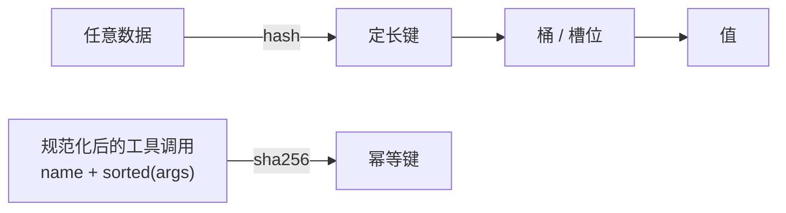

# A01 Hash：字典、集合、幂等键与内容哈希

> 字典和集合是 Python 里最常用的数据结构，背后是同一个想法：把任意数据映射成一个定长的键。AI 应用里这个想法出现在幂等键、chunk 去重、prompt 缓存前缀、LRU 缓存四个地方。

## 学习目标

- 能解释哈希表为什么平均 O(1)、什么情况下退化，以及 Python 里哪些对象可哈希
- 能用内容哈希（sha256）给一段文本、一个工具调用、一个文档版本生成稳定的标识，并说出规范化的必要性
- 能实现一个带容量上限的 LRU 缓存并说出它在模型调用层的用途

## 前置

- [P02 容器与迭代](../../python/02-collections-and-iteration/README.md)、[A00 复杂度](../00-complexity/README.md)

## 核心概念

<!-- outline：待写。要点清单：
1. 可哈希 = 不可变且相等的对象哈希相同；dict 的 key、set 的元素、frozenset
2. 内容哈希 vs 身份哈希：sha256(规范化内容) 稳定，id() 不稳定
3. 规范化是幂等键的关键：参数排序、去空白、数值精度；第 05 课 03_idempotency_key.py
4. 文档 chunk 去重与版本：内容哈希变了才重新 embedding，第 15 课
5. prompt cache 的前缀匹配也是哈希思路：逐字节一致才命中，第 08 课
6. LRU：OrderedDict 或 functools.lru_cache；模型调用结果缓存、embedding 缓存
7. 布隆过滤器一句话：用少量内存回答肯定没见过
-->

## 它在 AI 应用里用在哪

- 幂等键 → [第 05 课 Tool Calling](../../../lessons/05-tool-calling/README.md)、[原则 06](../../../principles/06-side-effects-are-idempotent-and-auditable.md)
- chunk 内容哈希与增量索引 → [第 15 课 数据工程](../../../lessons/15-data-engineering/README.md)
- 缓存友好的上下文布局 → [第 08 课](../../../lessons/08-context-engineering-for-agents/README.md)

## 延伸阅读

- [Hello 算法 · 哈希表](https://www.hello-algo.com/chapter_hashing/)（访问日期 2026-09-04）
- [Python 文档 · functools.lru_cache](https://docs.python.org/3/library/functools.html#functools.lru_cache)（访问日期 2026-09-04）

---

[← A00](../00-complexity/README.md) · [A02 →](../02-stacks-queues/README.md)
