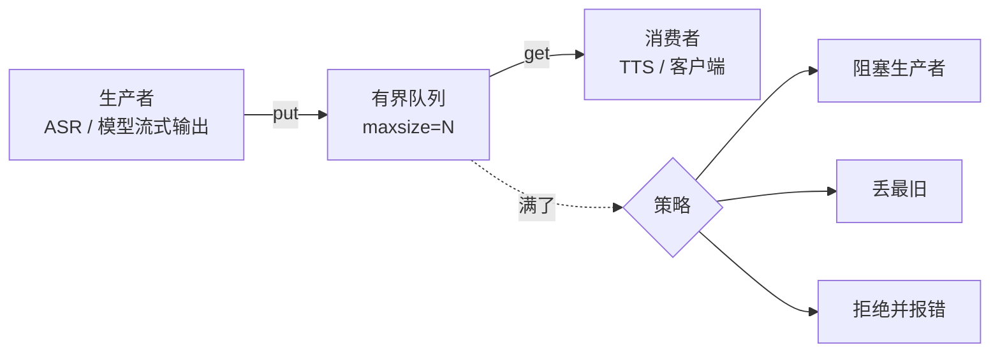

# A02 栈、队列与 Deque：事件队列、有界缓冲与 backpressure

> Agent 运行时里到处是队列：待处理的用户消息、待执行的工具调用、待推送的事件、流式输出的缓冲。有界还是无界、满了怎么办，是这些队列最重要的设计决定。

## 学习目标

- 能说出栈和队列各自的操作和典型用途，以及 Python 里 list、deque、queue.Queue、asyncio.Queue 的适用场景
- 能解释 backpressure 是什么，为什么无界队列在生产里是内存泄漏，并写出一个有界队列满时的三种策略
- 能用栈实现一个嵌套结构的解析或撤销操作

## 前置

- [P02 容器与迭代](../../python/02-collections-and-iteration/README.md)

## 核心概念

<!-- outline：待写。要点清单：
1. 栈 LIFO：调用栈、撤销、括号匹配、嵌套 JSON 解析
2. 队列 FIFO：deque 两端 O(1)；list.pop(0) 是 O(n) 的常见错误
3. 有界队列与 backpressure：生产快于消费时内存无限涨；maxsize 加满时策略
4. double texting 的 enqueue 策略就是一个每线程队列，第 07 课
5. 流式输出的缓冲：模型吐 token 快于客户端消费，robotics-voice 第 02 篇的三处背压
6. 优先级队列留给 A03
-->

## 它在 AI 应用里用在哪

- double texting 的 enqueue → [第 07 课](../../../lessons/07-agent-state-and-runtime/README.md)
- 流式与背压 → [第 02 课](../../../lessons/02-model-api-structured-output-streaming/README.md)、[语音 track 第 02 篇](../../../tracks/robotics-voice/02-interruption-and-backpressure.md)
- 任务队列与后台运行 → [第 16 课](../../../lessons/16-system-architecture/README.md)

## 延伸阅读

- [Hello 算法 · 栈与队列](https://www.hello-algo.com/chapter_stack_and_queue/)（访问日期 2026-09-04）
- [Python 文档 · asyncio.Queue](https://docs.python.org/3/library/asyncio-queue.html)（访问日期 2026-09-04）：`maxsize` 一段就是 backpressure。

---

[← A01](../01-hashing/README.md) · [A03 →](../03-heaps-topk/README.md)
