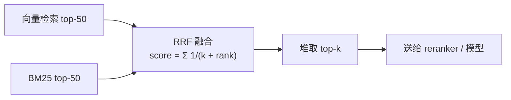

# A03 堆与 Top-K：检索合并、RRF 与优先级调度

> 检索返回一万个候选你只要前十个，两路检索结果要按分数合并，一批任务要按截止时间调度。这些都是同一个数据结构：堆。

## 学习目标

- 能说出堆的性质、插入和弹出的复杂度，以及为什么 top-k 用堆是 O(n log k) 而不是排序的 O(n log n)
- 能用 heapq 实现 top-k、多路有序合并和一个带优先级的任务调度器
- 能解释 RRF（Reciprocal Rank Fusion）在合并向量检索和 BM25 结果时做了什么

## 前置

- [A00 复杂度](../00-complexity/README.md)

## 核心概念

<!-- outline：待写。要点清单：
1. 最小堆 / 最大堆；heapq 只有最小堆，取最大用负号
2. top-k：维护大小为 k 的最小堆，O(n log k)；heapq.nlargest
3. 多路合并：heapq.merge 合并多个有序流，检索分片结果合并
4. RRF：排名倒数求和，不依赖分数量纲，第 13 课 hybrid.py
5. 优先级队列：按 deadline 或用户等级调度模型调用，第 19 课限流下的排队
6. 什么时候不用堆：k 接近 n 时直接排序
-->

## 它在 AI 应用里用在哪

- 混合检索的 RRF → [第 13 课 RAG](../../../lessons/13-rag-end-to-end/README.md)、[M4](../../../project/m4-rag-and-memory/README.md)
- 暴力 top-k → [第 04 课](../../../lessons/04-embeddings-and-vector-search/README.md)
- 优先级与限流排队 → [第 19 课](../../../lessons/19-reliability-cost-llmops/README.md)

## 延伸阅读

- [Hello 算法 · 堆](https://www.hello-algo.com/chapter_heap/)（访问日期 2026-09-04）
- [Reciprocal Rank Fusion 原始论文](https://plg.uwaterloo.ca/~gvcormac/cormacksigir09-rrf.pdf)（访问日期 2026-09-04）：两页，公式只有一行。

---

[← A02](../02-stacks-queues/README.md) · [A04 →](../04-trees/README.md)
