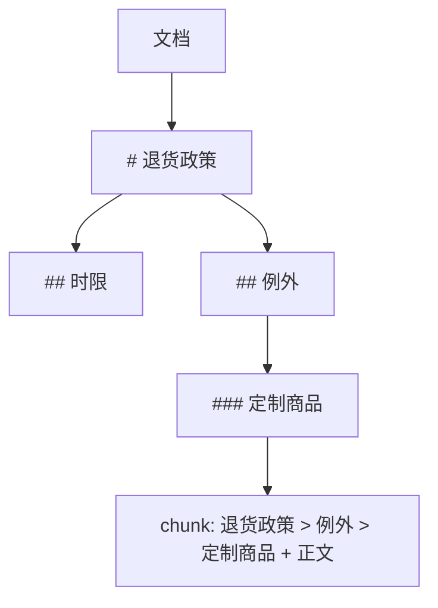

# A04 树：文档层级切块、Trie 与决策树路由

> 文档有标题层级，JSON 有嵌套，工具有分类，路由有分支。它们都是树。按树切块的 RAG 比按长度切块召回更准，这是本篇最直接的应用。

## 学习目标

- 能用递归遍历一棵树（先序、后序、层序），并说出递归深度的限制和迭代改写的方法
- 能把一份 Markdown 解析成标题树，并按子树生成带路径的 chunk
- 能说出 Trie 的用途，并用它实现前缀匹配的命令或工具名补全

## 前置

- [P02 容器与迭代](../../python/02-collections-and-iteration/README.md)、[P04 类与 dataclass](../../python/04-oop-and-dataclasses/README.md)

## 核心概念

<!-- outline：待写。要点清单：
1. 树的表示：嵌套 dict、dataclass 带 children、父指针
2. 三种遍历与各自用途；层序用队列（A02）
3. Markdown 标题树 → 带路径的 chunk：第 13 课 chunking、第 15 课解析
4. JSON Schema 本身是树：第 02 课结构化输出的校验是树遍历
5. Trie：工具名前缀、命令补全、敏感词匹配（第 20 课）
6. 决策树作为路由：第 09 课 Routing 模式的确定性版本、第 21 课的选型决策树
7. 递归深度限制与显式栈改写
-->

## 它在 AI 应用里用在哪

- 按标题切块 → [第 13 课 RAG](../../../lessons/13-rag-end-to-end/README.md)、[第 15 课](../../../lessons/15-data-engineering/README.md)
- 确定性路由 → [第 09 课](../../../lessons/09-workflow-vs-agent/README.md)
- 敏感词与前缀匹配 → [第 20 课](../../../lessons/20-security-governance/README.md)

## 延伸阅读

- [Hello 算法 · 树](https://www.hello-algo.com/chapter_tree/)（访问日期 2026-09-04）

---

[← A03](../03-heaps-topk/README.md) · [A05 →](../05-graphs/README.md)
