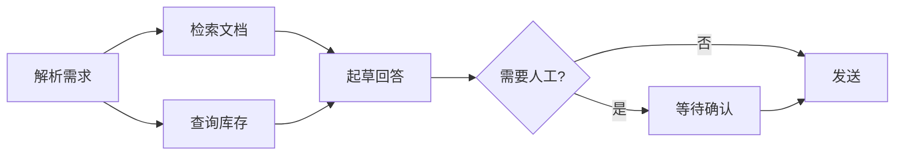

# A05 图、BFS/DFS 与拓扑排序：Workflow DAG、依赖解析与环检测

> Workflow 是一张有向图，工具调用之间有依赖，多 Agent 的 handoff 可能绕回原点，记忆之间有关联。图的三个基本操作，遍历、拓扑排序、找环，直接对应三个工程问题：执行顺序、并行度、死循环。

## 学习目标

- 能用邻接表表示一张图，写出 BFS 和 DFS，并说出各自适合的问题
- 能对一张 DAG 做拓扑排序，算出哪些节点可以并行执行，并检测出环
- 能把一个多步骤 Workflow 建模成图，并解释框架里的 State Graph 和这张图的关系

## 前置

- [A02 栈、队列](../02-stacks-queues/README.md)、[A04 树](../04-trees/README.md)

## 核心概念

上面这张图里，B 和 C 没有依赖关系，可以并行；拓扑排序给出的层级就是并行度。

<!-- outline：待写。要点清单：
1. 邻接表 dict[node, list[node]]；有向 / 无向；DAG
2. BFS 用队列，最短路径、层级；DFS 用栈或递归，连通性、路径枚举
3. Kahn 拓扑排序：入度为 0 的一层可并行；第 09 课 Parallelization 模式、第 06 课并行工具调用
4. 环检测：DFS 三色标记；handoff 绕回、Workflow 死循环，第 10 课的最大交接次数是运行时兜底
5. LangGraph 的 StateGraph 就是这张图加一个共享 state；Framework Lab 的 Control Flow 维度
6. 记忆图 / 知识图谱一句话：节点是实体，边是关系，检索是子图遍历，第 14 课
-->

## 它在 AI 应用里用在哪

- Workflow 模式与并行 → [第 09 课](../../../lessons/09-workflow-vs-agent/README.md)
- handoff 环与交接上限 → [第 10 课](../../../lessons/10-multi-agent-handoff/README.md)
- 框架的图模型 → [Framework Lab](../../../project/framework-lab/README.md)

## 延伸阅读

- [Hello 算法 · 图](https://www.hello-algo.com/chapter_graph/)（访问日期 2026-09-04）
- [Python 文档 · graphlib.TopologicalSorter](https://docs.python.org/3/library/graphlib.html)（访问日期 2026-09-04）：标准库自带拓扑排序，含环检测。

---

[← A04](../04-trees/README.md) · [A06 →](../06-concurrency-models/README.md)
