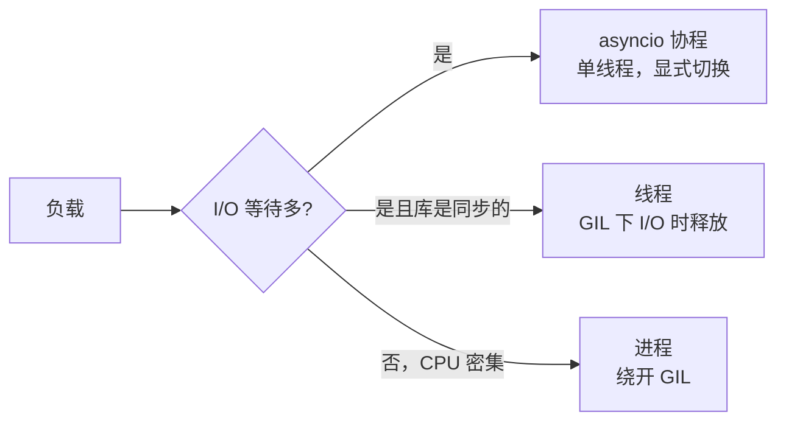

# A06 并发模型：线程、进程、协程，GIL、竞态、锁与死锁

> P07 教的是 asyncio 的 API。这一篇讲 API 背后的模型：三种并发单位各解决什么问题、GIL 限制了什么、两个并发写入为什么会丢数据、锁怎样保护又怎样制造死锁。有了这层，P07 的每个选择才有理由。

## 学习目标

- 能说出线程、进程、协程三者的切换成本、共享内存方式和各自适合的负载（I/O 密集还是 CPU 密集）
- 能用一个可复现的例子演示竞态条件，并用锁、原子操作或单写者模型三种方式修复
- 能画出一个死锁的等待环，并说出避免死锁的两条规则

## 前置

- [P07 asyncio 并发](../../python/07-asyncio/README.md)：本篇是它的概念层，建议两篇一起学

## 核心概念

<!-- outline：待写。要点清单：
1. 三种并发单位：协程协作式、线程抢占式、进程独立内存；切换成本量级
2. GIL：同一时刻一个线程执行 Python 字节码；I/O 时释放，所以线程适合同步 I/O 库，不适合 CPU 密集
3. 竞态：读-改-写不原子；两个协程在 await 处交错；第 07 课 double texting 没有策略就是竞态
4. 锁、信号量、事件；asyncio.Lock 与 threading.Lock 不能混用
5. 死锁：等待环；避免：固定加锁顺序、带超时
6. 单写者 / 消息传递比共享内存更容易做对：事件线程 append-only 就是单写者，第 07 课
7. to_thread 与进程池：同步 SDK 和 CPU 密集的解析各走哪条路，M0 05_blocking_call
-->

## 它在 AI 应用里用在哪

- asyncio 的具体 API 与五个对照实验 → [P07](../../python/07-asyncio/README.md)、[M0](../../../project/m0-concurrency/README.md)
- 并发写同一线程的竞态 → [第 07 课](../../../lessons/07-agent-state-and-runtime/README.md)、[M2 的乐观并发](../../../project/m2-state-and-storage/README.md)
- 并行工具调用与限流 → [第 06 课](../../../lessons/06-agent-loop/README.md)、[第 19 课](../../../lessons/19-reliability-cost-llmops/README.md)

## 延伸阅读

- [Python 文档 · 并发执行](https://docs.python.org/3/library/concurrency.html)（访问日期 2026-09-04）：threading、multiprocessing、concurrent.futures 三者的官方入口。
- [Real Python · What Is the Python GIL?](https://realpython.com/python-gil/)（访问日期 2026-09-04）：GIL 讲得最清楚的一篇。

---

[← A05](../05-graphs/README.md) · [前置总览](../../README.md)
