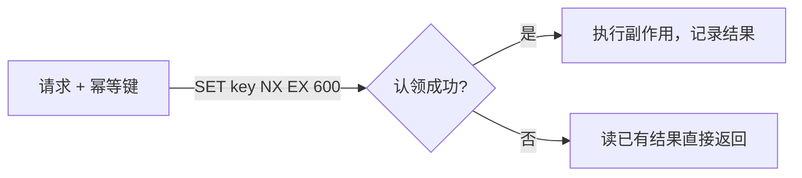

# B04 Redis：TTL、SET NX 幂等与令牌桶

> 主项目里 Redis 只做三件事：幂等键、运行锁、限流。这一篇只讲这三件事需要的命令和数据结构，以及 Redis 为什么不该当事实来源。

## 学习目标

- 能用 `SET NX EX` 实现"认领一个幂等键"并解释 TTL 为什么必须有
- 能用 Redis 实现一个每租户的令牌桶限流器，并说出它和固定窗口计数的区别
- 能说出哪些数据可以放 Redis、哪些不能，以及 Redis 重启后系统应该发生什么

## 前置

- [B03 Git、命令行与 Docker Compose](../03-git-cli-and-docker/README.md)：用 compose 起 Redis
- [A01 Hash](../../algorithms/01-hashing/README.md)：幂等键的规范化

## 核心概念

<!-- outline：待写。要点清单：
1. 五种基本类型和各自的 O(1) 操作；本课只用 string、hash、sorted set
2. TTL：没有过期时间的键是内存泄漏；幂等键的 TTL 要长于业务重试窗口
3. SET NX：原子的"不存在才写"，就是分布式锁的最小形态；释放锁要校验持有者
4. 令牌桶：Lua 脚本或 INCR + EXPIRE；和固定窗口计数的突发差异
5. Redis 是缓存和协调器，不是事实来源：重启丢数据系统要能自愈，M2 的事实在 PostgreSQL
6. redis-py 的 asyncio 客户端；连接池
-->

## 它在 AI 应用里用在哪

- 幂等键与运行锁 → [第 05 课](../../../lessons/05-tool-calling/README.md)、[第 07 课](../../../lessons/07-agent-state-and-runtime/README.md)、[M2](../../../project/m2-state-and-storage/README.md)
- 每租户限流 → [第 19 课](../../../lessons/19-reliability-cost-llmops/README.md)、[M5](../../../project/m5-production/README.md)
- Redis 与 PostgreSQL 的边界 → [第 16 课](../../../lessons/16-system-architecture/README.md)

## 延伸阅读

- [Redis 文档 · SET](https://redis.io/docs/latest/commands/set/)（访问日期 2026-09-04）：`NX`、`EX` 两个选项就是本课的一半。
- [Redis 文档 · Distributed Locks](https://redis.io/docs/latest/develop/use/patterns/distributed-locks/)（访问日期 2026-09-04）：单实例锁的正确写法和它的局限。

---

[← B03](../03-git-cli-and-docker/README.md) · [前置总览](../../README.md)
