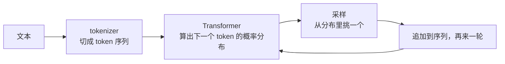

# F00 LLM 是什么：Next Token Prediction 与能力来源

> 这一篇不教训练，只回答一个问题：LLM 到底是什么东西，它的哪些性质会直接影响你写的应用。对应 LLMs-from-scratch 第 1 章、Happy-LLM 第 1～4 章。

## 学习目标

- 能用一句话说清 LLM 在做什么（预测下一个 token），并推出它的三个直接后果
- 能区分预训练、微调、对齐三个阶段各自给模型带来了什么
- 能解释为什么"模型不是数据库"

## 前置

- [P02 容器与迭代](../../python/02-collections-and-iteration/README.md)：本篇代码用 `Counter` 和字典

## 核心概念

一个 LLM 就是一个函数：输入一串 token，输出"下一个 token 是什么"的概率分布。生成一段话就是把这个函数反复调用几百次。所有你在应用里遇到的性质，都从这个循环推出来。

1. **它预测的是下一个 token，不是"答案"。** 所以它会流畅地说出错误的东西：只要那串 token 在训练数据的分布里"看起来合理"。这就是幻觉的来源，不是 bug，是机制。
2. **它没有记忆。** 每次调用都是从头看一遍输入。你觉得它"记得"上文，是因为运行时把上文又发了一遍。这是主线第 07 课 State 存在的理由。
3. **它没有内部数据库。** 参数里存的是统计模式，不是可查询、可更新、有来源的事实。要最新、私有、可追溯的知识，用 RAG。
4. **上下文窗口是硬边界。** 输入加输出的 token 总数有上限，超过就截断或报错。窗口越大，每次调用越贵越慢，[F03](../03-attention-and-transformer/README.md) 解释为什么。
5. **输出是概率的，采样决定风格。** temperature、top-p 只是在改"从分布里怎么挑"，不改分布本身。[F04](../04-context-window-and-sampling/README.md) 展开。
6. **预训练给能力，微调给格式，对齐给偏好。** 预训练在海量文本上学"续写"；指令微调让它学会"按指令回答"这种格式；对齐让它更符合人的偏好。三者叠加才是你调用的那个模型。[F05](../05-training-and-alignment/README.md) 展开。
7. **同一个基座，不同的后训练，行为差别很大。** 这是为什么同一家的 chat 模型和 instruct 模型对工具调用的意愿不一样。
8. **模型规模、数据量、算力三者要匹配。** 扩展定律说的是"按比例一起加"，不是"参数越多越好"。对应用工程师的意义：小模型加好数据在窄任务上常常打赢大模型。
9. **"涌现能力"是描述现象，不是解释。** 规模到某个点某些任务突然能做了。工程上的含义是：不要假设小模型能做大模型能做的每件事，也不要假设大模型在你的任务上一定更好，测。
10. **推理成本按 token 计，输入和输出价格不同。** 输入便宜、输出贵，而且历史每轮都算输入。这是主线第 08 课 Context Engineering 和第 19 课成本控制的经济学基础。

## 动手

| 文件 | 演示什么 | 运行 |
|---|---|---|
| [`code/01_bigram_lm.py`](./code/01_bigram_lm.py) | 一个 bigram 语言模型：只数"哪个词常跟着哪个词"，生成的句子有些是真的、有些是拼接出来的，它自己分不出 | `uv run python prerequisites/llm-foundations/00-what-an-llm-is/code/01_bigram_lm.py`，换 `SEED` 多跑几次 |

跑几个不同的 seed。你会看到训练语料里没出现过、但每一步都"合理"的句子。真正的 LLM 只是把"数前一个词"换成了"用 Transformer 看前面几千个 token"，机制一样。这就是为什么幻觉不能靠"让模型更努力"消除，只能在应用层用事实注入和工具调用兜住。

## 它在 AI 应用里用在哪

- 要点 1 和 3 是主线 [第 01 课](../../../lessons/01-how-llms-work/README.md) 讨论"能力边界"的起点，也是 [第 13 课 RAG](../../../lessons/13-rag-end-to-end/README.md) 存在的理由。
- 要点 2 → [第 07 课 State 与 Runtime](../../../lessons/07-agent-state-and-runtime/README.md)。
- 要点 10 → [第 08 课 Context Engineering](../../../lessons/08-context-engineering-for-agents/README.md)。

## 延伸阅读

- [LLMs-from-scratch · ch01](https://github.com/rasbt/LLMs-from-scratch/tree/main/ch01)（访问日期 2026-09-04）：本章没有代码，只有阅读建议，适合先看。
- [Happy-LLM 第 1～4 章](https://github.com/datawhalechina/happy-llm)（访问日期 2026-09-04）：中文，从 NLP 基础到 LLM 定义和训练策略。
- [llm-course · LLM Fundamentals](https://github.com/mlabonne/llm-course)（访问日期 2026-09-04）：数学和神经网络基础的资料清单，按需补。

---

[← 前置总览](../README.md) · [F01 →](../01-tokenization/README.md)
