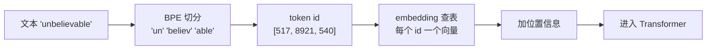

# F01 Tokenization：模型眼里的文字

> token 不是字，不是词，是模型的计费单位、上下文单位和很多奇怪行为的根源。对应 LLMs-from-scratch 第 2 章。

## 学习目标

- 能解释 BPE 分词的基本思路，以及为什么中文的 token 效率通常比英文低
- 能估算一段文本大约多少 token，并知道估算误差来自哪
- 能说出 embedding 层在做什么，以及它和「文本 embedding 模型」是什么关系

## 前置

- [F00 LLM 是什么](../00-what-an-llm-is/README.md)

## 核心概念

1. **BPE 从字节开始，把最常一起出现的相邻对合并成新 token，反复合并到词表大小为止。** 常见词是一个 token，罕见词被拆成几段。词表里没有「未知词」，任何字节串都能表示。
2. **中文一个字常常是 1～2 个 token，英文一个常用词是 1 个 token。** 同样的意思，中文往往多花 30%～100% 的 token。做成本估算时不要用英文经验。
3. **粗估：英文 1 token ≈ 4 个字符 ≈ 0.75 个词；中文 1 token ≈ 1～1.5 个汉字。** 精确数字必须用目标模型的 tokenizer 算，不同模型词表不同。
4. **数字、代码、JSON 的 token 效率很差。** 一个 6 位数可能是 2～3 个 token；JSON 里的引号、括号、空格全算。结构化输出比自然语言描述同一信息更费 token，这是主线第 02 课的取舍之一。
5. **tokenizer 是模型的一部分，不能换。** 换 tokenizer 等于换模型。同一家的不同代模型也可能词表不同，跨模型比较 token 数没有意义。
6. **embedding 层是一张查表：token id → 向量。** 这个向量是训练出来的，没有人工含义。它和 [F02](../02-embeddings/README.md) 讲的「文本 embedding 模型」不是一回事：后者是把整段文本压成一个向量用于检索，是另一个模型。
7. **位置信息要另外加。** attention 本身不知道顺序，所以要把「这是第几个 token」编码进去。绝对位置编码有长度上限，RoPE 这类相对位置编码是现代模型能扩展上下文长度的原因之一。
8. **上下文窗口是 token 数，不是字数。** 4k、32k、128k 都指 token。把一份中文 PDF 塞进去之前先算。
9. **特殊 token 控制格式。** 对话的角色分隔、结束符、工具调用的开始标记都是特殊 token。这是为什么「模型输出了一段像工具调用的文本」和「模型真的发出了工具调用」在协议层是可区分的。
10. **同一段话的 token 切分可能因前后文不同而不同。** 空格归属、大小写都会影响。不要假设「这个词永远是 1 个 token」。

## 动手

| 文件 | 演示什么 | 运行 |
|---|---|---|
| [`code/01_bpe_tokenizer_toy.py`](./code/01_bpe_tokenizer_toy.py) | 60 行 BPE：训练合并规则、编码解码；英文压缩好，中文每字 3 字节几乎不合并 | `uv run python prerequisites/llm-foundations/01-tokenization/code/01_bpe_tokenizer_toy.py`，加 `SHOW_MERGES=1` 看每一步合并 |

跑完看两件事：高频的字节串很早就被合并成一个 token；低频的到最后还是碎的。这就是「常见词一个 token、罕见词多个 token」的机制。真实 tokenizer 的词表有几万到几十万个合并规则，原理不变。

## 常见错误

**用字数估 token。** 中英文比例不同，估出来能差一倍。`01` 打印了 bytes/token，英文常见短语接近 4，中文接近 1.5。要精确就用供应商的 tokenizer 或 token 计数接口，估算时中文按每字 1.5 token 算。

## 它在 AI 应用里用在哪

- token 计费和估算 → [第 02 课](../../../lessons/02-model-api-structured-output-streaming/README.md) 的成本记录、[第 20 课](../../../lessons/20-reliability-cost-llmops/README.md) 的成本预算。
- 上下文是 token 数 → [第 08 课](../../../lessons/08-context-engineering-for-agents/README.md) 的裁剪与压缩。
- 特殊 token 与工具调用协议 → [第 05 课](../../../lessons/05-tool-calling/README.md)。

## 延伸阅读

- [LLMs-from-scratch · ch02](https://github.com/rasbt/LLMs-from-scratch/tree/main/ch02)（访问日期 2026-09-04）：主章节代码加 `05_bpe-from-scratch` 这个 bonus，本篇的实验是它的极简版。
- [karpathy/minbpe](https://github.com/karpathy/minbpe)（访问日期 2026-09-04）：另一份极简 BPE 实现，配视频，想真正弄懂 tokenizer 看这个。
- [Happy-LLM 第 5 章](https://github.com/datawhalechina/happy-llm)（访问日期 2026-09-04）：训练一个 Tokenizer 的实操。

---

[← F00](../00-what-an-llm-is/README.md) · [F02 →](../02-embeddings/README.md)
