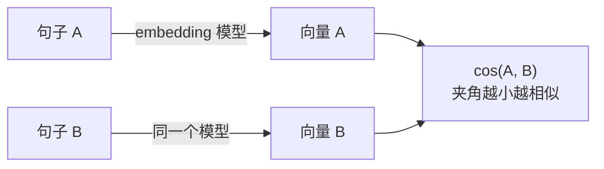

# F02 Embedding 与向量空间

> 把一段文本变成一个定长向量，让"意思接近"变成"夹角小"。这一篇讲它是什么、从哪来、为什么能比较；怎样用它建索引和检索归主线第 04 课。

## 学习目标

- 能解释文本 embedding 模型和 LLM 内部 embedding 层的区别，以及两者为什么不能互换
- 能说清余弦相似度算的是什么、为什么要先归一化、点积在什么条件下等于余弦
- 能说出 embedding 模型的训练目标（对比学习）如何决定了"相似"的含义

## 前置

- [F01 Tokenization](../01-tokenization/README.md)

## 核心概念

<!-- outline：待写。要点清单：
1. 向量表达的是训练出来的相似性，不是词面重合；对比学习让"改写"靠近、"同词不同义"远离
2. 余弦只看方向；L2 归一化后余弦退化成点积
3. 维度是模型属性，换模型必须重建全部向量；支持 Matryoshka 裁剪的模型可以在调用时降维
4. 查询和文档必须用同一个模型；非对称检索模型对 query 和 passage 用不同前缀
5. embedding 层（token id → 向量）与文本 embedding 模型（整段 → 向量）是两个东西
6. 多语言 embedding 的对齐质量决定中文检索效果，要在自己的数据上测
7. reranker 是另一类模型：同时看 query 和文档做精排，比 embedding 准但慢，只用在 top-k 之后
-->

## 动手

主线 [第 04 课](../../../lessons/04-embeddings-and-vector-search/README.md) 正文的哈希词袋 `embed()` 和 `cosine()` 用一个没有语义的向量把余弦和归一化讲清楚，本篇完成前先读那一段。

## 它在 AI 应用里用在哪

- 索引与 pgvector → [第 04 课](../../../lessons/04-embeddings-and-vector-search/README.md)
- 混合检索与重排 → [第 13 课 RAG](../../../lessons/13-rag-end-to-end/README.md)
- 记忆召回 → [第 14 课 Memory](../../../lessons/14-memory/README.md)

## 延伸阅读

- [Sentence-BERT](https://arxiv.org/abs/1908.10084)（访问日期 2026-09-04）：文本 embedding 模型的起点，读第 3 节的训练目标。
- [generative-ai-for-beginners · 08 Building Search Applications](https://github.com/microsoft/generative-ai-for-beginners/tree/main/08-building-search-applications)（访问日期 2026-09-04）：余弦相似度的图解。

---

[← F01](../01-tokenization/README.md) · [F03 →](../03-attention-and-transformer/README.md)
