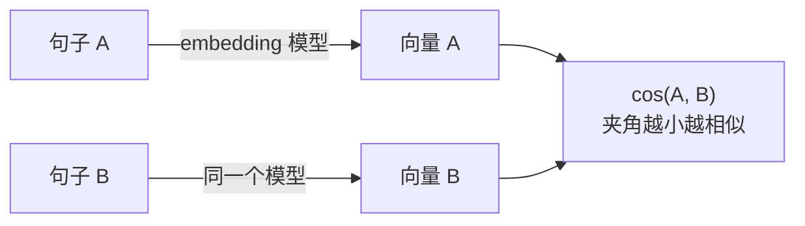

# F02 Embedding 与向量空间

> 把一段文本变成一个定长向量，让"意思接近"变成"夹角小"。这一篇讲它是什么、从哪来、为什么能比较；怎样用它建索引和检索归主线第 04 课。

## 学习目标

- 能解释文本 embedding 模型和 LLM 内部 embedding 层的区别，以及两者为什么不能互换
- 能说清余弦相似度算的是什么、为什么要先归一化、点积在什么条件下等于余弦
- 能说出 embedding 模型的训练目标（对比学习）如何决定了"相似"的含义

## 前置

- [F01 Tokenization](../01-tokenization/README.md)

## 核心概念

1. **两个 embedding 是两回事，名字撞了。** [F01](../01-tokenization/README.md) 里的 embedding 层是 LLM 内部的一张查表：token id → 向量，一个 token 一个。这一篇讲的文本 embedding 模型是另一个独立的模型：输入一整段文本，输出一个代表整段意思的向量。前者是生成模型的零件，后者是检索用的工具，不能互相替代。
2. **向量表达的是"训练出来的相似"，不是词面重合。** embedding 模型用对比学习训练：把语义相同的句子对拉近，把不相关的推远。所以"怎么退货"和"退款流程是什么"能靠近，"苹果手机"和"苹果派"会分开。**它学到的相似度取决于训练数据里什么算"一对"**，换一个训练目标，"相似"的含义就变了。
3. **余弦只看方向，不看长度。** 两个向量的余弦是它们夹角的余弦值，范围 −1 到 1。文本越长，词越多，向量的模长越大；如果直接比点积，长文档会天然占便宜——这不是相关性，是长度偏差。余弦把长度除掉，只留方向。
4. **L2 归一化之后，点积就是余弦。** 把每个向量除以自己的模长，模长变成 1，此时点积和余弦完全相等。这就是向量库普遍存归一化向量的原因：检索时用内积算，省掉每次比较的开方。主线第 04 课的 pgvector 建表直接用这个结论。
5. **维度由模型决定，换模型必须重建全部向量。** 新旧向量混在一起检索没有意义，这是换 embedding 模型迁移成本高的根本原因。维度也不是完全不能选：用 Matryoshka 方式训练的模型允许截断到几个预设长度（比如 1536 → 512），主流的托管 embedding 接口大多支持这个参数。但**只能用模型自己给出的那几个长度**——它们之所以能截断，是因为训练时就要求前 k 维独立可用，不是因为随便砍哪几维都行。
6. **查询和文档必须来自同一套模型。** 拿模型 A 编码文档、模型 B 编码查询，算出来的分数没有意义。注意「同一套」不等于「同一个」：有的检索模型是配对训练的双编码器，query 和 passage 各走一个编码器；更常见的是同一个模型加不同前缀（E5 系列的 `query: ` / `passage: `，bge 的中文指令前缀）。配错编码器或用错前缀，召回会明显变差，**而且不报错**——这类问题只有靠召回率的度量才发现得了。
7. **多语言模型的对齐质量决定中文检索效果。** 同一个模型在英文上好用，不代表中文一样好；跨语言检索（中文问题查英文文档）更依赖训练时的对齐质量。这件事没有普适答案，必须在自己的数据上测。
8. **reranker 是另一类模型，不要和 embedding 混。** embedding 是双塔：查询和文档各自独立编码，可以提前把文档向量算好存起来，所以快。reranker 是交叉编码器：把查询和文档拼在一起做一次前向，看得到两者的交互，所以准，但没法预计算——每个候选都要跑一次。因此它只用在 top-k 之后做精排，不能拿来做第一轮检索。

## 动手

| 文件 | 演示什么 | 运行 |
|---|---|---|
| [`code/01_cosine_and_normalization.py`](./code/01_cosine_and_normalization.py) | 四个对照实验：点积的长度偏差、余弦如何消掉它、归一化后点积等于余弦、维度截断怎样翻转排序 | `python3 prerequisites/llm-foundations/02-embeddings/code/01_cosine_and_normalization.py` |

用的是词袋向量，没有语义，但向量怎么比较这件事和真实 embedding 完全一样。跑完重点看两处：实验 1 里 `long_cat` 排在 `short_cat` 前面，纯粹因为它更长；实验 4 里砍掉一半维度之后两个文档的名次翻了过来。

## 常见错误

**不归一化就比点积。** 长文本的向量模长大，点积天然偏高，长句子会莫名其妙排在前面。实验 1 的输出就是这个偏差的最小形态。

**拿 LLM 的 embedding 层当文本向量用。** 取最后一层隐状态做平均，效果通常远不如专门的 embedding 模型——后者是为「整段文本的相似度」训练的，前者不是。

**查询和文档用了不同的前缀。** E5 系列要 `query: ` 和 `passage: `，bge 的中文检索要带指令前缀。写错、漏写、两边不一致，**接口都不会报错**，只是召回悄悄掉一截。这类问题只有 Recall@k 能发现（[第 14 课](../../../lessons/14-rag-end-to-end/README.md)）。

**把余弦分数当成绝对的相关性阈值。** 「0.8 以上算相关」这种规则是跟着模型走的：同一批数据换一个模型，最高分可能只有 0.6，阈值一卡就把对的结果全挡在外面。阈值要在自己的数据上标定，**换模型必须重新标定**——这和「换模型要重建向量」是同一件事的两面。

## 它在 AI 应用里用在哪

- 索引、维度选择与 pgvector → [第 04 课](../../../lessons/04-embeddings-and-vector-search/README.md)
- 混合检索与重排 → [第 14 课 RAG](../../../lessons/14-rag-end-to-end/README.md)
- 记忆召回 → [第 15 课 Memory](../../../lessons/15-memory/README.md)

## 延伸阅读

- [Sentence-BERT](https://arxiv.org/abs/1908.10084)（访问日期 2026-09-04）：文本 embedding 模型的起点，读第 3 节的训练目标，能看清"双塔为什么快、交叉编码器为什么准"。
- [Matryoshka Representation Learning](https://arxiv.org/abs/2205.13147)（访问日期 2026-09-06）：可截断维度是怎么训出来的，读摘要和图 1 就够。
- [generative-ai-for-beginners · 08 Building Search Applications](https://github.com/microsoft/generative-ai-for-beginners/tree/main/08-building-search-applications)（访问日期 2026-09-04）：余弦相似度的图解。

---

[← F01](../01-tokenization/README.md) · [F03 →](../03-attention-and-transformer/README.md)
