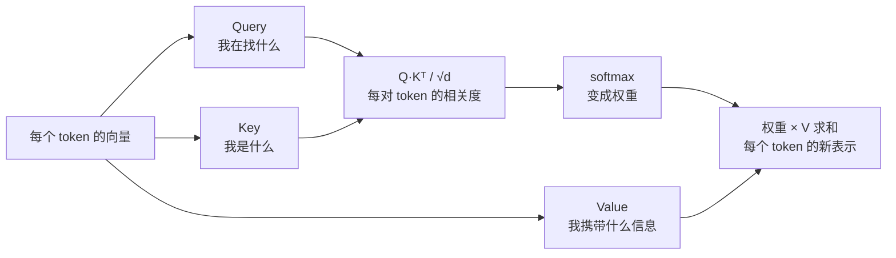
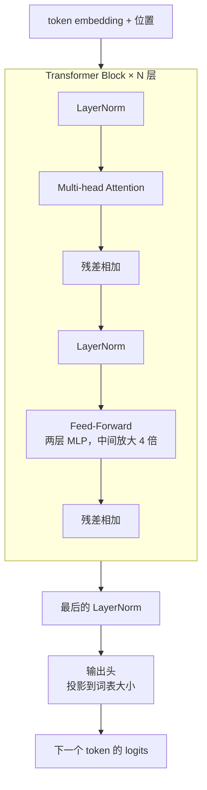

# F03 Attention 与 Transformer：为什么上下文越长越贵

> attention 是 Transformer 的核心，也是上下文窗口的成本来源。理解它，主线第 08 课的每一个裁剪决定都有了依据；知道一个 decoder-only 模型由什么组成、参数量怎么算，才能看懂模型卡片上的数字。对应 LLMs-from-scratch 第 3、4 章。

## 学习目标

- 能用点积、softmax、加权求和三步说清一次 attention 在算什么，并推出它的 O(n²) 复杂度
- 能说出 causal mask、multi-head、GQA 各解决什么问题
- 能画出一个 Transformer block 的结构，并从层数、隐藏维度、词表大小粗估参数量和权重文件大小

## 前置

- [F01 Tokenization](../01-tokenization/README.md)：token 序列和位置信息

## 核心概念

### 一次 attention 在算什么

1. **attention 让每个 token 看一遍所有其他 token，按相关度加权取信息。** Query 是「我在找什么」，Key 是「我是什么」，Value 是「我携带什么」。点积算相关度，softmax 变权重，加权求和 Value 就是输出。
2. **复杂度是 O(n²)。** n 个 token 两两算相关度。上下文从 4k 到 32k，attention 的计算量是 64 倍不是 8 倍。这是长上下文贵的根本原因。
3. **causal mask 让 token 只能看到前面的。** 生成时不能偷看未来。实现上就是把上三角的相关度设成负无穷，softmax 后变 0。
4. **multi-head 是多组 Q/K/V 并行算，再拼起来。** 每组学不同的关系（语法、指代、位置……）。
5. **√d 缩放是为了防止 softmax 饱和。** 向量维度大时点积的值域也大，不缩放的话 softmax 会几乎变成 one-hot，梯度消失。
6. **KV cache 就是把每个 token 的 K 和 V 存下来。** 生成第 n+1 个 token 时，前 n 个的 K、V 不用重算。代价是显存，[F06](../06-kv-cache-and-inference/README.md) 算这笔账。
7. **GQA（Grouped-Query Attention）让多个 Query 头共享一组 K/V。** 目的是减少 KV cache 显存，几乎不损失质量。现代开源模型基本都用。
8. **"lost in the middle"是实测现象：模型对上下文开头和结尾更敏感，中间部分容易忽略。** 对应用的直接含义：重要指令放最前或最后，检索结果不要堆在中间。
9. **Flash Attention 等优化改的是计算方式，不改结果。** 通过分块和避免存 n² 的中间矩阵，让长上下文在有限显存里跑得动。选托管 API 时看不到它，自部署时它决定你能开多长的窗口。

### 一层一层叠起来

10. **一个 block 只有两个主要部件：attention 和 feed-forward。** attention 负责 token 之间交换信息，feed-forward 负责每个 token 自己的非线性变换。其余是 LayerNorm 和残差连接这类让训练稳定的配件。
11. **N 层 block 堆起来就是「深度」。** 7B 级模型通常 32 层左右，隐藏维度 4096。层数和维度是模型卡片上最重要的两个数。
12. **参数量大头在 feed-forward 和 attention 的投影矩阵。** 粗估每层约 12 × d² 个参数，加上词表 × d 的 embedding。32 层、d=4096 算出来约 6.4B，加 embedding 就是通常说的 7B。
13. **decoder-only 成为主流，因为它训练目标简单、能无限扩展数据、生成任务天然适配。** 通用 LLM 基本都是 decoder-only。
14. **MoE（Mixture of Experts）把 feed-forward 换成多个「专家」，每个 token 只走其中几个。** 「总参数 400B、激活 17B」这种描述就是 MoE。对应用的含义：延迟接近小模型，能力接近大模型，但显存要装下全部参数。
15. **模型卡片上的「上下文长度」是训练时见过的最大长度，不是硬件限制。** 超过它模型可能还能跑，但质量不保证。
16. **权重文件的大小 ≈ 参数量 × 每个参数的字节数。** 7B 参数用 fp16 是 14GB，int8 是 7GB，int4 是 3.5GB。这是 F06 量化的起点。

## 动手

| 文件 | 演示什么 | 运行 |
|---|---|---|
| [`code/01_single_head_attention.py`](./code/01_single_head_attention.py) | 4 个 token、维度 3，手算一遍点积、softmax、加权求和；`CAUSAL=0` 看 mask 在挡什么 | `uv run python prerequisites/llm-foundations/03-attention-and-transformer/code/01_single_head_attention.py` |
| [`code/02_gpt_param_count.py`](./code/02_gpt_param_count.py) | 从层数、维度、词表算 7B 的参数量，再换算 fp16 / int8 / int4 的权重体积 | `uv run python prerequisites/llm-foundations/03-attention-and-transformer/code/02_gpt_param_count.py` |

`01` 里数一数：4 个 token 算了 16 个点积。换成 4000 个 token 是 1600 万个。这就是 n²。`02` 输出约 6.6B，和"7B"对得上；三行显存数字就是你在选「能不能在一张 24GB 卡上跑」时要看的。

## 它在 AI 应用里用在哪

- O(n²) 和 lost in the middle → [第 08 课 Context Engineering](../../../lessons/08-context-engineering-for-agents/README.md) 的所有裁剪决定。
- 参数量与显存、MoE 的「激活参数」 → [第 22 课 模型适配与推理服务](../../../lessons/22-model-adaptation-finetuning-inference/README.md) 的选型。

## 延伸阅读

- [LLMs-from-scratch · ch03](https://github.com/rasbt/LLMs-from-scratch/tree/main/ch03) 与 [ch04](https://github.com/rasbt/LLMs-from-scratch/tree/main/ch04)（访问日期 2026-09-04）：从简化的 self-attention 一步步到 multi-head，再完整实现一个 GPT。
- [Attention Is All You Need](https://arxiv.org/abs/1706.03762)（访问日期 2026-09-04）：原始论文，只需要读 3.2 节。
- [Happy-LLM 第 2、3 章](https://github.com/datawhalechina/happy-llm)（访问日期 2026-09-04）：Transformer 架构和三种架构对比。

---

[← F02](../02-embeddings/README.md) · [F04 →](../04-context-window-and-sampling/README.md)
