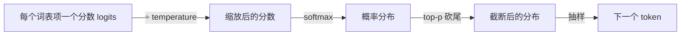

# F04 Context Window 与 Sampling

> 两个直接决定应用行为的旋钮：窗口决定模型一次能看多少，采样决定它从概率分布里怎么挑。两者都不改变模型「知道什么」，但都改变你花多少钱、得到多稳定的输出。

## 学习目标

- 能说清 temperature 和 top-p 分别改变了什么，以及为什么 temperature 为 0 也不等于「一定正确」
- 能列出一个上下文窗口里同时挤着哪几类内容，并解释多轮对话的输入 token 为什么近似平方增长
- 能说出窗口上限、训练长度、有效长度三个数字的区别

## 前置

- [F00 LLM 是什么](../00-what-an-llm-is/README.md)
- [F03 Attention 与 Transformer](../03-attention-and-transformer/README.md)：O(n²) 和 lost in the middle

## 核心概念

1. **输出是抽样，不是查找。** 分数经过 temperature 缩放和 softmax 变成概率，再按概率抽一个。temperature 低，分布尖，几乎总选最高分；temperature 高，分布平，第二、第三选项经常出现。top-p 把尾部低概率项直接砍掉。
2. **temperature 为 0 是贪心，每次一样，但「一样」不等于「对」。** 它只是最可能的那个。实现上 T=0 通常特殊处理为 argmax，批处理和浮点误差仍可能让结果不完全一致。
3. **temperature 不是「创造力开关」。** 它只改变次优选项胜出的频率，不改变模型知道什么。抽取结构化数据用 0，需要多样性再调高，并且配 top-p 砍尾。
4. **上下文窗口是一笔每轮都在花的预算。** 系统提示、工具定义、检索内容、整段历史、给回答预留的空间，全部挤在一个窗口里。
5. **如果客户端每轮都把历史重新发送，第 n 轮的输入 token 就近似等于前 n 轮的总和。** 多轮对话的累计输入可能远大于单轮请求；账单里输入和输出各占多少，要按实际 token 量和供应商价格计算。
6. **窗口上限、训练长度、有效长度是三个数。** 供应商标的 128k 是上限；模型训练时见过的最大长度可能更短；在你的任务上质量不下降的长度更短。越长越贵、越慢，中间部分更容易被忽略，128k 不代表应该填满。
7. **溢出时常见的做法包括裁历史、做摘要、减少检索内容和缩短工具定义。** 每种做法都会改变可用信息，哪些能删要用任务样本验证，这是主线第 08 课的核心判断。
8. **中文和英文的 token 化效率不同。** 提示词的固定部分和用户内容都应按目标模型分别测量；把英文的字符/token 经验直接套到中文，预算容易偏差。

## 动手

| 文件 | 演示什么 | 运行 |
|---|---|---|
| [`code/01_sampling_temperature.py`](./code/01_sampling_temperature.py) | 一组假 logits 抽样一千次，看 temperature 和 top-p 怎么改变分布 | `uv run python prerequisites/llm-foundations/04-context-window-and-sampling/code/01_sampling_temperature.py`，试 `TEMPERATURE=0`、`0.2`、`2.0`，`TOP_P=0.9` |

窗口预算的逐轮计算在主线 [第 01 课](../../../lessons/how-llms-work/README.md) 的成本模型那一节，那里把它和价格连在一起。

## 常见错误

**期待 temperature 0 消除幻觉。** [F00](../00-what-an-llm-is/README.md) 的 bigram 模型没有随机性也会生成拼接出来的句子。幻觉是机制的一部分，采样参数管不了它。

**只算输出 token。** 输入随历史增长，很快成为主要开销。看账单时先看输入列。

## 它在 AI 应用里用在哪

- 采样参数按任务分别设置 → [第 02 课 模型调用](../../../lessons/model-api-structured-output-streaming/README.md)
- 窗口预算与成本模型 → [第 01 课](../../../lessons/how-llms-work/README.md)
- 溢出时的取舍 → [第 08 课 Context Engineering](../../../lessons/context-engineering-for-agents/README.md)

## 延伸阅读

- [Anthropic · Context windows](https://platform.claude.com/docs/en/build-with-claude/context-windows)（访问日期 2026-09-04）：一家供应商对窗口、输入输出 token 的官方解释，配图好。
- [Lost in the Middle](https://arxiv.org/abs/2307.03172)（访问日期 2026-09-04）：长上下文中间位置被忽略的实测，读图 1 就够。

---

[← F03](../03-attention-and-transformer/README.md) · [F05 →](../05-training-and-alignment/README.md)
