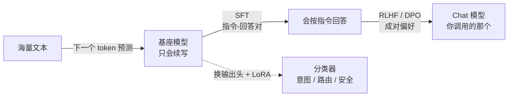

# F05 训练与对齐：预训练、SFT、偏好对齐对应用意味着什么

> 你大概率永远不会预训练一个模型，但许多 chat 模型都会经历预训练、指令微调和偏好对齐。知道每一步给了模型什么，就知道为什么 system prompt 有效、为什么模型会过度拒绝、为什么同一基座的不同版本工具调用能力差很多，以及一个质量问题该改提示还是该微调。对应 LLMs-from-scratch 第 5、6、7 章。

## 学习目标

- 能说出预训练、SFT、偏好对齐三个阶段各自的输入数据和优化目标，以及各自给模型带来了什么
- 能解释「对话模板」是什么，为什么用错模板模型会胡说
- 能说出把 LLM 改成分类器要换掉哪个部件，以及 LoRA 为什么能用极少参数达到接近全量微调的效果

## 前置

- [F03 Attention 与 Transformer](../03-attention-and-transformer/README.md)：输出头、参数量

## 核心概念

### 预训练：能力从哪来

1. **自回归预训练的核心任务是给前文预测下一个 token。** 没有人工标注，文本本身就能生成训练目标。这是它能使用海量文本的原因。loss 是交叉熵，perplexity 是 e^loss，可以把它当作模型不确定性的一个指标。
2. **loss 低不等于好用。** 预训练完的基座模型只会续写，你问它问题它可能接着问你问题。「好用」是后训练给的。
3. **数据质量比数量更决定上限。** 去重、过滤、配比代码和多语言，这些决定了模型的知识面和能力边界。模型不知道的东西，prompt 再好也问不出来。「知识截止日期」由训练数据决定，需要新知识用检索。
4. **训练成本同时受参数量、token 数、硬件、并行方式和训练步数影响。** 它通常远高于应用团队的推理成本。加载别人预训练好的权重，是应用工程的常见起点；只有在拥有独特的大规模数据，且 prompt、RAG 和微调都不够时，才值得评估自建预训练。

### SFT 与对齐：从「会续写」到「会听话」

5. **SFT（监督微调）用「指令 → 期望回答」的数据对训练。** 常见实现只对回答部分算 loss，因此模型学到的是「看到指令后生成回答」的格式。
6. **对话模板把 system / user / assistant 拼成一串带特殊 token 的文本。** 每家模型的模板不同。用错模板，模型可能把角色标记当普通文本，输出质量明显下降。托管 API 往往替你处理这一步，自部署时要按模型卡复现。
7. **system prompt 的效果来自模型训练数据、模板和推理时的消息边界共同作用。** 不同模型对 system prompt 的遵从程度不同，不能把它当成权限系统。
8. **工具调用行为来自后训练数据、对话模板和解码约束的共同作用。** 一个模型会不会调工具、参数填得准不准、会不会编造工具名，取决于这些环节；训练也不会覆盖你的全部工具，所以主线第 05 课仍要做确定性校验。
9. **RLHF 用人类对成对回答的偏好训一个奖励模型，再用强化学习让模型往高奖励方向走；DPO 跳过奖励模型直接用偏好对优化。** 它们让模型学到「有用、诚实、无害」这类难以用数据对表达的目标。
10. **过度拒绝是对齐的副作用。** 安全对齐让模型学会拒绝有害请求，代价是边界模糊的正常请求也被拒。应用里遇到时，先换措辞和加上下文，再考虑换模型。

### 微调改了什么：分类器与 LoRA

11. **分类微调的一种常见做法是增加分类头。** 原来投影到词表，现在投影到类别数；也可以保留生成头，用受约束的标签 token 做分类。数据量、冻结范围和效果要在目标任务上测，不能只凭一个固定样本数判断。
12. **LoRA 冻结原权重，在旁边加一对低秩矩阵 A（d×r）和 B（r×d）。** 训练只更新 A、B，参数量通常远小于全量微调。把适配器合并回权重后，推理路径可以没有额外的低秩计算；保持分离则方便一个基座挂多个适配器，但会增加运行时开销。
13. **微调小模型做分类 vs prompt 大模型做分类**：前者延迟低、成本低、行为稳定，但要标数据、要维护；后者零样本就能用，但每次调用贵、慢、输出格式要约束。生产里高频路径常用前者。
14. **判断该用哪一层解决问题：格式和风格问题先试 prompt；prompt 不稳定且有足够覆盖变体的标注，试 SFT；涉及「更好 vs 更差」的主观判断，才是偏好对齐的领域。** 知识问题优先走检索。多数应用先把 prompt、工具契约和评测做好，再决定是否训练。

## 动手

| 文件 | 演示什么 | 运行 |
|---|---|---|
| [`code/01_chat_template.py`](./code/01_chat_template.py) | 不训练，只拼字符串：看对话模板把角色变成什么样的纯文本，以及漏掉最后的 assistant 标记会发生什么 | `uv run python prerequisites/llm-foundations/05-training-and-alignment/code/01_chat_template.py` |
| [`code/02_lora_param_count.py`](./code/02_lora_param_count.py) | 不同 rank 下 LoRA 的可训练参数量和全量微调的对比 | `uv run python prerequisites/llm-foundations/05-training-and-alignment/code/02_lora_param_count.py` |

`01` 里的示意训练只在 `<|assistant|>` 之后的部分计算 loss，所以模型学的是「在这个位置该说什么」。自部署时漏掉最后的 assistant 标记，模型可能继续生成用户段。`02` 的假设配置在 rank 16 时训练 8.4M 参数，对照 7B 全量微调约 6600M；这两个数字来自脚本设定，用来解释量级差异，不代表所有模型的显存需求。

## 它在 AI 应用里用在哪

- system prompt 为什么有效、边界在哪 → [第 03 课 Prompt Engineering](../../../lessons/prompt-engineering/README.md)
- 工具调用能力的来源 → [第 05 课](../../../lessons/tool-calling/README.md) 守卫存在的理由
- 分类器在 Agent 里的位置 → [第 09 课 Routing](../../../lessons/workflow-vs-agent/README.md)、[第 22 课 安全过滤](../../../lessons/security-governance/README.md)
- 该 prompt、该 RAG 还是该微调 → [第 23 课](../../../lessons/model-adaptation-finetuning-inference/README.md) 的决策树

## 延伸阅读

- [LLMs-from-scratch · ch05](https://github.com/rasbt/LLMs-from-scratch/tree/main/ch05)、[ch06](https://github.com/rasbt/LLMs-from-scratch/tree/main/ch06)、[ch07](https://github.com/rasbt/LLMs-from-scratch/tree/main/ch07)（访问日期 2026-09-04）：预训练、分类微调、指令微调的从零实现。ch07 的 bonus 用 GPT-4 给回答打分，和主线第 19 课的 LLM Judge 是同一思路。
- [LoRA: Low-Rank Adaptation of Large Language Models](https://arxiv.org/abs/2106.09685)（访问日期 2026-09-04）：原始论文，第 4 节的方法描述一页就够。
- [Happy-LLM 第 6 章](https://github.com/datawhalechina/happy-llm)（访问日期 2026-09-04）：预训练、SFT、LoRA / QLoRA 的训练流程实践。
- [llm-course · Supervised Fine-Tuning、Preference Alignment](https://github.com/mlabonne/llm-course)（访问日期 2026-09-04）：SFT 和 DPO 的资料与 notebook。

---

[← F04](../04-context-window-and-sampling/README.md) · [F06 →](../06-kv-cache-and-inference/README.md)
