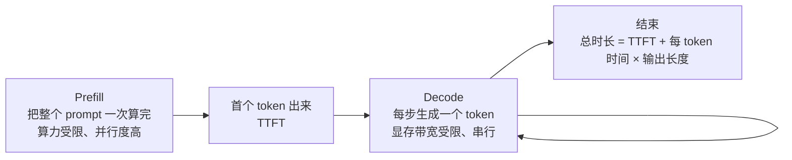

# F06 KV Cache 与推理：延迟、显存和吞吐的账

> 这篇把应用工程和推理实现接起来：托管 API 与自部署怎么比较、上下文长度怎么估、首字延迟为什么和总时长不同。LLMs-from-scratch 没有单独一章讲它，本篇对应 llm-course 的 Engineer 路线。

## 学习目标

- 能解释 prefill 和 decode 两个阶段的区别，以及各自的瓶颈
- 能估算一个模型在给定上下文长度下的 KV cache 显存
- 能说出量化、批处理、投机解码各优化什么，代价是什么

## 前置

- [F03 Attention 与 Transformer](../03-attention-and-transformer/README.md)：KV cache 和 GQA 是什么、权重体积怎么算

## 核心概念

1. **一次生成分两段：prefill 处理完整输入，decode 逐个生成 token。** 在常见 GPU 推理中，prefill 更偏向并行计算，decode 更容易受显存带宽和调度影响；实际瓶颈要用 trace 验证。
2. **TTFT（首字延迟）通常受 prefill 和排队影响，并会随输入长度增加。** 输入 10k token 的 TTFT 往往比 1k 慢，但批处理、缓存和服务端调度也会改变结果。这是主线第 08 课裁剪上下文的直接收益。
3. **KV cache 让 decode 不必重算历史 token，但每步仍要读取越来越长的缓存。** 因此单 token 时间不会按输入长度平方增长，却也不能假设和上下文长度完全无关。
4. **KV cache 显存 = 2 × 层数 × KV 头数 × 头维度 × 每参数字节 × 序列长度。** GQA 减少 KV 头数后，单 token 的缓存会变小；长上下文时，这项显存可能超过权重本身。
5. **批处理把多个请求的 decode 合在一起，让一次权重搬运服务多个 token。** 它通常提高吞吐，代价是排队和单请求延迟要重新测。continuous batching 让请求随到随加。vLLM 这类推理服务器还会用 PagedAttention 按页管理 KV cache，减少碎片和浪费。
6. **量化把权重从 fp16 压到 int8 / int4，通常能降低权重显存，也可能改善带宽受限的 decode。** 精度变化和速度收益依模型、量化方法与任务而异。量化的通常只是权重，KV cache 是否量化要看引擎支持；长上下文时两项都要算。
7. **投机解码用一个小模型先猜几个 token，大模型一次验证。** 加速幅度取决于猜中率、调度和模型组合；格式稳定的输出更容易获得收益，开放生成要实测。
8. **支持 prompt caching 的服务会缓存可复用前缀的 prefill 结果。** 前缀一致时可以减少 TTFT 和输入处理成本；system prompt 和工具定义放在前面并保持稳定，有利于命中缓存，但具体规则依供应商而异。
9. **自部署和托管 API 要按完整成本比较：** 流量、合规、模型定制、GPU 利用率、运维人力和升级成本都要算。稳定大流量或有数据边界时自部署可能合适，低流量和快速迭代时托管通常更省运维。

## 动手

| 文件 | 演示什么 | 运行 |
|---|---|---|
| [`code/01_kv_cache_memory.py`](./code/01_kv_cache_memory.py) | 有无 GQA 的两个 7B 配置在 4k / 32k / 128k 上下文下的 KV cache 显存；一张 24GB 卡能装几路 32k 请求 | `uv run python prerequisites/llm-foundations/06-kv-cache-and-inference/code/01_kv_cache_memory.py` |

脚本用两组 7B 规模的假设配置做估算：无 GQA 时，128k 上下文约 67.1GB；GQA-8 时约 16.8GB。数字只用于展示 KV 头数的量级影响，真实模型还会受层数、头维度、缓存精度、并发和框架开销影响。主线第 23 课的显存估算器把权重和 KV cache 两项合在一起算。

## 它在 AI 应用里用在哪

- TTFT 与输入长度、prompt caching → [第 08 课 Context Engineering](../../../lessons/context-engineering-for-agents/README.md)
- 自部署 vs 托管、量化选型 → [第 23 课](../../../lessons/model-adaptation-finetuning-inference/README.md)
- 延迟预算 → [第 21 课](../../../lessons/reliability-cost-llmops/README.md)

## 延伸阅读

- [vLLM 文档](https://docs.vllm.ai/en/latest/)（访问日期 2026-09-04）：看 PagedAttention 和 continuous batching 两节的原理说明就够。
- [Hugging Face · KV cache quantization](https://huggingface.co/blog/kv-cache-quantization)（访问日期 2026-09-04）：KV cache 量化的效果和取舍。
- [llm-course · The LLM Engineer · Inference optimization](https://github.com/mlabonne/llm-course)（访问日期 2026-09-04）：Flash Attention、KV cache、投机解码的资料清单。

---

[← F05](../05-training-and-alignment/README.md) · [F07 →](../07-model-landscape/README.md)
