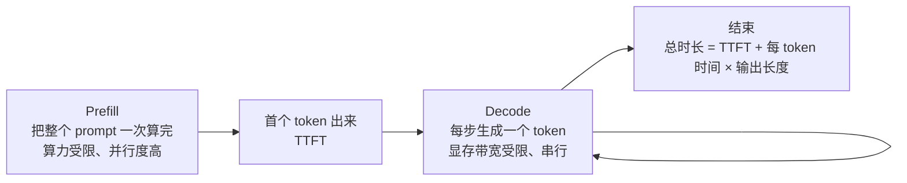

# F06 KV Cache 与推理：延迟、显存和吞吐的账

> 这是应用工程师最该懂的底层。你选托管 API 还是自部署、能开多长上下文、首字延迟为什么和总时长差这么多，答案都在这里。LLMs-from-scratch 没有单独一章讲它，本篇对应 llm-course 的 Engineer 路线。

## 学习目标

- 能解释 prefill 和 decode 两个阶段的区别，以及各自的瓶颈
- 能估算一个模型在给定上下文长度下的 KV cache 显存
- 能说出量化、批处理、投机解码各优化什么，代价是什么

## 前置

- [F03 Attention 与 Transformer](../03-attention-and-transformer/README.md)：KV cache 和 GQA 是什么、权重体积怎么算

## 核心概念

1. **一次生成分两段：prefill 算完整个输入，decode 一个一个吐 token。** prefill 是矩阵乘矩阵，GPU 算力吃满；decode 每步只算一个 token，瓶颈是把几十 GB 权重从显存搬进计算单元，算力大量空闲。
2. **TTFT（首字延迟）主要由 prefill 决定，和输入长度成正比。** 输入 10k token 的 TTFT 比 1k 的慢得多。这是主线第 08 课裁剪上下文的直接收益。
3. **每 token 的生成时间由显存带宽决定，几乎和输入长度无关。** 所以流式输出的"打字速度"是稳定的。
4. **KV cache 显存 = 2 × 层数 × KV 头数 × 头维度 × 每参数字节 × 序列长度。** 7B 级模型 fp16 每个 token 约 0.5MB，用 GQA 后更小；32k 上下文一个请求就要 16GB 左右。这是长上下文真正的显存成本，比权重本身还能大。
5. **批处理把多个请求的 decode 合在一起，让一次权重搬运服务多个 token。** 吞吐大幅提升，单请求延迟略增。continuous batching 让请求随到随加。vLLM 这类推理服务器的核心就是这个加 PagedAttention（把 KV cache 按页管理，减少浪费）。
6. **量化把权重从 fp16 压到 int8 / int4，显存减半再减半，decode 更快。** int8 几乎无损，int4 在多数任务上可接受，在数学和代码上更明显。要测，不要信。注意量化的通常只是权重，KV cache 默认还是 fp16，除非引擎专门支持 KV cache 量化。上下文很长时压 KV cache 比压权重收益更大。
7. **投机解码用一个小模型先猜几个 token，大模型一次验证。** 对确定性高的输出（代码、格式化文本）加速明显，对开放生成效果一般。
8. **prompt caching 缓存的是 prefill 的 KV cache。** 前缀相同的请求跳过 prefill，TTFT 和价格都降。要拿到这个收益，system prompt 和工具定义必须放在最前面且逐字节一致，这是主线第 08 课"缓存友好布局"的原理。
9. **自部署 vs 托管 API 的判断：** 流量稳定且大、有数据合规要求、需要定制模型时自部署划算；否则托管 API 的弹性和零运维几乎总是更优。算账时把 GPU 闲置率、运维人力、升级模型的成本算进去。

## 动手

| 文件 | 演示什么 | 运行 |
|---|---|---|
| [`code/01_kv_cache_memory.py`](./code/01_kv_cache_memory.py) | 有无 GQA 的两个 7B 配置在 4k / 32k / 128k 上下文下的 KV cache 显存；一张 24GB 卡能装几路 32k 请求 | `uv run python prerequisites/llm-foundations/06-kv-cache-and-inference/code/01_kv_cache_memory.py` |

没有 GQA 的 7B 模型，128k 上下文的 KV cache 是 64GB，单张卡装不下。用 GQA 后是 16GB。这就是为什么 GQA 成了标配，也是为什么"支持 128k 上下文"和"能以合理成本跑 128k"是两回事。主线第 22 课的显存估算器把权重和 KV cache 两项合在一起算。

## 它在 AI 应用里用在哪

- TTFT 与输入长度、prompt caching → [第 08 课 Context Engineering](../../../lessons/08-context-engineering-for-agents/README.md)
- 自部署 vs 托管、量化选型 → [第 22 课](../../../lessons/22-model-adaptation-finetuning-inference/README.md)
- 延迟预算 → [第 20 课](../../../lessons/20-reliability-cost-llmops/README.md)

## 延伸阅读

- [vLLM 文档](https://docs.vllm.ai/en/latest/)（访问日期 2026-09-04）：看 PagedAttention 和 continuous batching 两节的原理说明就够。
- [Hugging Face · KV cache quantization](https://huggingface.co/blog/kv-cache-quantization)（访问日期 2026-09-04）：KV cache 量化的效果和取舍。
- [llm-course · The LLM Engineer · Inference optimization](https://github.com/mlabonne/llm-course)（访问日期 2026-09-04）：Flash Attention、KV cache、投机解码的资料清单。

---

[← F05](../05-training-and-alignment/README.md) · [F07 →](../07-model-landscape/README.md)
