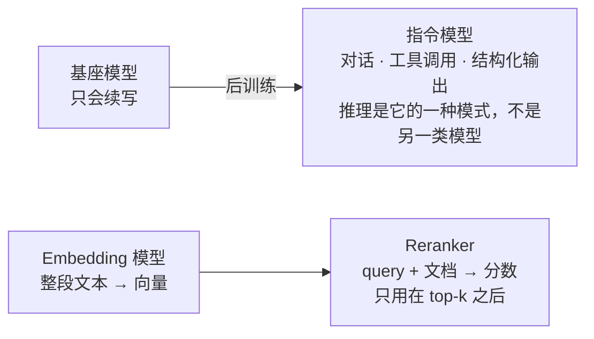

# F07 模型地图：怎么读一张模型卡

> 前六篇讲机制，这一篇讲市场。基座、指令、推理模型是什么关系；开放权重和托管 API 各给了你什么；embedding 和 reranker 为什么是另外两类模型；模型卡上哪几个数字决定你能不能用它。

## 学习目标

- 能把一个陌生模型归到基座 / 指令 / 推理 / embedding / reranker 五类之一，并说出它能用在应用的哪一层
- 能从模型卡读出上下文长度、注意力头结构、许可证、知识截止、工具调用支持五项，并说出各自影响什么决策
- 能解释"开放权重"和"开源"的区别，以及它对自部署和合规意味着什么

## 前置

- [F05 训练与对齐](../05-training-and-alignment/README.md)、[F06 KV Cache 与推理](../06-kv-cache-and-inference/README.md)

## 核心概念

上面是生成线，下面是检索线。**两条线互不相通**：embedding 模型不会说话，指令模型的向量也不适合拿来检索。

1. **先分清两条线。** 生成线：基座只会续写，直接拿来对话会很怪；指令模型是应用的默认选择，对话、工具调用、结构化输出都靠它。检索线：embedding 把整段文本压成向量，reranker 对候选精排，两者都不产出自然语言（[F02](../02-embeddings/README.md)）。
2. **「推理模型」现在更像一种模式，不是一个独立类别。** 它指的是回答前先生成一段思考再作答。早期确实有专门的推理模型，但这个能力正在变成主流指令模型的一个可开关选项（各家叫法不同：思考预算、reasoning effort、extended thinking）。**选型时要问的不是「这是不是推理模型」，而是「它能不能开推理、开了之后延迟和价格各是多少」。**
3. **开着推理不是免费的。** 思考 token 你看不见，但要付钱，延迟经常是几倍。用它做一次意图分类，是拿显微镜看路牌。合理的用法是只在真正需要多步推导的节点开，其余走普通模式——什么时候值得，看主线[第 01 课](../../../lessons/01-how-llms-work/README.md)的成本模型。
4. **开放权重不等于开源。** 权重能下载，不代表训练数据和训练代码公开，也不代表你能随便商用。有的许可证限制月活规模，有的禁止用模型输出去训练别的模型，有的要求显著标注。**这是硬约束，不是打分项**——选型时先过许可证这一关，再谈能力。
5. **模型卡先看五项。** 上下文长度（能塞多少，[F04](../04-context-window-and-sampling/README.md)）；层数与 kv 头数（自部署时算显存，[F06](../06-kv-cache-and-inference/README.md)）；许可证（能不能用）；知识截止（哪些事它一定不知道，得靠检索补）；是否原生支持工具调用与结构化输出（决定你要不要自己兜底解析）。
6. **知识截止不是一条硬边界。** 它标的是训练数据的大致终点，不代表模型对截止前的事都清楚、对之后的事一无所知——越靠近截止日期，掌握得越稀疏，而且模型不会告诉你它在哪一段开始变得不可靠。所以它的用法是「排除法」：**截止之后的事实一定要外部提供**，之前的也不能默认它记得准。
7. **检索不只是为了补新知识。** 模型不知道你公司内部的任何事，这和截止日期无关；另外三个理由同样重要：答案要能给出处（第 14 课的引用）、知识要能随时更新而不用重训、不同用户能看到的内容不一样（权限过滤）。**「模型不够新」只是走 RAG 的理由之一，不是全部**——只盯着这一条，会在模型升级之后误以为可以把检索去掉。
8. **托管 API 有三种形态。** 厂商原生接口、OpenAI 兼容网关、云厂商托管。**协议兼容度决定了换供应商的成本**：走 OpenAI 兼容协议时，换模型可能只是改个 base_url 和模型名；用了某家的原生特性（特定的缓存控制、服务端工具），就得为它单独写一个 adapter。这条是[原则 12](../../../principles/12-models-are-swappable-adapters.md)的现实依据。
9. **小模型有它的位置，大模型不是默认答案。** 分类、路由、字段抽取、端侧场景，小模型往往又快又便宜，质量差距可以用更严的输出约束补回来。一个常见的架构是小模型做路由和抽取、大模型只处理真正难的那部分。
10. **价格、上下文长度、能力标志全是时间敏感信息。** 它们每个季度都在变。写进任何文档都要带查询日期，否则半年后没人知道那个数字还作不作数。这门课的[技术选型](../../../reference/stack.md)和[框架一览](../../../reference/frameworks.md)都按这条规矩记。

## 动手

这一篇没有脚本，换一个纸上练习：打开你正在用或考虑用的那个模型的模型卡（Hugging Face 页面或供应商文档），把上面第 4 条那五项抄下来，每项后面写一句"它影响我的哪个决定"。

写不出来的那几项，就是你目前的盲区。特别注意许可证那一栏——很多人从来没打开看过。

## 常见错误

**按榜单选模型。** 榜单测的是别人的任务。要在自己真正依赖的能力上跑探针，做法见主线[第 01 课](../../../lessons/01-how-llms-work/README.md)。

**把"开放权重"当成"随便用"。** 许可证是法务问题，出问题时改模型的成本远高于选型时多读十分钟。

**用参数量比较模型。** 参数量和实际能力的关系早就不是线性的了，训练数据和后训练的影响更大。同样是"7B"，代际之间差距可能比参数量翻倍还大。

## 它在 AI 应用里用在哪

- 模型选型矩阵与能力探针 → [第 01 课](../../../lessons/01-how-llms-work/README.md)
- 模型可替换的 adapter → [原则 12](../../../principles/12-models-are-swappable-adapters.md)
- 托管还是自建 → [第 22 课](../../../lessons/22-model-adaptation-finetuning-inference/README.md)

## 延伸阅读

- [generative-ai-for-beginners · 02 Exploring and comparing LLMs](https://github.com/microsoft/generative-ai-for-beginners/tree/main/02-exploring-and-comparing-different-llms)（访问日期 2026-09-04）：模型分类讲得清楚，本篇的骨架。
- [Hugging Face · Model Cards](https://huggingface.co/docs/hub/model-cards)（访问日期 2026-09-04）：模型卡包含哪些字段。

---

[← F06](../06-kv-cache-and-inference/README.md) · [前置总览](../README.md)
