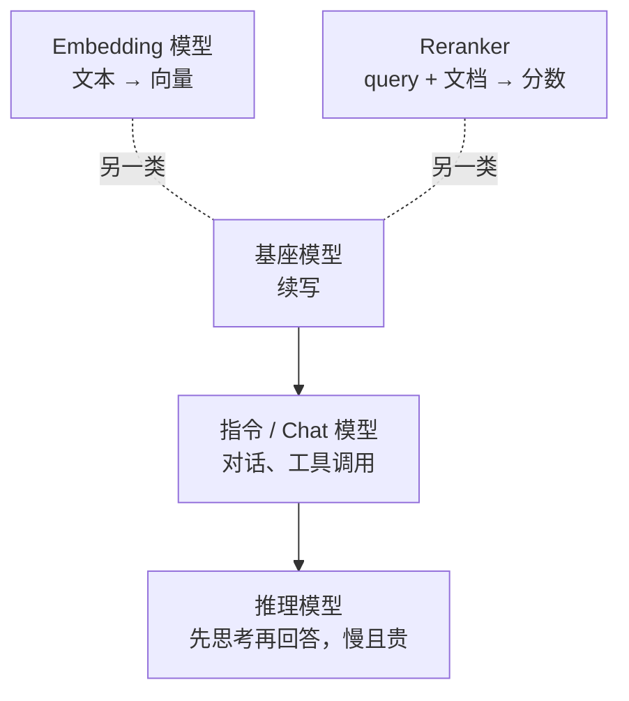

# F07 模型地图：怎么读一张模型卡

> 前六篇讲机制，这一篇讲市场。基座、指令、推理模型是什么关系；开放权重和托管 API 各给了你什么；embedding 和 reranker 为什么是另外两类模型；模型卡上哪几个数字决定你能不能用它。

## 学习目标

- 能把一个陌生模型归到基座 / 指令 / 推理 / embedding / reranker 五类之一，并说出它能用在应用的哪一层
- 能从模型卡读出上下文长度、kv 头数、许可证、知识截止、工具调用支持五项，并说出各自影响什么决策
- 能解释"开放权重"和"开源"的区别，以及它对自部署和合规意味着什么

## 前置

- [F05 训练与对齐](../05-training-and-alignment/README.md)、[F06 KV Cache 与推理](../06-kv-cache-and-inference/README.md)

## 核心概念

<!-- outline：待写。要点清单：
1. 五类模型各在应用的哪一层：对话与 Agent 用指令模型；复杂规划用推理模型但要控成本；检索用 embedding + reranker
2. 开放权重 vs 开源：权重可下载不等于训练数据和代码开放；许可证限制商用与再分发
3. 模型卡必读五项：上下文长度、kv 头数与层数（F06 算显存）、许可证、知识截止、是否原生支持工具调用与结构化输出
4. 托管 API 的三种形态：厂商原生、OpenAI 兼容网关、云厂商托管；协议兼容决定 adapter 的可替换性
5. 小模型的位置：分类、路由、抽取、端侧；大模型不是默认答案
6. 价格与上下文长度都是时间敏感信息，写进文档必须标日期
-->

## 它在 AI 应用里用在哪

- 模型选型矩阵与能力探针 → [第 01 课](../../../lessons/01-how-llms-work/README.md)
- 模型可替换的 adapter → [原则 12](../../../principles/12-models-are-swappable-adapters.md)
- 托管还是自建 → [第 21 课](../../../lessons/21-model-adaptation-finetuning-inference/README.md)

## 延伸阅读

- [generative-ai-for-beginners · 02 Exploring and comparing LLMs](https://github.com/microsoft/generative-ai-for-beginners/tree/main/02-exploring-and-comparing-different-llms)（访问日期 2026-09-04）：模型分类讲得清楚，本篇的骨架。
- [Hugging Face · Model Cards](https://huggingface.co/docs/hub/model-cards)（访问日期 2026-09-04）：模型卡包含哪些字段。

---

[← F06](../06-kv-cache-and-inference/README.md) · [前置总览](../README.md)
