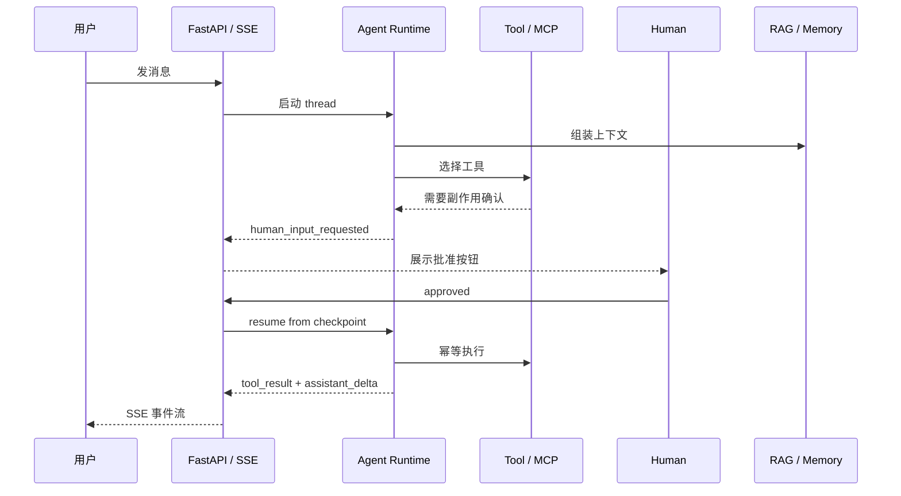
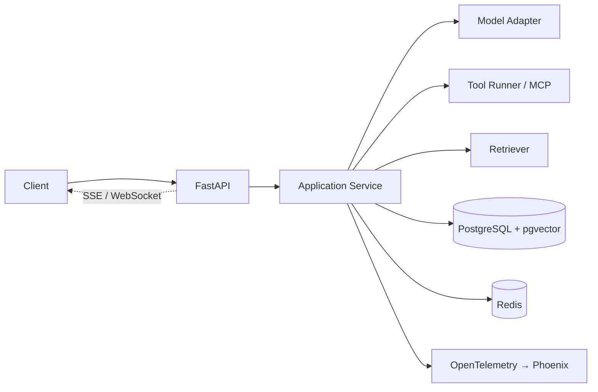

# 主项目｜AI 应用服务骨架

> 一个不绑定模型供应商的 AI 应用后端，从 asyncio 实验开始，每个里程碑聚焦一个能力簇并有明确的最小验收目标，最终长成带工具、RAG、Memory、评测和可观测性的生产级服务。
> 每一课学到的概念都在这里落地。实现型里程碑要留下代码、测试和一次失败注入；设计型里程碑要留下设计文档、估算、决策记录和失败推演。

## 这就是课程的 Hero Demo

打开 Playground，你看到的是一条真实的 Agent 请求链，而不是一个孤立的聊天框：

完成 M5 后，系统具备 FastAPI、streaming、Agent Runtime、Tool Calling、HITL、checkpoint / resume、MCP、RAG、Memory、PostgreSQL + pgvector、Redis、Evaluation、OpenTelemetry、Phoenix、fallback、cost budget、security 和 deployment。它们不是一张愿望清单：代码在 `src/aiapp/`，验收在 `tests/project/m1` 到 `m5`，失败行为由 `INJECT_` 和 `scripts/chaos.py` 留证。

### 三条可展示的证据链

| 证据链 | 怎么看 | 你能说明什么 |
|---|---|---|
| 运行 | [Playground](../README.md#完整运行方式) → 对话 → 工具确认 → 继续 | 流式、人机介入、状态恢复不是 PPT 概念 |
| 观测 | 启动 Phoenix 后打开 `http://localhost:6006` | 一次请求每一跳的耗时、错误和成本可以追溯 |
| 验收 | `uv run pytest -q`、`scripts/eval_run.py`、`scripts/chaos.py --all` | 系统不仅能成功，也能在故障下按设计失败 |

## 架构目标

## 里程碑

服务跑起来后打开 `http://localhost:8000/playground`，M1～M4 的能力都能在这一页上操作：对话与事件流、人工确认、文档导入与检索、记忆。页面源码在 `src/aiapp/api/static/playground.html`，只调 `/v1` 接口。

| 里程碑 | 名称 | 内容 | 类型 | 状态 |
|---|---|---|---|---|
| M0 | [并发实验](./m0-concurrency/README.md) | 串行、并发、限并发、取消、超时五个对照实验；为流式和并行工具调用打底 | 实现 | complete |
| M1 | [API 骨架](./m1-api-skeleton/README.md) | FastAPI + Pydantic + pytest；健康检查、鉴权、SSE 流式、结构化错误、system prompt 版本化 | 实现 | complete |
| M2 | [数据与状态](./m2-state-and-storage/README.md) | conversation / message / task 表、Alembic 迁移、Redis 状态、checkpoint 与 resume | 实现 | complete |
| M3 | [Tool Workflow](./m3-tool-workflow/README.md) | 工具契约、确认与幂等、失败恢复、最小 trace；再接 MCP 和一个 Skill | 实现 | complete |
| M4 | [Tiny-RAG 与 Memory](./m4-rag-and-memory/README.md) | 混合检索、引用、Recall@k、记忆提取与删除演练 | 实现 | complete |
| M5 | [生产化](./m5-production/README.md) | Golden set 回归、OpenTelemetry + Phoenix、限流、Fallback、成本统计、故障演练、容器化与部署 | 实现 | complete |
| M6 | [综合设计](./m6-platform-design/README.md) | 多租户知识库 + 任务 Agent 平台的 RFC：容量、威胁模型、模型与推理选型、迁移与退出；Capstone 4 的设计阶段 | 设计 | draft |

### 里程碑的学习节奏

每个里程碑都按同一条证据链推进：**读对应课程 → 跑现有代码 → 打开一个失败注入 → 改一小块 → 跑该里程碑测试 → 把结果写进自己的项目记录**。主项目中的状态和接口是后续课程的共同语言，尽量不要跳过 M2 的存储边界直接复制 M5 的部署文件。

## Framework & Architecture Lab

M3 之后可以开始，默认在 Part 5 学完后一次做完。[Framework Lab](./framework-lab/README.md) 用同一个审批型任务 Agent 的需求，在 LangGraph、OpenAI Agents SDK、Claude Agent SDK 上各实现一遍，跑同一套一致性测试，按十二个维度逐格对照。产出是选型的判断力，不是排名。

| 内容 | 状态 |
|---|---|
| [Framework Lab 总览](./framework-lab/README.md) | draft |
| [框架全景与选型标准](./framework-lab/00-landscape.md) | draft |

## Capstone

章节练习证明你懂一个机制，[Capstone](./capstones/README.md) 证明你能交付一个系统。四个题目各有前置、可执行的验收和评分量表。

| # | Capstone | 前置 | 状态 |
|---|---|---|---|
| 1 | [Production Agent Service](./capstones/01-production-agent-service/README.md) | M5 | complete |
| 2 | [RAG + Memory Agent](./capstones/02-rag-memory-agent/README.md) | M4, 17 | outline |
| 3 | [Long-running Durable Agent](./capstones/03-durable-agent/README.md) | M3, Framework Lab | outline |
| 4 | [Multi-tenant AI Platform](./capstones/04-multi-tenant-platform/README.md) | M6 | outline |

## 课程到项目的映射

> 检查两件事：有没有课程没有项目落点；有没有里程碑依赖了还没学的课。改课程或里程碑时同步改这张表。

| 课 | 核心产出 | 项目落点 | 依赖 |
|---|---|---|---|
| [00](../lessons/00-setup/README.md) | fake adapter 与环境 | M0 | P00 |
| [01](../lessons/01-how-llms-work/README.md) | 选型矩阵、能力探针、成本模型 | adapters/PRESETS；M5 成本账与 fallback；M6 ADR-4 | F00, F01, F04, F07 |
| [02](../lessons/02-model-api-structured-output-streaming/README.md) | 模型调用、结构化输出、流式 | M0, M1 | P05, P06, P07 |
| [03](../lessons/03-prompt-engineering/README.md) | system prompt 与版本化 | M1 | 02 |
| [04](../lessons/04-embeddings-and-vector-search/README.md) | Embedding 选型与向量索引 | M4.1 | F02, B01 |
| [05](../lessons/05-tool-calling/README.md) | Tool contract | M3.1, M3.2 | P04, P06, 02 |
| [06](../lessons/06-agent-loop/README.md) | Agent loop | M2, M3 | P07, 05 |
| [07](../lessons/07-agent-state-and-runtime/README.md) | State schema 与 runtime | M2 | B01, 06 |
| [08](../lessons/08-context-engineering-for-agents/README.md) | Context builder | M3 | 03, 06, 07 |
| [09](../lessons/09-workflow-vs-agent/README.md) | 架构模式选型说明 | M3（选型记录） | 06 |
| [10](../lessons/10-multi-agent-handoff/README.md) | 两个 Agent 的 handoff | M3.4（可选） | 07, 09 |
| [11](../lessons/11-mcp/README.md) | MCP client 接入 | M3.3 | 05 |
| [12](../lessons/12-skills-and-capability-layers/README.md) | 一个 Skill 包 | M3.3 | 08, 11 |
| [13](../lessons/13-rag-end-to-end/README.md) | Tiny-RAG 管线 | M4.1, M4.2 | 04 |
| [14](../lessons/14-memory/README.md) | Memory 提取与检索 | M4.3 | 07, 13 |
| [15](../lessons/15-data-engineering/README.md) | 文档版本与删除演练 | M4 | 13 |
| [16](../lessons/16-system-architecture/README.md) | 端到端架构图 | M1, M2 回顾；M5 前置 | 07, 13 |
| [17](../lessons/17-evaluation/README.md) | Golden set 与回归门禁 | M5.1 | B02, 06, 13 |
| [18](../lessons/18-observability/README.md) | Trace 与故障实验 | M5.2 | P03, 17 |
| [19](../lessons/19-reliability-cost-llmops/README.md) | 限流、Fallback、成本、部署 | M5.3 | P07, 18 |
| [20](../lessons/20-security-governance/README.md) | 注入与越权测试、多租户边界 | M5 | 05, 13 |
| [21](../lessons/21-model-adaptation-finetuning-inference/README.md) | 模型与推理选型决策 | M6 | F05, F06, 01, 19 |
| [22](../lessons/22-product-design-ux/README.md) | 交互与反馈闭环设计 | M6 | 17 |
| [23](../lessons/23-system-design-decisions/README.md) | RFC | M6 | 16–22 |

## 工具栈

Python 3.12 + uv、FastAPI、Pydantic v2、pytest、PostgreSQL + pgvector、Redis、Docker Compose、OpenTelemetry、Arize Phoenix。模型通过可替换的 adapter 接入，默认提供 fake adapter 保证离线可跑。选型理由见 [reference/stack.md](../reference/stack.md)。

## 边界

- 先做模块边界和测试，再考虑 Agent 框架。
- Redis 不当永久事实来源；Prompt 不当唯一业务逻辑。
- 仓库里不出现真实 API Key、内部地址或账号。
- `src/` 存放最终形态；各 `mN-*/` 目录存放该阶段的增量说明和阶段性代码；`tests/project/mN/` 是该里程碑的验收测试。
- `framework-lab/` 和 `capstones/` 不编号，是七个里程碑之后的两个实践单元；Lab 最早可在 M3 后开始。框架依赖只进 `frameworks` 依赖组。
