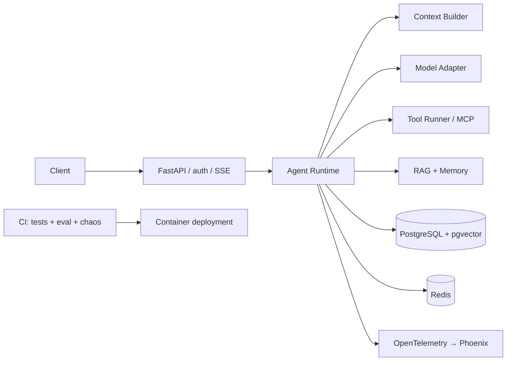

# Capstone 1｜Production Agent Service

> 把 M1–M5 交付成一个能被别人运行、评审和追问的服务。这个 Capstone 的“答案”不是某个行业功能，而是一套能证明你理解运行时、数据、失败和运维边界的工程证据。

## 需求

为一个租户交付任务型 Agent 服务。用户可以发起问题、查看流式进度、批准高风险工具，并在服务重启后继续任务。服务默认使用 fake model，演示时可切换到兼容协议的真实模型。

### Non-goals

- 不追求做一个通用聊天产品、模型训练平台或多 Agent 平台。
- 不要求实现新的 Agent 框架；框架对照属于 [Framework Lab](../../framework-lab/README.md)。
- 不把提示词当成权限系统，不把 Redis 当成永久事实来源。
- 不提交真实用户数据、密钥、内部地址或未经许可的第三方语料。

## 约束

| 约束 | 最低要求 |
|---|---|
| 运行 | Python 3.12、uv、Docker Compose；fake model 离线可跑 |
| 接口 | FastAPI；创建 thread、发送消息、读取事件；SSE 首块前后错误语义清楚 |
| 状态 | PostgreSQL 是事实来源，Redis 只做缓存 / 锁 / 限流；checkpoint 可恢复 |
| 安全 | 租户身份绑定在运行时；工具 allowlist；副作用确认；PII 出站过滤 |
| 预算 | 给出单请求和单租户日预算；超预算停止并留下原因码 |
| 可运维性 | 至少定义 3 个 SLO、5 个告警和一次回滚路径 |
| 团队假设 | 1–2 名工程师，能在一周内跑通验收；设计选择要写假设和退出条件 |

### 推荐架构



## 验收清单

### Automated tests

提交一个能在干净环境运行的测试入口，至少覆盖：

- `uv run pytest tests/project/m1 -q` 到 `tests/project/m5 -q`：API、状态、工具、RAG、Memory、评测、可靠性和 telemetry。
- `uv run python scripts/eval_run.py --report eval-report.md`：任务、工具选择、检索和 judge 校准不低于基线。
- `uv run python scripts/chaos.py --all`：超时、供应商错误、限流、熔断、成本预算和数据依赖故障按预期结束。
- 至少新增 5 个 Capstone 测试：跨租户拒绝、PII 出站拦截、恢复不重复副作用、评测退化阻断、预算耗尽。

测试失败要给出“观察到什么 / 预期是什么 / 如何修复”的诊断信息，不能只断言 `200`。

### Functional and operational acceptance

- [ ] `docker compose --profile full up -d --build --wait` 一次启动服务和依赖，`/healthz`、`/readyz` 语义不同且都可检查。
- [ ] Playground 能展示 `assistant_delta`、工具调用、`human_input_requested`、批准、`tool_result` 和最终答案。
- [ ] 进程在 checkpoint 后终止，重新启动后用同一个 thread resume；副作用计数保持为 1。
- [ ] Phoenix 中能看到 request → runtime → model / tool / retrieval 的 trace，包含租户、prompt 版本、用量和错误状态等非敏感属性。
- [ ] 主模型超时或连续失败时，fallback / 快速失败符合设计；重试不会放大副作用。
- [ ] 跨租户 thread、文档、memory、工具和成本查询全部拒绝，并有专门测试。
- [ ] 运行一次 `INJECT_` 或 `AIAPP_INJECT` 失败注入，附原始命令、输出和修复 / 处置结论。

## 评分量表

每个维度 0–2 分，满分 14；评分不是替代验收，验收未通过时不能用文档分弥补。第三档必须附代码、测试或运行截图证据。

| 维度 | 0｜缺失 | 1｜可运行 | 2｜可交付 |
|---|---|---|---|
| Correctness | 主路径不能跑或结果不可解释 | 主路径和少量错误可跑 | API、工具、引用和错误语义有测试与原因码 |
| Persistence | 重启丢状态或副作用重复 | 有 checkpoint，边界靠人工确认 | 恢复、幂等、迁移和 pending 状态有自动化测试 |
| Evaluation | 只展示几次手工输出 | 有 golden set 和总分 | 有 slice、轨迹断言、基线、阈值和退化案例 |
| Observability | 只有 print 或最终日志 | 有结构化日志 / trace | 可从 trace 定位模型、工具、检索、成本和租户问题 |
| Security | 权限藏在 prompt | 有 allowlist / confirmation | 有租户边界、PII、注入、供应链和删除测试 |
| Cost & Reliability | 无预算，失败靠重试 | 有 timeout / retry / budget | 有 SLO、fallback、限流、熔断、成本归因和 chaos 证据 |
| Delivery & Docs | 只能作者本机运行 | 有 README 和 Dockerfile | 一键启动、CI、runbook、ADR、截图和回滚步骤齐全 |

## 交付物

至少提交以下文件或等价物：

```text
README.md                    # 30 秒定位、运行和验收入口
src/                         # 服务代码与配置边界
tests/                       # 单元、接口、失败和租户隔离测试
eval/                        # golden set、基线、报告或生成报告的命令
docs/                         # 架构图、runbook、ADR、威胁与成本说明
demo/                         # 脱敏截图 / GIF；可改放 .github/assets/demo/
Dockerfile + compose         # 开发与部署形态
```

README 还要回答：系统做什么、不做什么、如何换模型、如何迁移、故障时先看什么、如何回滚。

## 评测、观测与故障注入

至少准备 20 条 golden tasks，按正常问题、工具选择、拒绝 / 确认、RAG 引用、长上下文和失败恢复切片。最终答案断言之外，至少断言一次工具轨迹和一次不应发生的副作用。

建议录制四个短 Demo：

1. streaming → tool → approval → execution → final answer；
2. RAG import → query → citation；
3. Phoenix trace 展开一次完整请求；
4. kill process → resume，证明幂等。

录制规范见 [`reference/demo-recording.md`](../../../reference/demo-recording.md)。不要把“录制待办”当成截图交付。

## 部署、Runbook 与 ADR

### 部署

- 开发：`docker compose --profile full up -d --build --wait`。
- CI：相对链接、模板、状态、迁移、pytest、eval、chaos 和镜像守卫全部通过。
- 生产：密钥通过环境变量或密钥管理服务注入；拒绝默认 token、内存存储和未迁移数据库。
- 回滚：写清镜像回滚、数据库迁移兼容窗口、prompt / model adapter 版本回退和未完成 thread 的处置。

### Runbook

至少覆盖：首块延迟升高、模型供应商错误、工具持续超时、Redis 不可用、数据库连接耗尽、成本尖峰。每条写症状、查询入口、止损动作、恢复动作和事后补测。

### ADR

至少写 3 份 ADR：

- 为什么 runtime 状态不交给 Redis，checkpoint 和业务事实如何分工；
- 为什么选择 Workflow / Agent 以及副作用在哪里确认；
- 为什么选择当前模型、fallback 和部署形态，什么指标触发退出或迁移。

## 常见失败

- **只做成功 Demo**：评审一问供应商超时或重启恢复就没有证据。先把 failure injection 录进测试。
- **把 CI 绿当成上线**：离线 fake 通过不代表真实供应商、数据量和权限一定正确；在报告中明确测试边界。
- **用 prompt 做安全**：把 tenant_id、工具 allowlist 和 PII 过滤放在运行时，prompt 只负责表达意图。
- **checkpoint 保存了状态但没做幂等**：恢复会再执行一次删除 / 发信。为每个副作用写稳定键，并测试重放。
- **追求功能数量**：不要再塞一个 Agent；把已有路径的 trace、成本、回滚和文档做完整，作品才可讲。

---

[← Capstone 总览](../README.md)
