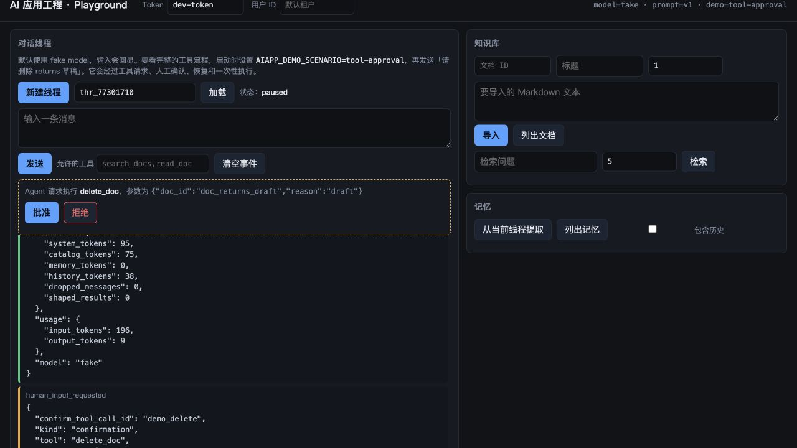
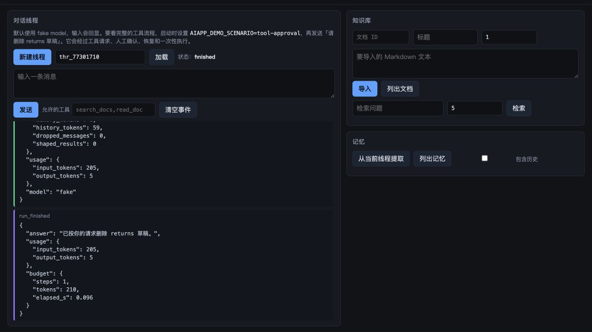

# 跟着参考项目读这门课

课程正文解释机制，参考项目把机制放进一个可以启动、失败和验收的服务。读到一条原则时，不要只停在示意代码：先运行对应场景，看事件和错误，再回到正文理解为什么这样设计。

## 先让服务跑起来

无 API Key 的最小路径只使用内存存储和 fake model：

```bash
cd ai-app-engineering-ref
uv sync
uv run uvicorn aiapp.api.app:create_app --factory --port 8000
```

打开 <http://localhost:8000/playground>，Token 填 `dev-token`。默认 fake model 只回显输入，这是确认 HTTP、SSE 和事件线程的起点。

这条路径使用内存存储，适合看请求和事件。要验证重启后 checkpoint、Redis 幂等键和 PostgreSQL 知识库仍然存在，改用完整容器栈：

```bash
docker compose --profile full up -d --build --wait
curl http://localhost:8000/healthz
curl http://localhost:8000/readyz
```

结束后执行 `docker compose --profile full down`，不要加 `-v`，否则会同时删掉本地卷。

要看完整的工具链，启动确定性的课程场景：

```bash
AIAPP_DEMO_SCENARIO=tool-approval \
  uv run uvicorn aiapp.api.app:create_app --factory --port 8000
```

发送“请删除 returns 草稿”。你会依次看到 `tool_result`、`human_input_requested`、`human_input`、`run_finished`。页面上的每一条事件都来自真实的 `/v1/threads/{id}/messages` 或 `/human-input` 接口。

## 课程和项目怎样对上

| 课程 | 运行入口 | 先观察什么 | 失败演练 |
|---|---|---|---|
| 00–03 | `adapters/`、`runtime/turn.py`、`prompts/` | 模型适配器、SSE 增量、prompt 版本 | `AIAPP_INJECT=provider_error` |
| 04、15、17 | Playground 知识库面板、`knowledge/` | 导入、切块、混合检索、引用 | 删除文档后检查 residue；`scripts/eval_recall.py` |
| 05–07 | `runtime/runner.py`、`runtime/loop.py`、`storage/` | 工具守卫、确认、checkpoint、幂等 | `scripts/chaos.py --inject tool_error` |
| 08、09、12–14 | `runtime/context.py`、`skills.py`、`mcp_source.py` | 上下文预算、Skill、MCP 工具注册 | 工具白名单、MCP 断开、上下文裁剪测试 |
| 10、11 | 课程正文、M3 选型记录和 Framework Lab | 长任务清单、handoff 的边界 | 主线运行时暂未实现这两层；Framework Lab 目前只有 baseline 和 LangGraph 可运行 |
| 16 | Memory 面板、`knowledge/memory.py` | 来源事件、冲突合并、定向删除 | `tests/project/m4/test_memory.py` |
| 18–22 | `api/`、`ops/`、`eval/` | 请求链、trace、成本、限流、fallback | `scripts/chaos.py --all` |
| 23 | `adapters/openai_compat.py`、M6 ADR-4 | OpenAI 兼容推理端点、替换模型的接缝 | 微调和自托管容量规划仍是设计稿 |
| 24 | `api/static/playground.html` | 确认密度、反馈状态和错误恢复 | `tests/project/m5/test_telemetry_and_api.py` |
| 25 | 课程正文 | 级联语音链路的延迟预算 | 参考项目暂未实现语音链路 |
| 26 | `m6-platform-design/`、`capstones/` | ADR、容量和退出条件 | 当前是设计稿，不能当作已实现能力 |

完整的课程到文件映射见参考项目的 [project/README.md](https://github.com/lance2016/ai-app-engineering-ref/blob/main/project/README.md)（核对日期 2026-09-09）。

Framework Lab 可以单独跑一遍共同规格。当前只有 baseline 和 LangGraph 两个实现接入测试，另两个 SDK 还没有适配器；`skip` 是待实现能力的记录，不是通过：

```bash
cd ai-app-engineering-ref
uv run pytest tests/project/framework_lab -q
```

!!! note "本地运行记录（2026-09-09）"
    下面的结果来自参考项目当前版本；两个待实现 SDK 的适配器补上后，`skipped` 数字会变化。

```text
8 passed, 24 skipped
```

这条结果适合配合 [多智能体与 Handoff](../lessons/multi-agent-handoff/README.md) 和 [Workflow 还是 Agent](../lessons/workflow-vs-agent/README.md) 读：先看同一份事件契约怎样被两种实现满足，再看评分表里哪些能力还没有证据。

## 四个最小演示

### 运行截图

下面三张图来自本地 Playground，不是示意图。第一张停在确认门前：工具请求已经进入事件线程，但删除还没有发生；第二张是同一线程批准后的终态。第三张把同一套服务切到 `AIAPP_INJECT=slow_model`，展示首个模型块超时如何变成结构化错误。






### 工具确认

```bash
AIAPP_DEMO_SCENARIO=tool-approval \
  uv run uvicorn aiapp.api.app:create_app --factory --port 8000
```

运行时先接受模型的工具请求，再由 `ToolRunner` 判断是否需要确认。`delete_doc` 有副作用，所以它不会因为 JSON 合法就直接执行。关键代码在 [`runtime/runner.py`](https://github.com/lance2016/ai-app-engineering-ref/blob/main/project/src/aiapp/runtime/runner.py) 和 [`api/routes/threads.py`](https://github.com/lance2016/ai-app-engineering-ref/blob/main/project/src/aiapp/api/routes/threads.py)。

下面是真实项目中的守卫顺序，省略了 trace 包装和异常分类；读者可以直接打开文件看完整实现：

```python title="project/src/aiapp/runtime/runner.py"
if tool.has_side_effects:
    decision = confirmation_for(thread, call.id)
    if decision is None:
        return NeedsConfirmation(call)
    if decision is False:
        return outcome("user declined; nothing was changed", route="declined", is_error=True)

key = idempotency_key(call, ctx)
if not await self._kv.claim(key, "running", self.result_ttl_s):
    recorded = await self._kv.get(key)
    if recorded and recorded != "running":
        stored = json.loads(recorded)
        return outcome(stored["content"], route="replayed", is_error=stored["is_error"])
```

前半段回答“谁批准了这次副作用”，后半段回答“同一个调用重来时是否会再次执行”。这两个问题都由运行时回答，模型输出只是一份请求。

### RAG 引用

启动 `rag-citation` 场景，在知识库面板填入文档 ID `refund-policy`、版本 `1`，导入一条退款规则，再查询文档中的事实。检索结果带 `citation_id`，回答结束后追加 `citations_checked`；固定回答里的 `[refund-policy@v1#0]` 只有在这个 ID 和版本都一致时才会通过校验。引用校验代码在 [`knowledge/citations.py`](https://github.com/lance2016/ai-app-engineering-ref/blob/main/project/src/aiapp/knowledge/citations.py)。要复现坏引用，运行 [`test_made_up_and_unsupported_citations_are_flagged`](https://github.com/lance2016/ai-app-engineering-ref/blob/main/tests/project/m4/test_citations.py)；它会让回答引用未检索到的编号，并在验收事件中标记缺少证据。

### Memory

启动 `memory` 场景，发送“我喜欢简短的回答”，点击“从当前线程提取”。返回的候选必须引用本线程中的用户事件；随后可以在面板中查看和删除。提取和合并代码在 [`knowledge/memory.py`](https://github.com/lance2016/ai-app-engineering-ref/blob/main/project/src/aiapp/knowledge/memory.py)。

### 故障

```bash
uv run python scripts/chaos.py --inject model_timeout
uv run python scripts/chaos.py --inject tool_error
uv run python scripts/chaos.py --inject provider_down
```

这些不是伪造的日志片段：脚本会创建真实的 ASGI 应用，发起请求，读取事件和 OpenTelemetry span，再对预期行为做断言。六种演练一次跑完：

```bash
uv run python scripts/chaos.py --all
```

评测门禁也可以离线复现：

```bash
uv run python scripts/eval_run.py
```

这次本地运行的两段输出如下。它们说明失败不是正文里凭空写出来的“错误 case”：请求真的经过服务，脚本再对 HTTP 状态、线程状态和 span 做断言。

!!! note "本地运行记录（2026-09-09）"
    下面的输出来自参考项目当前版本的 `scripts/chaos.py`，线程 ID 和 span 属性会随每次运行变化。

```text
== model_timeout: PASS
   expected: 504 model_timeout before any bytes; chat span ERROR TimeoutError; thread status failed
   observed: HTTP 504, thread status failed
   span: chat slow(fake)                  [ERROR] ... error.type=TimeoutError
   span: invoke_agent aiapp               [ERROR] ... aiapp.stop_reason=model_timeout

== tool_error: PASS
   expected: transient tool failures retried then reported as an error result; execute_tool span ERROR; run finishes
   observed: HTTP 200, tool_result route=transient_exhausted in stream: True
   span: execute_tool search_docs         [ERROR] ... aiapp.tool.route=transient_exhausted aiapp.tool.attempts=3
   span: invoke_agent aiapp               [OK   ] ... aiapp.stop_reason=finished
```

## 什么时候换成真实模型

先用 fake 和确定性场景理解状态、权限、工具和失败路径，再配置 `.env` 中的 `MODEL_PROVIDER`。真实模型适合观察工具选择准确率和 prompt 变化，不适合承担确定性验收；验收仍然应该由测试、golden set 和故障演练完成。

参考项目当前是一个可启动、可失败、可验收的教学服务。M0–M5 已有代码和测试；Framework Lab 的 baseline 与 LangGraph 已有离线实现，另外两个 SDK 适配器仍在待办；M6 和 Capstone 2–4 是设计稿。真实模型工具基线、长任务清单、handoff 和语音链路都没有假装已经完成。
