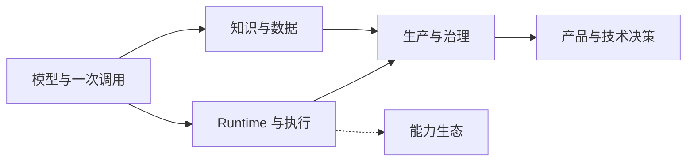

# 专题地图：先建立模型，再深入机制

> 这张地图解决一个入口问题：现在该读哪一组内容，读到什么程度可以先停。课程不把 27 课当成 27 个同等大小的主题，而是分成核心专题、深入专题和参考资料三层。

## 先看一张图

模型产生概率性的输出。Runtime 决定它能不能继续，知识与数据提供外部事实，生产与治理负责评测、观测、可靠性和安全，产品与技术决策把这些边界放回真实约束。MCP、Skill、Handoff 和 Harness 是 Runtime 的扩展，不是所有 AI 应用的必修零件。

信息也有一条权威性阶梯：模型输出是建议，检索结果是待核对的证据，工具返回的是观察结果，业务数据库才是业务事实；涉及不可逆动作时，人工确认是授权边界。把这些层混成“模型说了算”，后面的检索、状态和安全设计都会失去落点。

## 七个大专题

| 大专题 | 核心小专题 | 深入小专题 | 先停在哪里 |
|---|---|---|---|
| 模型与一次调用 | [00](../lessons/setup/README.md)、[01](../lessons/how-llms-work/README.md)、[02](../lessons/model-api-structured-output-streaming/README.md)、[03](../lessons/prompt-engineering/README.md) | F00–F07、[23](../lessons/model-adaptation-finetuning-inference/README.md) | 能解释模型输出、token、上下文、结构化输出和流式 |
| Runtime 与执行 | [05](../lessons/tool-calling/README.md)、[06](../lessons/agent-loop/README.md)、[07](../lessons/agent-state-and-runtime/README.md)、[08](../lessons/context-engineering-for-agents/README.md)、[09](../lessons/workflow-vs-agent/README.md) | [10](../lessons/long-horizon-tasks/README.md) | 能说明模型建议如何经过代码变成一次可控执行 |
| 知识与数据 | [04](../lessons/embeddings-and-vector-search/README.md)、[15](../lessons/rag-end-to-end/README.md)、[17](../lessons/data-engineering/README.md) | [16](../lessons/memory/README.md) | 能定位解析、切块、检索、生成和删除中的失败 |
| 生产与治理 | [18](../lessons/system-architecture/README.md)、[19](../lessons/evaluation/README.md)、[20](../lessons/observability/README.md)、[21](../lessons/reliability-cost-llmops/README.md)、[22](../lessons/security-governance/README.md) | 多租户、供应链和故障演练 | 能从请求链、评测和 trace 解释系统为什么坏 |
| 能力生态 | — | [11](../lessons/multi-agent-handoff/README.md)、[12](../lessons/mcp/README.md)、[13](../lessons/skills-and-capability-layers/README.md)、[14](../lessons/agent-harness/README.md) | 只有工作确实涉及多 Agent 或第三方能力时再读 |
| 产品与交互 | — | [24](../lessons/product-design-ux/README.md)、[25](../lessons/voice-agents/README.md) | 只有需要设计 AI 交互或语音链路时再读 |
| 技术决策 | [26](../lessons/system-design-decisions/README.md) | 参考项目的 M6 RFC 和 ADR | 能把假设、取舍、退出条件和验证写在一起 |

“核心”不是简单，“深入”也不是更正确。核心页面先建立跨项目都能复用的模型；深入页面处理规模、协议、框架或具体场景。

## 三条阅读路线

### 只想建立 AI 应用的整体画面

[00](../lessons/setup/README.md) → [01](../lessons/how-llms-work/README.md) → [02](../lessons/model-api-structured-output-streaming/README.md) → [03](../lessons/prompt-engineering/README.md) → [05](../lessons/tool-calling/README.md) → [07](../lessons/agent-state-and-runtime/README.md) → [08](../lessons/context-engineering-for-agents/README.md) → [18](../lessons/system-architecture/README.md) → [19](../lessons/evaluation/README.md) → [21](../lessons/reliability-cost-llmops/README.md) → [22](../lessons/security-governance/README.md)

### 主要做 RAG 和知识库

[00](../lessons/setup/README.md) → [01](../lessons/how-llms-work/README.md) → [02](../lessons/model-api-structured-output-streaming/README.md) → [03](../lessons/prompt-engineering/README.md) → [04](../lessons/embeddings-and-vector-search/README.md) → [15](../lessons/rag-end-to-end/README.md) → [17](../lessons/data-engineering/README.md) → [19](../lessons/evaluation/README.md)

### 需要理解 Agent Runtime

先读“整体画面”路线，再读 [06](../lessons/agent-loop/README.md)、[07](../lessons/agent-state-and-runtime/README.md)、[09](../lessons/workflow-vs-agent/README.md)。长任务、多 Agent、MCP、Skill 和 Harness 按工作需要补，不要一次全部读完。

### 为面试做复习

先沿核心课建立模型，再用[面试地图](./interview-map.md)做递进追问。面试地图是自测索引，不是第二套主线课程；答不稳时回到对应专题补机制，不要按十组问题从头背答案。

## 新内容怎么放

新增内容遵循四条规则：

1. 一个小专题只回答一个主要问题；如果同时有两个独立的失败机制，就拆成两个页面。
2. 新页面先归入已有大专题。只有出现至少三个相互依赖的新页面，才考虑增加大专题。
3. 核心页面必须留下一个失败场景和一种验证方式；细节、版本和厂商差异放到深入或参考页面。
4. URL 不因重新分组而改变。学习顺序只在 `mkdocs.yml` 的 nav 中表达，专题归属用课程 frontmatter 的 `topic` 和 `tier` 表达。

课程总览负责知识地图，首页负责选路线，参考项目路线负责可运行证据。三者不再重复完整课程表。

---

[← 课程总览](../lessons/README.md) · [参考项目路线](./project-playbook.md)
