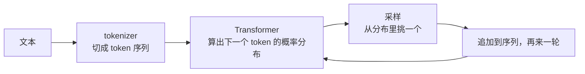

# 01 理解 LLM：应用工程师需要知道的那一层

> 对应 LLMs-from-scratch 第 1 章、Happy-LLM 第 1～4 章。这一篇不教训练，只回答一个问题：LLM 到底是什么东西，它的哪些性质会直接影响你写的应用。

## 学习目标

- 能用一句话说清 LLM 在做什么（预测下一个 token），并推出它的三个直接后果
- 能区分预训练、微调、对齐三个阶段各自给模型带来了什么
- 能解释为什么"模型不是数据库"

## 心智模型



一个 LLM 就是一个函数：输入一串 token，输出"下一个 token 是什么"的概率分布。生成一段话就是把这个函数反复调用几百次。所有你在应用里遇到的性质，都从这个循环推出来。

## 要点

1. **它预测的是下一个 token，不是"答案"。** 所以它会流畅地说出错误的东西：只要那串 token 在训练数据的分布里"看起来合理"。这就是幻觉的来源，不是 bug，是机制。
2. **它没有记忆。** 每次调用都是从头看一遍输入。你觉得它"记得"上文，是因为运行时把上文又发了一遍。这是第 07 课 State 存在的理由。
3. **它没有内部数据库。** 参数里存的是统计模式，不是可查询、可更新、有来源的事实。要最新、私有、可追溯的知识，用 RAG（第 13 课）。
4. **上下文窗口是硬边界。** 输入加输出的 token 总数有上限，超过就截断或报错。窗口越大，每次调用越贵越慢（第 08 篇解释为什么）。
5. **输出是概率的，采样决定风格。** temperature、top-p 只是在改"从分布里怎么挑"，不改分布本身。temperature 设 0 也不保证每次一样，因为浮点和批处理。
6. **预训练给能力，微调给格式，对齐给偏好。** 预训练在海量文本上学"续写"；指令微调让它学会"按指令回答"这种格式；对齐（RLHF/DPO 等）让它更符合人的偏好。三者叠加才是你调用的那个模型。
7. **同一个基座，不同的后训练，行为差别很大。** 这是为什么同一家的 chat 模型和 instruct 模型对工具调用的意愿不一样。
8. **模型规模、数据量、算力三者要匹配。** 扩展定律说的是"按比例一起加"，不是"参数越多越好"。对应用工程师的意义：小模型加好数据在窄任务上常常打赢大模型。
9. **"涌现能力"是描述现象，不是解释。** 规模到某个点某些任务突然能做了。工程上的含义是：不要假设小模型能做大模型能做的每件事，也不要假设大模型在你的任务上一定更好，测。
10. **推理成本按 token 计，输入和输出价格不同。** 输入便宜、输出贵，而且历史每轮都算输入。这是第 08 课 Context Engineering 和第 19 课成本控制的经济学基础。

## 实验：手写一个"下一个 token"的玩具

不用任何库。用一个二元语法（bigram）模型体会"预测下一个 token"是什么感觉，以及为什么它会说出"看起来合理"的胡话。

```python
import random
from collections import Counter, defaultdict

corpus = "the cat sat on the mat . the dog sat on the log . the cat saw the dog ."
tokens = corpus.split()

# "训练"：数一数每个 token 后面跟了什么
follow = defaultdict(Counter)
for a, b in zip(tokens, tokens[1:]):
    follow[a][b] += 1

def next_token_distribution(prev):
    counts = follow[prev]
    total = sum(counts.values())
    return {tok: n / total for tok, n in counts.items()}

def generate(start, n=8, seed=0):
    random.seed(seed)
    out = [start]
    for _ in range(n):
        dist = next_token_distribution(out[-1])
        if not dist:
            break
        toks, probs = zip(*dist.items())
        out.append(random.choices(toks, probs)[0])
    return " ".join(out)

print(next_token_distribution("the"))   # {'cat': 0.4, 'mat': 0.2, 'dog': 0.4}  这就是"概率分布"
print(generate("the"))                  # 一句语法通顺、语义可能荒谬的话
```

跑几次不同的 seed。你会看到"the cat sat on the log"这种训练数据里没出现过、但每一步都"合理"的句子。真正的 LLM 只是把"数前一个词"换成了"用 Transformer 看前面几千个 token"，机制一样。

## 和主线的关系

- [第 01 课 LLM 工作原理与能力边界](../../lessons/01-how-llms-work/README.md) 是本篇的应用版，本篇补它的底层直觉。
- 要点 2 → [第 07 课](../../lessons/07-agent-state-and-runtime/README.md)；要点 3 → [第 13 课](../../lessons/13-rag-end-to-end/README.md)；要点 10 → [第 08 课](../../lessons/08-context-engineering-for-agents/README.md)。

## 延伸阅读

- [LLMs-from-scratch · ch01](https://github.com/rasbt/LLMs-from-scratch/tree/main/ch01)（访问日期 2026-09-04）：本章没有代码，只有阅读建议，适合先看。
- [Happy-LLM 第 1～4 章](https://github.com/datawhalechina/happy-llm)（访问日期 2026-09-04）：中文，从 NLP 基础到 LLM 定义和训练策略。
- [llm-course · LLM Fundamentals](https://github.com/mlabonne/llm-course)（访问日期 2026-09-04）：数学和神经网络基础的资料清单，按需补。

---

[← Track 目录](./README.md) · [02 →](./02-text-and-tokens.md)
