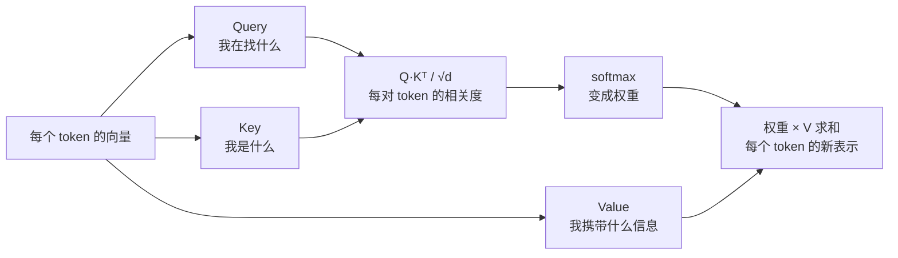

# 03 Attention：为什么上下文越长越贵

> 对应 LLMs-from-scratch 第 3 章。attention 是 Transformer 的核心，也是上下文窗口的成本来源。理解它，第 08 课的每一个裁剪决定都有了依据。

## 学习目标

- 能用点积、softmax、加权求和三步说清一次 attention 在算什么
- 能推出 attention 的计算复杂度，并解释为什么上下文长度翻倍成本不止翻倍
- 能说出 causal mask、multi-head、GQA 各解决什么问题

## 心智模型



## 要点

1. **attention 让每个 token 看一遍所有其他 token，按相关度加权取信息。** Query 是"我在找什么"，Key 是"我是什么"，Value 是"我携带什么"。点积算相关度，softmax 变权重，加权求和 Value 就是输出。
2. **复杂度是 O(n²)。** n 个 token 两两算相关度，n² 对。上下文从 4k 到 32k，attention 的计算量是 64 倍不是 8 倍。这是长上下文贵的根本原因。
3. **causal mask 让 token 只能看到前面的。** 生成时不能偷看未来。实现上就是把上三角的相关度设成负无穷，softmax 后变 0。
4. **multi-head 是多组 Q/K/V 并行算，再拼起来。** 每组学不同的关系（语法、指代、位置……）。头数是超参，不是越多越好。
5. **√d 缩放是为了防止 softmax 饱和。** 向量维度大时点积的值域也大，不缩放的话 softmax 会几乎变成 one-hot，梯度消失。
6. **KV cache 就是把每个 token 的 K 和 V 存下来。** 生成第 n+1 个 token 时，前 n 个的 K、V 不用重算。这把每步生成从 O(n²) 降到 O(n)，代价是显存。第 08 篇算这笔账。
7. **GQA（Grouped-Query Attention）让多个 Query 头共享一组 K/V。** 目的是减少 KV cache 的显存，几乎不损失质量。现代开源模型基本都用。
8. **attention 不理解顺序，位置编码负责。** 见第 02 篇要点 7。
9. **"lost in the middle"是实测现象：模型对上下文开头和结尾更敏感，中间部分容易忽略。** 对应用的直接含义：重要指令放最前或最后，检索结果不要堆在中间（第 08 课）。
10. **Flash Attention 等优化改的是计算方式，不改结果。** 通过分块和避免存 n² 的中间矩阵，让长上下文在有限显存里跑得动。你选托管 API 时看不到它，选自部署时它决定你能开多长的窗口。

## 实验：手写单头 attention

纯 Python，4 个 token、维度 3。看一次点积、softmax、加权求和。

```python
import math

def softmax(xs):
    m = max(xs)
    exps = [math.exp(x - m) for x in xs]
    s = sum(exps)
    return [e / s for e in exps]

def dot(a, b):
    return sum(x * y for x, y in zip(a, b))

# 4 个 token，每个已经投影成 Q、K、V（真实模型里是三个可学习的矩阵乘出来的）
Q = [[1, 0, 0], [0, 1, 0], [1, 1, 0], [0, 0, 1]]
K = [[1, 0, 0], [0, 1, 0], [1, 1, 0], [0, 0, 1]]
V = [[1, 0, 0], [0, 1, 0], [0, 0, 1], [1, 1, 1]]
d = 3

def attend(i, causal=True):
    scores = [dot(Q[i], K[j]) / math.sqrt(d) for j in range(len(K))]
    if causal:
        scores = [s if j <= i else float("-inf") for j, s in enumerate(scores)]
    weights = softmax(scores)
    out = [sum(w * V[j][k] for j, w in enumerate(weights)) for k in range(d)]
    return weights, out

for i in range(4):
    w, o = attend(i)
    print(f"token {i}: weights={[round(x, 2) for x in w]} -> out={[round(x, 2) for x in o]}")
```

看第 2 个 token（Q=[1,1,0]）：它和 token 0、1、2 的 Key 都有点积，权重分散在三者上，输出是三个 Value 的混合。第 3 个 token 因为 causal mask 能看到全部，但 Query 只和自己的 Key 相关，权重集中在自己。把 `causal=False` 跑一遍，对比 token 0 的权重变化，就明白 mask 在挡什么。

数一数：4 个 token 算了 16 个点积。换成 4000 个 token 是 1600 万个。这就是 n²。

## 和主线的关系

- O(n²) 和 lost in the middle → [第 08 课 Context Engineering](../../lessons/08-context-engineering-for-agents/README.md) 的所有裁剪决定。
- KV cache → [第 21 课](../../lessons/21-model-adaptation-finetuning-inference/README.md) 和本 track 第 08 篇。

## 延伸阅读

- [LLMs-from-scratch · ch03](https://github.com/rasbt/LLMs-from-scratch/tree/main/ch03)（访问日期 2026-09-04）：从简化的 self-attention 一步步到 multi-head，bonus 里有不同实现的效率对比。
- [Attention Is All You Need](https://arxiv.org/abs/1706.03762)（访问日期 2026-09-04）：原始论文，只需要读 3.2 节。

---

[← 02](./02-text-and-tokens.md) · [04 →](./04-gpt-architecture.md)
