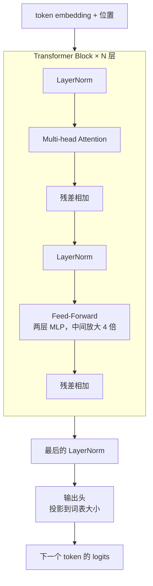

# 04 GPT 架构：一层一层叠起来

> 对应 LLMs-from-scratch 第 4 章。知道一个 decoder-only 模型由什么组成，参数量怎么算，才能看懂模型卡片上的数字。

## 学习目标

- 能画出一个 Transformer block 的结构，说出每个部件的作用
- 能从模型的层数、隐藏维度、词表大小粗估参数量
- 能解释 decoder-only 为什么成了主流

## 心智模型



## 要点

1. **一个 block 只有两个主要部件：attention 和 feed-forward。** attention 负责 token 之间交换信息，feed-forward 负责每个 token 自己的非线性变换。其余是 LayerNorm 和残差连接这类让训练稳定的配件。
2. **N 层 block 堆起来就是"深度"。** 7B 级模型通常 32 层左右，隐藏维度 4096。层数和维度是模型卡片上最重要的两个数。
3. **参数量大头在 feed-forward 和 attention 的投影矩阵。** 粗估：每层约 12 × d² 个参数（attention 4d²，FFN 8d²），加上词表 × d 的 embedding。32 层、d=4096：32 × 12 × 4096² ≈ 6.4B，加 embedding 就是所谓的 7B。
4. **残差连接让梯度能穿过几十层。** 没有它，深层网络训不动。这是工程发现，不是理论推导。
5. **decoder-only 成为主流，因为它训练目标简单、能无限扩展数据、生成任务天然适配。** encoder-decoder（T5 类）在翻译等任务上仍有优势，但通用 LLM 基本都是 decoder-only。
6. **输出头把最后一层的向量投影到词表大小，得到每个 token 的 logits。** softmax 后就是第 01 篇说的概率分布。很多模型让输出头和 embedding 共享权重来省参数。
7. **MoE（Mixture of Experts）把 feed-forward 换成多个"专家"，每个 token 只走其中几个。** 总参数很大但每个 token 的计算量小。"总参数 400B、激活 17B"这种描述就是 MoE。对应用的含义：延迟接近小模型，能力接近大模型，但显存要装下全部参数。
8. **dropout 在推理时关闭。** 训练时随机丢弃部分激活防过拟合，推理时不用。所以同一个模型训练和推理的行为不同。
9. **模型卡片上的"上下文长度"是训练时见过的最大长度，不是硬件限制。** 超过它模型可能还能跑，但质量不保证。
10. **权重文件的大小 ≈ 参数量 × 每个参数的字节数。** 7B 参数用 fp16 是 14GB，int8 是 7GB，int4 是 3.5GB。这是第 08 篇量化的起点。

## 实验：算一遍 7B 的参数量

```python
def gpt_params(n_layers, d_model, vocab, ffn_mult=4, tie_embeddings=True):
    attention = 4 * d_model * d_model               # Q, K, V, O 四个投影
    ffn = 2 * d_model * (ffn_mult * d_model)         # 两层：d -> 4d -> d
    per_layer = attention + ffn
    embedding = vocab * d_model
    head = 0 if tie_embeddings else vocab * d_model
    total = n_layers * per_layer + embedding + head
    return total, per_layer, embedding

total, per_layer, emb = gpt_params(n_layers=32, d_model=4096, vocab=32000)
print(f"per layer: {per_layer/1e6:.0f}M, embedding: {emb/1e6:.0f}M, total: {total/1e9:.2f}B")
for bytes_per_param, name in [(2, "fp16"), (1, "int8"), (0.5, "int4")]:
    print(f"  weights in {name}: {total * bytes_per_param / 1e9:.1f} GB")
```

输出约 6.6B，和"7B"对得上（真实模型的 FFN 用了 SwiGLU，比例略不同，所以有零头）。三行显存数字就是你在选"能不能在一张 24GB 卡上跑"时要看的。

## 和主线的关系

- 参数量与显存 → [第 21 课 模型适配与推理服务](../../lessons/21-model-adaptation-finetuning-inference/README.md) 的选型。
- MoE 的"激活参数"概念 → 看模型价格和延迟时的判断依据。

## 延伸阅读

- [LLMs-from-scratch · ch04](https://github.com/rasbt/LLMs-from-scratch/tree/main/ch04)（访问日期 2026-09-04）：完整实现一个 GPT，bonus 有性能分析。
- [Happy-LLM 第 2、3 章](https://github.com/datawhalechina/happy-llm)（访问日期 2026-09-04）：Transformer 架构和 encoder-only / encoder-decoder / decoder-only 三种架构对比。

---

[← 03](./03-attention.md) · [05 →](./05-pretraining.md)
