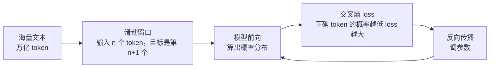

# 05 预训练：能力从哪来，为什么你不该自己做

> 对应 LLMs-from-scratch 第 5 章。你大概率永远不会预训练一个模型，但要知道它决定了什么、花了什么，才能判断"换模型"和"换数据"哪个更有效。

## 学习目标

- 能说出预训练的目标函数和评估指标各是什么
- 能解释 loss、perplexity 和"模型好不好用"之间的差距
- 能给出"什么时候该考虑自己训练"的判断标准（答案几乎总是"不该"）

## 心智模型



## 要点

1. **预训练的任务只有一个：给前文，预测下一个 token。** 没有标注，文本本身就是标签。这是它能用上万亿 token 的原因。
2. **loss 是交叉熵，perplexity 是 e^loss。** perplexity 可以理解为"模型平均在多少个候选里犹豫"。从 100 降到 10 是巨大进步，从 10 降到 8 也是。
3. **loss 低不等于好用。** 预训练完的基座模型只会续写，你问它问题它可能接着问你问题。"好用"是后训练（第 06、07 篇）给的。
4. **数据质量比数量更决定上限。** 去重、过滤低质量网页、配比代码和多语言，这些数据工程决定了模型的知识面和能力边界。对应用的含义：模型不知道的东西，prompt 再好也问不出来。
5. **训练成本是参数量 × token 数 × 6 次浮点运算，粗估。** 7B 模型训 2T token 大约 8.4 × 10²² FLOPs，几百张 GPU 跑几周。个人和大多数团队都不会做这件事。
6. **学习率调度、warmup、梯度裁剪是让训练不崩的工程细节。** 知道有这些东西就够，除非你真的要训。
7. **温度和 top-k / top-p 采样是推理时的事，和训练无关。** temperature 除 logits 再 softmax：小于 1 让分布更尖，大于 1 更平。top-p 只从累积概率达到 p 的那些候选里挑。它们改的是"怎么挑"，不改模型。
8. **基座模型的"知识截止日期"由训练数据决定，不可能通过 prompt 突破。** 需要新知识，用检索（第 13 课）。
9. **加载别人预训练好的权重，是所有应用工程的起点。** 开源权重（Llama、Qwen、DeepSeek 等）让你不需要预训练；托管 API 让你连加载都不需要。
10. **判断"该不该自己预训练"的标准：你有独特的、大规模的、别人没有的领域文本，并且已经证明微调和 RAG 都不够。** 满足这三条的团队极少。

## 实验：温度到底在改什么

```python
import math

def softmax(xs):
    m = max(xs)
    e = [math.exp(x - m) for x in xs]
    return [v / sum(e) for v in e]

logits = [2.0, 1.0, 0.5, 0.1]   # 模型对四个候选 token 的原始打分
for t in [0.2, 0.7, 1.0, 1.5, 3.0]:
    probs = softmax([x / t for x in logits])
    print(f"T={t:<4} probs={[round(p, 3) for p in probs]}")

# top-p：只保留累积概率达到 p 的候选
def top_p(probs, p=0.9):
    order = sorted(range(len(probs)), key=lambda i: -probs[i])
    keep, cum = [], 0.0
    for i in order:
        keep.append(i); cum += probs[i]
        if cum >= p:
            break
    return keep

print("top-p 0.9 keeps indices:", top_p(softmax(logits)))
```

T 越小，第一个候选的概率越接近 1，输出越确定但也越单调；T 越大分布越平，越"有创意"也越容易跑偏。注意 T=0.2 时第一个候选也只有约 0.99，不是 1，所以"temperature 设 0 就一定确定"是误解（实现上 T=0 通常特殊处理为 argmax，但批处理和浮点误差仍可能让结果不同）。

## 和主线的关系

- 采样参数 → [第 02 课](../../lessons/02-model-api-structured-output-streaming/README.md)：结构化输出场景通常用低温度。
- 知识截止 → [第 13 课 RAG](../../lessons/13-rag-end-to-end/README.md)。
- "该不该自己训"的判断 → [第 21 课](../../lessons/21-model-adaptation-finetuning-inference/README.md)。

## 延伸阅读

- [LLMs-from-scratch · ch05](https://github.com/rasbt/LLMs-from-scratch/tree/main/ch05)（访问日期 2026-09-04）：在小数据上预训练一个 GPT，然后加载 OpenAI 的 GPT-2 权重对比。
- [llm-course · The LLM Scientist · Pre-Training Models](https://github.com/mlabonne/llm-course)（访问日期 2026-09-04）：数据准备、分布式训练、监控的资料清单。

---

[← 04](./04-gpt-architecture.md) · [06 →](./06-finetuning-classification.md)
