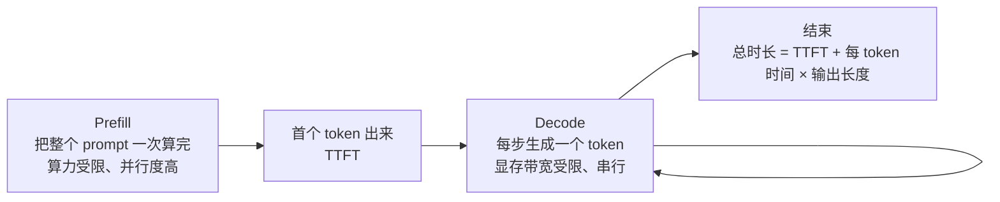

# 08 推理优化：延迟、显存和吞吐的账

> LLMs-from-scratch 没有单独一章讲这个，但它是应用工程师最该懂的底层。你选托管 API 还是自部署、能开多长上下文、首字延迟为什么和总时长差这么多，答案都在这里。

## 学习目标

- 能解释 prefill 和 decode 两个阶段的区别，以及各自的瓶颈
- 能估算一个模型在给定上下文长度下的 KV cache 显存
- 能说出量化、批处理、投机解码各优化什么，代价是什么

## 心智模型



## 要点

1. **一次生成分两段：prefill 算完整个输入，decode 一个一个吐 token。** prefill 是矩阵乘矩阵，GPU 算力吃满；decode 每步只算一个 token，瓶颈是把几十 GB 权重从显存搬进计算单元，算力大量空闲。
2. **TTFT（首字延迟）主要由 prefill 决定，和输入长度成正比。** 输入 10k token 的 TTFT 比 1k 的慢得多。这是第 08 课裁剪上下文的直接收益。
3. **每 token 的生成时间由显存带宽决定，几乎和输入长度无关（在 KV cache 装得下的前提下）。** 所以流式输出的"打字速度"是稳定的。
4. **KV cache 显存 = 2 × 层数 × KV 头数 × 头维度 × 每参数字节 × 序列长度。** 7B 级模型 fp16 每个 token 约 0.5MB（用 GQA 后更小）；32k 上下文一个请求就要 16GB 左右。这是长上下文真正的显存成本，比权重本身还能大。
5. **批处理把多个请求的 decode 合在一起，让一次权重搬运服务多个 token。** 吞吐大幅提升，单请求延迟略增。continuous batching 让请求随到随加，不用等一批凑齐。vLLM 这类推理服务器的核心就是这个加 PagedAttention（把 KV cache 按页管理，减少浪费）。
6. **量化把权重从 fp16 压到 int8 / int4，显存减半再减半，decode 更快（搬的字节少了）。** 质量损失通常很小，但对小模型和某些任务更明显。要测，不要信。
7. **KV cache 也能量化。** 上下文很长时它是显存大头，压它比压权重收益更大。
8. **投机解码用一个小模型先猜几个 token，大模型一次验证。** 猜对了就省了几步 decode。对确定性高的输出（代码、格式化文本）加速明显，对开放生成效果一般。
9. **prompt caching（托管 API 的功能）缓存的是 prefill 的 KV cache。** 前缀相同的请求跳过 prefill，TTFT 和价格都降。要拿到这个收益，system prompt 和工具定义必须放在最前面且逐字节一致，这是第 08 课"缓存友好布局"的原理。
10. **自部署 vs 托管 API 的判断：** 流量稳定且大、有数据合规要求、需要定制模型时自部署划算；否则托管 API 的弹性和零运维几乎总是更优。算账时把 GPU 闲置率、运维人力、升级模型的成本算进去。

## 实验：算 KV cache 的显存

```python
def kv_cache_bytes(n_layers, n_kv_heads, head_dim, seq_len, bytes_per_value=2):
    # K 和 V 各一份，所以 ×2
    return 2 * n_layers * n_kv_heads * head_dim * bytes_per_value * seq_len

def show(name, n_layers, n_heads, n_kv_heads, head_dim):
    per_token = kv_cache_bytes(n_layers, n_kv_heads, head_dim, 1)
    print(f"{name}: {per_token/1024:.0f} KB per token"
          f"  (GQA ratio {n_heads}/{n_kv_heads})")
    for seq in [4_096, 32_768, 128_000]:
        gb = kv_cache_bytes(n_layers, n_kv_heads, head_dim, seq) / 1e9
        print(f"   {seq:>7} tokens -> {gb:5.1f} GB")

# 两个典型 7B 级配置：一个没有 GQA（每个 Q 头一组 KV），一个用了 GQA（8 组 KV 头）
show("7B, no GQA", n_layers=32, n_heads=32, n_kv_heads=32, head_dim=128)
show("7B, GQA-8  ", n_layers=32, n_heads=32, n_kv_heads=8, head_dim=128)

# 一张 24GB 卡，权重 int4 占 3.5GB，剩下的能装多少 32k 上下文的并发请求？
free = 24 - 3.5
per_req = kv_cache_bytes(32, 8, 128, 32_768) / 1e9
print(f"\n24GB card, int4 weights: ~{free / per_req:.1f} concurrent 32k requests (fp16 KV cache)")
print(f"with int8 KV cache:      ~{free / (per_req / 2):.1f}")
```

没有 GQA 的 7B 模型，128k 上下文的 KV cache 是 64GB，单张卡装不下。用 GQA 后是 16GB。这就是为什么 GQA 成了标配，也是为什么"支持 128k 上下文"和"能以合理成本跑 128k"是两回事。

## 和主线的关系

- TTFT 与输入长度、prompt caching → [第 08 课 Context Engineering](../../lessons/08-context-engineering-for-agents/README.md)。
- 自部署 vs 托管、量化选型 → [第 21 课](../../lessons/21-model-adaptation-finetuning-inference/README.md)。
- 延迟预算 → [第 19 课](../../lessons/19-reliability-cost-llmops/README.md)，以及 [语音机器人 track 第 03 篇](../robotics-voice/03-latency-budget.md)。

## 延伸阅读

- [vLLM 文档](https://docs.vllm.ai/en/latest/)（访问日期 2026-09-04）：看 PagedAttention 和 continuous batching 两节的原理说明就够。
- [Hugging Face · KV cache quantization](https://huggingface.co/blog/kv-cache-quantization)（访问日期 2026-09-04）：KV cache 量化的效果和取舍。
- [llm-course · The LLM Engineer · Inference optimization](https://github.com/mlabonne/llm-course)（访问日期 2026-09-04）：Flash Attention、KV cache、投机解码的资料清单。

---

[← 07](./07-instruction-finetuning.md) · [Track 目录](./README.md)
