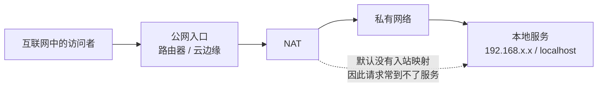

# 公网、私网与内网穿透

> **要点：核心概念**
>
> “内网穿透”不是一种固定协议，而是让互联网一侧的请求能够到达私有网络中服务的统称。难点通常来自 **私网地址不可在公网直接路由** 和 **NAT 默认不认识该把入站请求交给哪台设备**。

## 四个词，先说人话

| 词 | 它的含义 | 需要避免的误解 |
|---|---|---|
| 公网 IP | 能在互联网范围被路由的地址 | 有公网 IP 不代表服务应直接暴露 |
| 私网 IP | 仅在局域网或组织网络里有效的地址 | 外部手机不能直接访问它 |
| NAT | 将多个私网设备共享到较少公网地址的转换机制 | 它也让外部主动找到某台内网设备变困难 |
| 端口 | 一台主机上区分不同网络服务的编号 | 知道端口不等于拥有访问权限 |

## 常见的三条路径

| 做法 | 思路 | 适合什么 | 主要代价 |
|---|---|---|---|
| 端口映射 | 路由器把公网端口固定转给一台内网机器 | 自己完全掌控网络、需求简单 | 暴露源站，依赖公网 IP 与路由器配置 |
| [反向隧道](./05-cloudflare-tunnel.md) | 内网机器主动连到中继/边缘，外部请求沿已有通道返回 | 本地联调、没有公网 IP、想隐藏源站 | 依赖中继服务与凭据管理 |
| [VPN](./06-vpn-private-network.md) | 让获授权设备先成为私网的一部分 | 远程管理、访问多项内部资源 | 需要客户端、路由与权限设计 |

> **自测：一句话自测**
>
> 如果想让任何小程序用户调用一个 API，应该优先考虑“让手机加入我的内网”，还是“给 API 一个受控的 HTTPS 入口”？为什么？

## 和完整公网链路的关系

“内网穿透”只回答了请求怎样跨过私网边界；请求跨过边界后，还要继续经过 DNS、TCP、TLS、HTTP 和反向代理。可以把它和 [TCP/TLS/HTTPS 请求生命周期](./02-tcp-tls-https-lifecycle.md)、[DNS 与 WSS 链路](./03-dns-reverse-proxy-wss.md) 放在一起理解。

## 和主线的关系

本篇回答的是「请求怎样跨过私网边界」。主线里第一次需要它是在 [第 00 课](../../lessons/00-setup/README.md) 之后你想让手机或同事访问本机跑着的 Agent 服务时；到了 [第 16 课 系统架构](../../lessons/16-system-architecture/README.md) 讨论网关和入口时，公网、私网、NAT 是默认前提。

---

[← Track 目录](./README.md)
