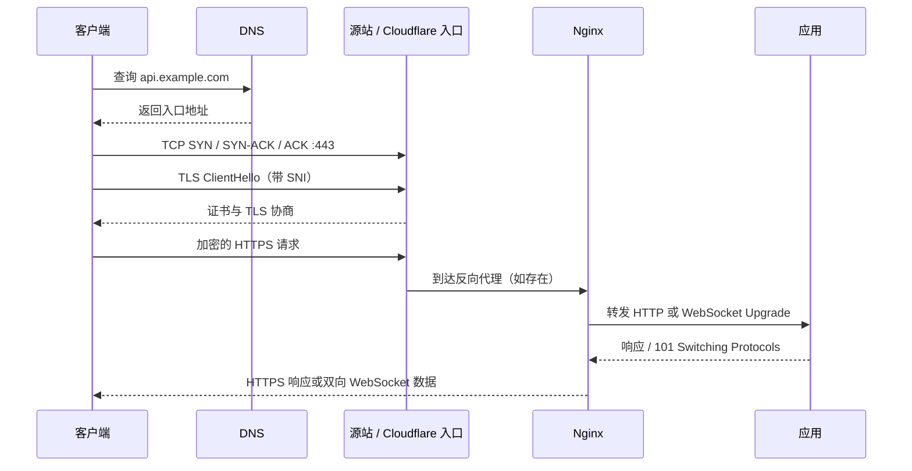

# TCP、TLS 与 HTTPS 请求生命周期

> **要点：一次请求不是“域名直接找到后端”**
>
> 域名只是入口名字。一个 HTTPS 或 WSS 请求通常要先完成 DNS 解析，再建立 TCP 连接，再通过 TLS 验证身份和加密，最后才进入 HTTP 请求；WebSocket 还要在 HTTP 之上完成一次 Upgrade。



## 五层心智模型

| 层 | 主要问题 | 失败时常见表现 | 当前项目对应物 |
|---|---|---|---|
| DNS | 这个名字应该解析到哪个入口？ | 域名解析失败、解析到旧地址 | Cloudflare 权威 DNS |
| TCP | 客户端能否连到目标 IP 的 443 端口？ | 超时、拒绝连接、安全组拦截 | 阿里云公网 443 |
| TLS | 入口能否证明自己就是这个域名？ | 证书不匹配、证书过期、握手失败 | Nginx 证书 |
| HTTP | 请求路径、方法和响应是否正确？ | 404、502、重定向、跨域/平台限制 | Nginx 与 FastAPI |
| WebSocket | HTTP 能否升级为持久双向连接？ | 没有 101、连接马上断开 | `/ws`、Upgrade、心跳 |

> **提示：排障顺序**
>
> 从下到上排查：DNS → TCP 443 → TLS → HTTP → WebSocket → 业务消息。上层失败时，不要一开始就改业务代码；先确认下层真的已经通过。

## DNS 只负责“找到入口”

DNS 服务器返回的是记录，不是业务响应。常见记录可以先这样理解：

| 记录 | 作用 | 在当前架构中的可能含义 |
|---|---|---|
| A | 名字指向 IPv4 地址 | 域名指向阿里云公网 IPv4 |
| AAAA | 名字指向 IPv6 地址 | 若存在，客户端可能优先尝试 IPv6 |
| CNAME | 名字指向另一个名字 | 将子域名交给另一个入口管理 |
| TXT | 携带文本声明 | 域名验证、SPF 等，不是 Web 服务入口 |

DNS-only 和 Cloudflare 代理的关键差异是“返回谁的地址”：前者通常返回源站地址，后者通常返回 Cloudflare 边缘地址。无论返回谁，DNS 都不会替你完成 TLS，也不会替你把普通 HTTP 变成 WebSocket。

## TCP 先建立可靠字节通道

TCP 三次握手可以简化成：

```text
客户端 → 服务端：SYN（我想建立连接）
服务端 → 客户端：SYN-ACK（我收到，也准备好了）
客户端 → 服务端：ACK（确认）
```

这只说明两端建立了传输层连接，不代表：

- 443 端口上一定有正确的 TLS 服务；
- 证书一定匹配当前域名；
- Nginx 一定转发到了正确的应用；
- WebSocket 业务一定能工作。

所以“端口通了”和“WSS 通了”是不同结论。

## TLS 解决身份和保密

客户端访问 `https://example.com` 时，证书至少要让客户端确认：

1. 证书覆盖当前主机名；
2. 证书在有效期内；
3. 证书链能被客户端信任；
4. 服务端确实拥有对应私钥。

TLS 终止在哪里，取决于入口模式：

```text
DNS-only：客户端 ──TLS──> 阿里云 Nginx ──HTTP──> 应用
Cloudflare 代理：客户端 ──TLS──> Cloudflare ──回源连接──> 源站
Tunnel：客户端 ──TLS──> Cloudflare ──Tunnel──> cloudflared ──> 服务
```

这也是为什么“Cloudflare 只做 DNS”时，证书和 443 必须在阿里云自己配置。

## HTTPS 如何升级成 WSS

WSS 可以理解为：

```text
TCP 连接
  ↓
TLS 加密
  ↓
HTTP 请求
  ↓
WebSocket Upgrade
  ↓
长期双向消息通道
```

客户端先发一个带有 `Upgrade: websocket` 的 HTTP 请求。代理和后端都同意后，服务端返回 `101 Switching Protocols`，连接才从普通 HTTP 进入 WebSocket 状态。

因此：

- `curl https://domain/healthz` 成功，只能说明 HTTPS 入口基本可用；
- 返回 `101`，说明 WebSocket 握手成功；
- 能收到 `pong`、创建房间和广播落子，才说明应用协议也成功。

## 反向代理为什么存在

生产环境通常不让应用直接承担所有公网入口职责，而是让 Nginx 负责：

```text
公网 443
  ↓ TLS 终止
按域名 / 路径分流
  ↓
127.0.0.1:8000 的应用服务
```

它可以统一处理证书、域名、访问日志、超时、请求头和多个后端的分流。对 WebSocket 来说，至少要保持 HTTP/1.1，并正确转发 Upgrade/Connection 头；对长连接，还要结合读取超时和应用心跳。

## 用证据定位失败层

| 观察到的现象 | 更可能的层 | 下一步证据 |
|---|---|---|
| 域名解析不到或解析到旧地址 | DNS | `dig`、管理后台记录、TTL |
| 443 超时或拒绝 | TCP / 防火墙 / Nginx 监听 | 安全组、监听端口、外网连接测试 |
| 证书错误 | TLS | 主机名、证书链、有效期、SNI |
| HTTPS 返回 404/502 | HTTP / 反向代理 / 应用 | Nginx access/error log、应用日志 |
| 没有 101 | WebSocket Upgrade | Upgrade 头、路径、Nginx 配置 |
| 101 后马上断开 | 应用协议 / 超时 / 心跳 | close code、服务日志、心跳 |
| 能连但创建房间失败 | 业务层 | 参数、登录态、状态机和数据库 |

## 和主线的关系

五层排障模型（DNS → TCP → TLS → HTTP → WebSocket）是 [第 19 课 可靠性](../../lessons/19-reliability-cost-llmops/README.md) 里超时、重试和熔断的底层依据：模型调用超时到底卡在哪一层，决定了该重试还是该切换供应商。[第 16 课](../../lessons/16-system-architecture/README.md) 讨论 SSE 与 WebSocket 时，Upgrade 和 101 的细节直接用到这里的内容。

---

[← Track 目录](./README.md)
