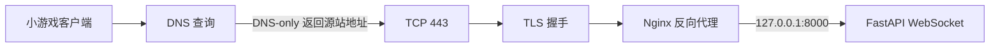

# DNS、反向代理与 WSS｜公网 WebSocket 链路

> **要点：最重要的区分**
>
> Cloudflare 的“权威 DNS”、Cloudflare 的“HTTP 代理”和 Cloudflare Tunnel 是三种不同角色。想让客户端直连阿里云降低一跳延迟，就使用 **Cloudflare DNS-only + 阿里云公网 443 + Nginx**；不要把 Tunnel 留在请求路径中。

## 一条完整请求链



客户端请求 `wss://<GAME_DOMAIN>/ws` 时，至少会经过这些阶段；每一层的底层原理见 [TCP、TLS 与 HTTPS 请求生命周期](./02-tcp-tls-https-lifecycle.md)：

1. DNS 把主机名解析成一个地址。
2. 客户端连接这个地址的 TCP 443 端口。
3. TLS 根据主机名验证证书并建立加密连接。
4. 客户端发送 HTTP WebSocket Upgrade 请求。
5. Nginx 返回 `101 Switching Protocols`，并把连接转发给后端。
6. 后端才开始处理 `ping`、创建房间、落子等应用消息。

因此“能解析”“HTTPS 正常”“WebSocket 握手成功”和“游戏协议正常”是四个不同层次。

## Cloudflare 的三种入口模式

| 模式 | DNS 返回什么 | 实际请求链 | 源站是否暴露 | 适合场景 |
|---|---|---|---|---|
| DNS-only | 阿里云源站地址 | 客户端 → 阿里云 Nginx → 应用 | 是 | 追求直连、自己管理 TLS 和安全 |
| Cloudflare 代理 | Cloudflare 边缘地址 | 客户端 → Cloudflare → 源站 | 通常隐藏 | CDN、WAF、DDoS 防护、边缘 TLS |
| Cloudflare Tunnel | Tunnel 关联的 Cloudflare 入口 | 客户端 → Cloudflare → 出站 Tunnel → 本地服务 | 不需要公开入站端口 | 没有公网 IP、开发联调、私有源站 |

### DNS-only 不等于“不需要 HTTPS”

DNS 只负责“名字解析”。它不会把 `ws://` 变成 `wss://`，也不会替源站签发证书。

DNS-only 仍然要求源站自己提供：

- 公网 443 端口；
- 与主机名匹配的可信证书；
- Nginx 或其他 TLS 入口；
- WebSocket 反向代理配置。

### 直连不一定永远更快

DNS-only 少了 Cloudflare 边缘和 Tunnel 这一层，通常更直接；但实际延迟取决于：

- 用户到阿里云机房的网络质量；
- Cloudflare 边缘到源站的网络质量；
- TLS 建连和重连频率；
- 源站处理时间。

所以“直连更快”是需要测量的假设，不是绝对规则。当前小游戏的目标是减少 Tunnel 中继层，并让客户端直接到阿里云源站。

## WSS、TLS 与 Nginx 的关系

`wss` 是 WebSocket over TLS。它不是另一种业务协议，而是：

```text
TLS 加密的 HTTPS 连接
        ↓ HTTP Upgrade
持久的双向 WebSocket 连接
```

Nginx 转发 WebSocket 时，关键配置是：

```nginx
proxy_pass http://127.0.0.1:8000;
proxy_http_version 1.1;
proxy_set_header Upgrade $http_upgrade;
proxy_set_header Connection "upgrade";
proxy_read_timeout 120s;
```

`proxy_http_version 1.1` 和 Upgrade 头让 Nginx 不把请求当成普通短 HTTP 请求；较长的读取超时则避免空闲对局被代理提前关闭。应用仍应有自己的心跳，因为网络设备和边缘服务可能清理长时间无数据的连接。

## 如何逐层排障

### 1. 先看 DNS

```bash
dig +short <GAME_DOMAIN> A
```

DNS-only 应该看到源站地址；Cloudflare 代理通常看到 Cloudflare 地址；Tunnel 通常看到 Tunnel 关联记录的结果。

### 2. 再看 HTTPS 和证书

```bash
curl -i https://<GAME_DOMAIN>/healthz
openssl s_client -connect <GAME_DOMAIN>:443 -servername <GAME_DOMAIN>
```

重点确认：

- 是否能连接 443；
- 证书主机名是否匹配；
- 证书链是否被客户端信任；
- 请求实际到的是 Nginx 还是 Cloudflare。

### 3. 再看 WebSocket

先看握手是否返回：

```text
101 Switching Protocols
```

再发送应用层 `ping`，确认返回 `pong`。只有握手和应用消息都成功，才算 WebSocket 链路真正打通。

### 4. 最后看业务协议

小游戏还要验证：

- 创建房间；
- 加入房间；
- 双方收到状态广播；
- 断线重连；
- 棋谱请求和权限边界。

WebSocket `101` 只说明传输层升级成功，不代表游戏协议正确。

## 小程序 / 小游戏的配置边界

客户端、Nginx 和平台后台至少有三处必须一致：

```text
客户端 WS_URL
        ↓
Nginx server_name 与路径
        ↓
微信后台 socket 合法域名
```

如果 `WS_URL` 没有变化，只是 DNS、Tunnel 或 Nginx 入口变化，通常不需要重新部署小游戏代码。但以下情况需要重新上传或重新配置：

- `WS_URL` 或 `API_URL` 改了；
- 微信后台没有登记新的主机名；
- 发布包里仍是旧的配置版本；
- 真机缓存的版本还没有更新。

## 本次实践的方案取舍

本次小游戏最终选择：

```text
Cloudflare：权威 DNS
公网入口：阿里云 443
TLS / WSS：Nginx
应用：127.0.0.1:8000
```

Tunnel 仍然有价值，但它更适合本地联调、隐藏源站或不具备公网入站条件的服务；它不是“只要用了 Cloudflare 就必须经过”的一层。

## 常见误区

- 把“Cloudflare 托管 DNS”误认为“流量一定经过 Cloudflare”。
- 把 DNS-only 当成无需证书的 HTTP 直连。
- 只测试 `/healthz`，没有测试 WebSocket Upgrade。
- 看到 `101` 就认为创建房间协议也一定正常。
- 为了 DNS 或 Nginx 变化重新发布小游戏，忽略了客户端 URL 是否真的改变。
- 通过临时切换生产 DNS 排障，却没有先准备可回退的证书和 Nginx 配置。

## 自测

> **自测：如果 DNS 已经解析到阿里云，但 `wss://` 仍失败，应该按什么顺序检查？**
>
> DNS 记录 → 公网 443 → 证书主机名与信任链 → Nginx Upgrade → 后端 WebSocket → 小程序合法域名与业务协议。

## 和主线的关系

这是主线 [第 16 课 系统架构](../../lessons/16-system-architecture/README.md) 里「流式响应怎样穿过反向代理到达客户端」的完整版：Nginx 对 WebSocket 的 `proxy_http_version 1.1` 和 Upgrade 头，对 SSE 则是关闭缓冲和放宽读超时。主项目 [M1 API 骨架](../../project/m1-api-skeleton/README.md) 的 SSE 端点部署到公网时会用到本篇的排障顺序。

---

[← Track 目录](./README.md)
