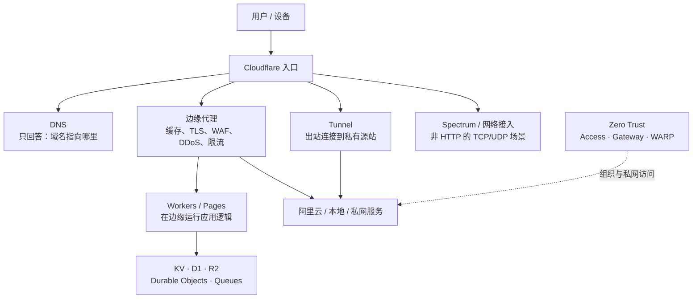
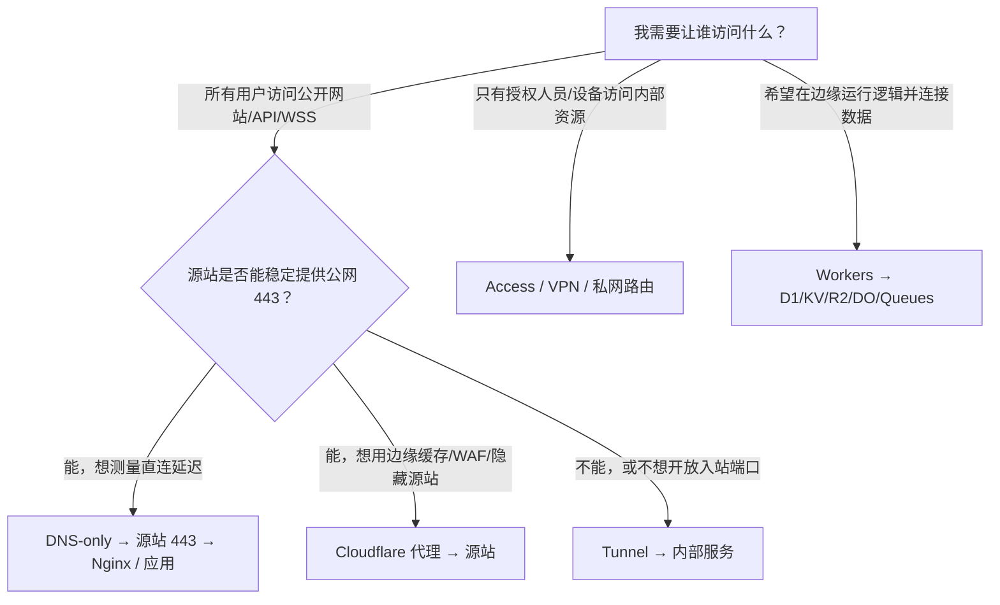

# Cloudflare｜能力地图

> **要点：不要把 Cloudflare 只理解成“内网穿透工具”**
>
> Cloudflare 更适合被理解为一套“连接云”：它把域名入口、网络流量、边缘安全、边缘计算、数据服务和组织私网连接组合起来。[Tunnel](./05-cloudflare-tunnel.md) 只是其中连接私有源站的一块拼图。



## 先分清四个平面

Cloudflare 产品很多，但不是每个产品都会出现在同一条请求路径里。理解“它位于哪个平面”，比背产品名更重要。

| 平面 | 它主要解决什么 | 典型能力 |
|---|---|---|
| 名称与入口 | 用户怎样找到服务、是否经过 Cloudflare | DNS、Registrar、SSL/TLS、代理、CDN、缓存 |
| 流量与安全 | 请求进来后如何加速、过滤、保护和分流 | DDoS、WAF、Rate Limiting、Bot、API Shield、Load Balancing |
| 应用与数据 | 不自建完整服务器也能运行逻辑和保存数据 | Workers、Pages、Durable Objects、D1、KV、R2、Queues、Workflows |
| 组织与私网 | 谁能访问内部服务、设备怎样接入网络 | Access、Tunnel、Gateway、WARP、Magic WAN/Transit |

> **重要：一条产品链不等于一条流量链**
>
> 例如当前小游戏使用 Cloudflare DNS-only 时，只用了“名称与入口”平面的权威 DNS；WSS 数据实际走阿里云 443 → Nginx → 应用。只有启用橙云代理、Tunnel 或 Workers 路由，Cloudflare 才会进入请求数据路径。

## 以问题选能力，而不是先选产品

| 你真正的问题 | 常见方向 |
|---|---|
| 用户怎样找到我的服务 | DNS、域名、HTTPS 入口 |
| 如何让静态资源或响应更快、更抗攻击 | CDN、缓存、DDoS/WAF 防护 |
| 能否在靠近用户的位置处理小段业务逻辑 | Workers |
| 数据该放哪里 | 关系数据、对象文件、缓存配置分别选择对应存储 |
| 本地没有公网 IP，怎样让一个服务可达 | Tunnel |
| 管理后台谁能访问 | Access 等身份与访问策略，加上应用自身的授权 |
| 如何保护 API 免受滥用 | WAF、Rate Limiting、API Shield、Turnstile，加上应用鉴权 |
| 想在边缘改写请求或做轻量 API | Workers；静态站点可用 Pages |
| 想做实时房间、协同或有序状态 | Durable Objects，必要时配合 Workers、Queues 或外部数据库 |
| 想保存文件、配置和关系数据 | R2、KV、D1；已有 MySQL/Postgres 可考虑 Hyperdrive |
| 想把耗时任务移出请求主链路 | Queues、Workflows、Cron Triggers |
| 想观察请求、错误和安全事件 | Analytics、Logs、Log Explorer、Health Checks |

## Cloudflare 能力地图（按学习顺序）

### 1. 域名、DNS 与入口

这是最容易和“流量代理”混淆的一层。

- **权威 DNS**：回答 A、AAAA、CNAME 等记录；本身不转发业务流量。
- **DNS 代理状态**：启用代理后，HTTP/HTTPS 客户端先到 Cloudflare 边缘；DNS-only 则直接得到源站地址。
- **SSL/TLS**：为经过 Cloudflare 的请求提供边缘 TLS；DNS-only 时仍由源站自己提供证书。
- **CDN、Cache、Load Balancing**：分别解决内容就近分发、缓存命中和多源站健康/流量调度。

### 2. 安全与访问控制

- **DDoS Protection**：在网络和应用入口吸收或过滤大规模攻击流量。
- **WAF**：根据规则拦截常见 Web 攻击和异常请求。
- **Rate Limiting**：限制某类请求的频率，适合保护登录、验证码、创建房间等敏感接口。
- **Bot Management / Turnstile**：识别或挑战自动化流量；Turnstile 不是应用登录系统。
- **API Shield**：围绕 API 的 schema、认证和滥用防护提供能力。
- **Access / Zero Trust**：给管理后台、内部工具等加身份和策略；它不替代业务层的用户授权。

### 3. 开发者平台

| 能力 | 直观理解 | 适合先记住的边界 |
|---|---|---|
| Workers | 在 Cloudflare 边缘执行 JavaScript/TypeScript 等代码 | 不是传统长驻 VPS，运行模型和限制不同 |
| Pages | 部署前端和全栈应用的入口 | 更偏应用交付，不等于拥有一台服务器 |
| Durable Objects | 带唯一身份、顺序协调和持久化状态的对象 | 很适合房间、协同、实时状态；需理解单对象串行化 |
| D1 | Workers 生态中的 SQL 数据库 | 适合轻量关系数据，不等于任意规模的传统数据库 |
| KV | 全球分发的键值配置/缓存 | 重点理解最终一致性，不要把它当强一致事务库 |
| R2 | 对象/文件存储 | 适合图片、棋谱、备份等非结构化对象 |
| Queues / Workflows | 异步消息和可恢复的多步骤任务 | 用来拆出耗时工作，减少请求主链路压力 |
| Hyperdrive | 让 Workers 更高效地访问已有 MySQL/Postgres | 它连接既有数据库，不是数据库本身 |
| Workers AI / Vectorize | AI 推理、向量检索等 AI 能力 | 先理解应用场景和成本，再决定是否引入 |

### 4. 网络连接与私网

- **Tunnel**：源站主动向 Cloudflare 建立出站连接，适合没有公网入站、想隐藏源站或做开发联调。
- **Access**：基于身份和策略保护公开入口，常与 Tunnel 组合。
- **Gateway / WARP**：从组织设备和出站流量角度做 DNS、HTTP、网络策略。
- **Magic WAN / Magic Transit / Spectrum**：面向更大范围的网络连接、网络层防护或非 HTTP TCP/UDP 应用。

这条分支和当前“小游戏玩家访问公开 WSS”不同：小游戏需要稳定的公开应用入口；管理员访问数据库或后台才更像 Zero Trust/VPN 的问题。

## 三种部署模式的决策图



## 当前五子棋项目应该放在哪里

```text
客户端 WSS
    ↓
Cloudflare：仅权威 DNS（DNS-only）
    ↓
阿里云公网 443
    ↓
Nginx：TLS 终止 + WebSocket Upgrade + 反向代理
    ↓
游戏服务：127.0.0.1:8000
```

这条方案的学习价值在于：它把“域名管理”“公网入口”“TLS/WSS”“反向代理”“应用协议”拆成了可单独验证的层。完整排障见 [DNS、反向代理与 WSS](./03-dns-reverse-proxy-wss.md)；如果改成 Cloudflare 代理或 Tunnel，先回到入口模式表判断请求路径发生了什么变化。

## DNS、代理和 Tunnel 不是同一件事

Cloudflare 可以只做权威 DNS，也可以进一步代理 HTTP/HTTPS，还可以通过 Tunnel 把公网主机名转发到没有公网入站的本地服务。判断方案时先看“流量是否经过 Cloudflare”，不要只看“域名是否在 Cloudflare 管理”。

| 角色 | Cloudflare 做什么 | 源站需要什么 |
|---|---|---|
| 权威 DNS | 回答域名应该解析到哪里 | 自己提供公网服务和 TLS |
| HTTP 代理 | 让客户端先到 Cloudflare 边缘，再由 Cloudflare 访问源站 | 源站接受 Cloudflare 的回源请求 |
| Tunnel | 通过源站主动建立的出站连接转发服务 | 运行 `cloudflared`，不必开放公网入站端口 |

> **提示：当前小游戏的选择**
>
> 如果目标是让客户端直接访问阿里云、减少 Tunnel 中继层，就使用 Cloudflare DNS-only + 阿里云 Nginx 443。Cloudflare 仍然是 DNS 提供商，但不在 WebSocket 数据路径中。

## 三条重要边界

- Cloudflare 让流量到达或处理得更好，**不替代应用自己的登录、授权和数据校验**。
- Tunnel 让特定服务可被转发，**不自动等于完整的服务器托管或私网互通**。
- 产品能力和限制会变化；要配置某项服务时，应回到对应的官方文档，而不是只凭这张地图。
- Cloudflare 不是“免费替代所有云服务”的单一产品；每项能力都有运行模型、套餐、区域、配额和一致性边界，生产选型要以官方产品文档和实际压测为准。

## 记忆口诀

```text
DNS：告诉你去哪里
代理：让请求先到边缘
Tunnel：让源站主动连出来
Workers：在边缘执行代码
数据服务：保存状态、文件和消息
Zero Trust：决定谁能访问
```

## 参考

- [Cloudflare 开发者文档](https://developers.cloudflare.com/)
- [Cloudflare 产品目录](https://developers.cloudflare.com/products/)
- [Cloudflare Fundamentals：产品总览](https://developers.cloudflare.com/fundamentals/get-started/)
- [Workers 概览](https://developers.cloudflare.com/workers/)

## 和主线的关系

主线不依赖任何一家云厂商。本篇的价值是「按平面理解能力，而不是背产品名」这个方法，同样适用于阿里云、AWS 或任何托管平台。[第 19 课](../../lessons/19-reliability-cost-llmops/README.md) 讲限流和 WAF 时，边缘层能做什么、应用层必须自己做什么，边界就是这里画的。

---

[← Track 目录](./README.md)
