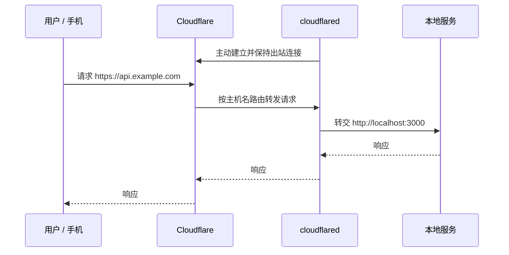

# Cloudflare Tunnel｜从本地服务到公网

> **要点：核心模型**
>
> `cloudflared` 运行在靠近服务的机器上，主动连到 Cloudflare。用户访问公开 HTTPS 域名后，Cloudflare 根据路由把请求沿这条已建立的出站连接转给本地服务。因此源站不必开放入站端口，也不必有公网 IP。



## 只要记住一个映射

```text
公开主机名  →  Tunnel  →  本地服务
api.example.com  →  dev-tunnel  →  http://localhost:3000
```

Tunnel 的价值不是“魔法地让整台电脑暴露在网上”，而是建立明确、可控制的服务路由。它是 [反向隧道](./01-public-private-and-nat-traversal.md) 这一类方案的具体实现：一个 Tunnel 可以承载多个路由，但每个路由都应回答：这个服务需要公开吗？谁应该访问它？应用本身怎样鉴权？

`cloudflared` 会建立多条长期的**出站**连接，以便故障切换；这改变的是“连接由谁先发起”，不是取消安全设计。公开主机名仍然是一个对外入口，需要最小化路由范围和应用层保护。

如果服务本身已经部署在阿里云并能稳定提供公网 443，而目标是减少中继层，应先比较 [DNS-only 直连](./03-dns-reverse-proxy-wss.md)、Cloudflare 代理和 Tunnel 的实际链路，不要因为域名由 Cloudflare 托管就默认必须使用 Tunnel。

## 开发临时地址与具名 Tunnel 不是一回事

| 方式 | 主机名 | 适合什么 | 不适合什么 |
|---|---|---|---|
| Quick Tunnel | 自动生成、临时的 `trycloudflare.com` 地址 | 浏览器里快速验证本机 Web 服务是否可达 | 需要预先登记固定域名的[真机联调](./07-miniprogram-local-backend.md)、长期使用或生产 |
| 具名 Tunnel | 自己配置的公开主机名 → 本地服务 | 需要稳定测试入口的 HTTP/WebSocket 联调 | 替代生产部署的可靠性、发布与运维体系 |

> **提示：判断口诀**
>
> **临时验证“能不能通”用 Quick Tunnel；要让外部系统反复、稳定地找到服务，用具名主机名；要长期对用户负责，部署稳定服务。**

## 它与 [VPN](./06-vpn-private-network.md) 的区别

| Cloudflare Tunnel | VPN |
|---|---|
| 常把某个服务发布成入口 | 常让受授权设备进入一段私网 |
| 源站主动向外连 | 远程客户端通常主动连到网关 |
| 访问公开 HTTP(S) 时客户端通常无需专用软件 | 通常需要客户端、身份与路由配置 |
| 适合 API、网站、本地联调 | 适合远程管理和内部资源访问 |

> **注意：Tunnel 连通不代表已经安全**
>
> 它可以隐藏源站地址、减少入站暴露，但公开 API 仍要做登录鉴权、授权、输入校验、限流和日志。Tunnel 凭据也必须当成密码处理，不能提交到仓库或笔记。

## 五步排障

1. 本地服务本身是否能响应？
2. `cloudflared` 是否在线并且凭据有效？
3. 公开主机名是否路由到正确的本地协议和端口？
4. HTTPS、域名规则或客户端网络限制是否通过？
5. 后端的路径、登录态和业务逻辑是否正确？

## 参考

- [Cloudflare Tunnel 官方原理](https://developers.cloudflare.com/cloudflare-one/networks/connectors/cloudflare-tunnel/)
- [Cloudflare Tunnel 路由与 Quick Tunnel](https://developers.cloudflare.com/tunnel/setup/)

## 和主线的关系

开发阶段把本机的 Agent 服务暴露给真机或同事联调，具名 Tunnel 是最省事的办法之一。它和 [第 20 课 安全与治理](../../lessons/20-security-governance/README.md) 的关系是：Tunnel 隐藏了源站，但公开入口的鉴权、限流和审计仍然是应用自己的事。

---

[← Track 目录](./README.md)
