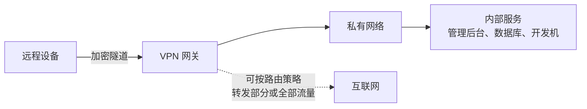

# VPN｜让设备进入私有网络

> **要点：核心模型**
>
> VPN 在远程设备和 VPN 网关之间建立受保护的网络连接，并按路由规则转发流量。它最适合回答“这台获授权设备怎样访问内部资源”，而不是“怎样把一个 API 公开给所有用户”。它处理的是 [私网访问](./01-public-private-and-nat-traversal.md)，不是公开服务发布。



## 先分清两种常见目的

| 目的 | 流量主要去哪里 | 典型关注点 |
|---|---|---|
| 远程访问私网 | 到家里、公司或云内网的资源 | 身份、设备准入、最小路由范围 |
| 改变设备的上网出口 | 部分或全部互联网流量先经过 VPN 网关 | 延迟、带宽、DNS、隐私与合规 |

同一个 VPN 可以设计成其中一种或两种，但它们的需求和风险不同。看到“VPN 已经连上”还要继续问：哪些网段被路由？DNS 走哪里？是否只有授权设备能连？

## 与 [Cloudflare Tunnel](./05-cloudflare-tunnel.md) 如何配合

```text
开发者访问内部管理工具 / 数据库  → VPN 或私网访问
小程序用户访问公开 API           → HTTPS 入口 + Cloudflare Tunnel（开发联调时）
运营后台需要额外保护              → 访问策略 + 应用自身鉴权
```

这不是二选一。VPN 控制“哪台设备进入网络”，Tunnel 控制“哪项服务被转发”。选择的依据是访问范围和身份边界，而不是工具名称。

Cloudflare 的 [Zero Trust / Access / Tunnel](./04-cloudflare-capability-map.md) 也属于这条“私网和身份”分支，但它们和 Cloudflare DNS、公开 WSS 入口不是同一个角色。

> **注意：安全底线**
>
> 不共享账号、配置文件或私钥；限制可访问的网段和端口；及时更新服务端与客户端；不要因为连接被加密就忽略设备安全、权限和日志。

## 自测

1. 若要让自己远程连接内部数据库，为什么 VPN 往往比公开数据库端口更合适？
2. 若要让所有小程序用户调用商品 API，为什么不应要求每个用户安装你的 VPN？
3. “全局流量经 VPN”和“只路由内部网段”分别意味着什么？

## 和主线的关系

主线里 VPN 出现在 [第 16 课](../../lessons/16-system-architecture/README.md) 讨论「开发者怎样访问生产数据库和 trace 后台」的时候：那是私网访问问题，不是公开服务问题。[第 20 课](../../lessons/20-security-governance/README.md) 的多租户和数据边界讨论也以「谁能进网络」和「谁能做什么」的区分为前提。

---

[← Track 目录](./README.md)
