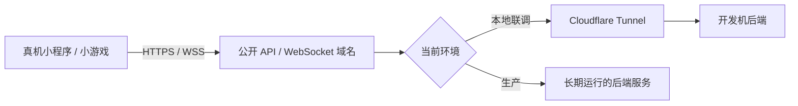
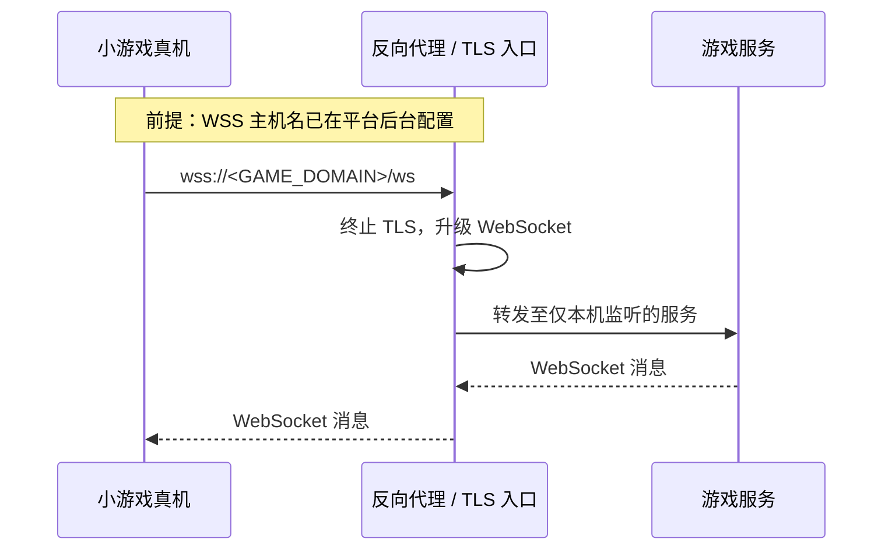

# 小程序与小游戏｜本地后端联调

> **要点：先建立正确请求路径**
>
> 真机中的小程序或小游戏不是运行在开发电脑上。HTTP 接口应走稳定的 HTTPS 域名，实时对局应走稳定的 WSS 域名；开发阶段可以由具名 [Cloudflare Tunnel](./05-cloudflare-tunnel.md) 将该域名转发到本地后端，生产阶段则应转向稳定部署的服务。



## 先分清：开发者工具、本地真机联调与生产

| 场景 | 客户端实际访问的地址 | 该地址指向哪里 | 关键边界 |
|---|---|---|---|
| 开发者工具中的快速调试 | `ws://127.0.0.1:<PORT>/ws` | 当前开发电脑 | `localhost` 在这里才是开发电脑；仅适合本机工具调试 |
| 真机联调 | `wss://<DEV_DOMAIN>/ws` | 具名 Tunnel 后的开发机，或测试服务器 | 主机名必须稳定，并与平台配置一致；随机临时 Tunnel 地址不适合它 |
| 体验版 / 正式版 | `wss://<GAME_DOMAIN>/ws` | 长期运行的后端服务 | 使用受信任证书、平台已登记的域名，以及可运维的部署 |

> **注意：`localhost` 没有“开发电脑”的特殊含义**
>
> 它永远是**发起请求的那台设备**。在手机上请求 `localhost:3000`，访问的是手机自己；在云服务器上请求它，访问的是那台云服务器。判断地址是否正确，先问“请求代码跑在哪里”。

## 当前项目的已验证实践

当前五子棋项目使用 WebSocket 实时对局，生产请求链路是：



这不是 VPN，也不是当前生产环境里的 Tunnel：源码中的客户端配置、部署说明和 Nginx 示例共同表明，生产入口是反向代理提供的 WSS 服务。Tunnel 仍可作为“把开发机服务提供给真机”的替代方案，但不能替代这条生产链路。

本次实际部署进一步验证了一个重要边界：生产域名可以由 Cloudflare 托管权威 DNS，但 DNS 记录使用 DNS-only，直接解析到阿里云；此时请求不会经过 Cloudflare Tunnel，公网 443 由阿里云 Nginx 负责 TLS 和 WebSocket Upgrade。选择它的原因是减少一层中继，并让延迟测量对应“客户端到阿里云源站”的真实路径。

验证顺序是：

```text
DNS → 443 → 证书 → HTTPS → WebSocket 101 → ping/pong → 创建/加入房间
```

从服务日志看，真实小游戏运行环境已经完成了 `/ws` 握手并创建房间，因此“网络连不上”不能只凭客户端表象判断，还要回到服务器日志确认请求是否到达，以及失败发生在哪一层。

> **提示：是否需要重新发布小游戏**
>
> 如果小游戏中的 `WS_URL` 和 `API_URL` 没变，只切换 DNS、Nginx 或 Tunnel，通常不需要重新上传代码。仍需确认微信后台的 socket 合法域名没有变化，并让真机使用当前发布版本。

## 传输层打通后，仍有四层问题

| 层 | 要验证什么 |
|---|---|
| 平台与域名 | 当前开发、测试或发布环境是否允许请求该 HTTPS/WSS 域名 |
| 网络与 Tunnel | 域名是否路由到活着的后端，证书是否有效 |
| 应用接口 | 路径、方法、参数、响应格式和 WebSocket 协议是否一致 |
| 身份与数据 | 登录态、授权、输入校验、数据隔离和错误处理是否正确 |

> **提示：配置是环境边界**
>
> 前端只依赖 `API_BASE_URL`、`WS_URL` 一类配置，而不是把 `localhost`、局域网 IP 或某个临时 Tunnel 地址写死在业务代码里。这样同一套代码才能在本地、联调和生产环境之间安全切换。对小游戏而言，客户端配置中的 WSS 主机名、反向代理的 `server_name` 和平台后台登记的合法域名必须保持一致。

## 从本地到生产，哪些东西会变化

| 本地联调 | 生产 |
|---|---|
| 开发机和临时 Tunnel 可能随时离线 | 服务运行在稳定主机或平台上 |
| 为验证接口和真机请求路径而存在 | 需要监控、备份、扩容、权限与发布流程 |
| 可快速迭代 | 需要稳定域名、正式安全策略与可回滚部署 |

Tunnel 解决“开发机上的服务怎样可达”，不能单独解决生产可靠性。

## 发布前的最小验证顺序

1. 在目标环境确认服务本身可响应，且监听范围符合预期。
2. 从公网验证 HTTPS/WSS 的证书、主机名和 `/ws` 路径，而不只是在服务器本机测试。
3. 确认客户端的 `WS_URL`、反向代理配置、平台后台的合法域名三处一致。
4. 用真机完成一次创建、加入、断线重连；WebSocket 的握手成功不代表实时协议、登录态和重连都正确。

> **注意：DNS-only 的代价**
>
> 源站公网地址会暴露，Cloudflare 的边缘 WAF、DDoS 防护和 Tunnel 隐藏源站能力不再处于请求路径中。需要用云厂商安全组、Nginx 限流、应用鉴权和日志监控补上边界。

> **自测：自测**
>
> 若开发者工具能连上 `ws://127.0.0.1:8000/ws`，但真机无法连上，为什么先检查“手机实际访问的主机名、协议和平台配置”，而不是反复修改后端端口？

## 和主线的关系

这是一个完整的真实案例，把前六篇的模型用在一个 WebSocket 服务的联调和上线上。它对主线的意义是 [第 22 课 产品设计](../../lessons/22-product-design-ux/README.md) 里「客户端配置、代理配置、平台配置三处一致」这类交付细节的具体样本；[第 19 课](../../lessons/19-reliability-cost-llmops/README.md) 的「发布前最小验证顺序」也可以直接套用本篇末尾的清单。

---

[← Track 目录](./README.md)
