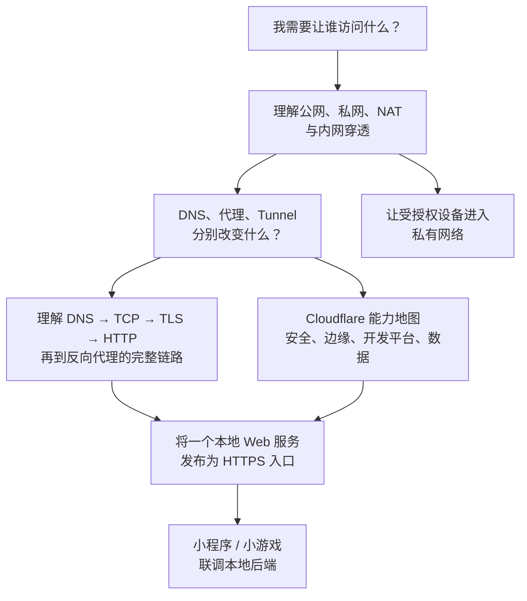

# Track｜网络与公网访问

> 方向选修，不编号进主线。这组笔记来自作者 2026-08 的一次真实部署：一个 WebSocket 小游戏从本地联调到公网上线。它们是原 Vault 里质量最高的一组，全部经过实际验证，这里只做格式转换。

## 目录

建议按顺序读 01 → 02 → 03 → 04 建立底层模型，再按需要进入 05（Tunnel）、06（VPN）或 07（真实案例）。

| # | 篇 | 状态 |
|---|---|---|
| 01 | [公网、私网与内网穿透](./01-public-private-and-nat-traversal.md) | complete |
| 02 | [TCP、TLS 与 HTTPS 请求生命周期](./02-tcp-tls-https-lifecycle.md) | complete |
| 03 | [DNS、反向代理与 WSS](./03-dns-reverse-proxy-wss.md) | complete |
| 04 | [Cloudflare 能力地图](./04-cloudflare-capability-map.md) | complete |
| 05 | [Cloudflare Tunnel](./05-cloudflare-tunnel.md) | complete |
| 06 | [VPN：让设备进入私有网络](./06-vpn-private-network.md) | complete |
| 07 | [小程序与小游戏本地后端联调](./07-miniprogram-local-backend.md) | complete |

> **要点：这个专题要解决什么**
>
> 当服务跑在本地、用户却在互联网另一端时，先判断：**谁要访问谁、访问一个服务还是整个私网、是否需要公开、身份如何验证**。VPN 和 Cloudflare Tunnel 是两种不同的答案。

## 三个必须建立的判断

| 先问的问题 | 它决定什么 |
|---|---|
| 访问者是公众、自己的设备，还是团队成员？ | 公开 HTTPS、访问策略还是 VPN/私网路由 |
| 要暴露一个 API，还是一整段内网？ | Tunnel 的服务路由，或 VPN 的网络路由 |
| 这是本地联调还是长期生产服务？ | 是否需要稳定主机、监控、权限管理和高可用 |

## 先用目标选路径

| 你的目标 | 优先路径 | 不该误用成什么 |
|---|---|---|
| 自己远程管理开发机、数据库或多个内部服务 | VPN / 私网访问 | 不要把数据库或 SSH 直接公开到互联网 |
| 真机临时联调本机上的一个 HTTP/WebSocket 服务 | **具名的** Tunnel + 稳定测试域名 | 不要把随机临时地址当成可长期配置的入口 |
| 对外发布网站、API 或小游戏服务 | 稳定主机 + 公开 HTTPS/WSS 入口 | Tunnel 的“能通”不等于生产的监控、备份与发布能力 |

> **提示：用在当前五子棋项目上**
>
> 游戏玩家需要访问的是一个公开的 WebSocket 服务，而不是你的整个内网。因此生产路径应是“玩家 → `wss://<GAME_DOMAIN>/ws` → 反向代理 → 游戏服务”；VPN 不参与玩家请求。开发者工具可直连本机做快速调试；若要让真机访问本机服务，则需要一个能长期配置到平台后台的稳定公网主机名。详见 [小程序与小游戏本地后端联调](./07-miniprogram-local-backend.md)。

## 接下来值得掌握

1. DNS、域名与 HTTPS：域名为何能指到正确入口。
2. 反向代理与 API 网关：请求到达入口后如何被分流。
3. 身份认证与授权：网络“能到”后，怎样确定“谁能做什么”。
4. 开发/测试/生产环境：怎样让接口地址和凭据安全地切换。

5. DNS-only、Cloudflare 代理和 Tunnel：分别改变解析结果、流量路径和源站暴露面。

## 当前边界

这里讲的是可迁移的基础模型，不假设你的 VPN 协议、真实域名、服务器地址或 Tunnel 凭据。遇到真实项目时，应另外建立项目笔记，仅记录已脱敏的架构与决策。

---

[← 课程总表](../../README.md)
