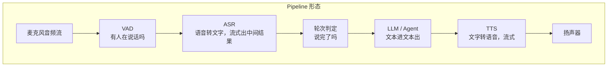
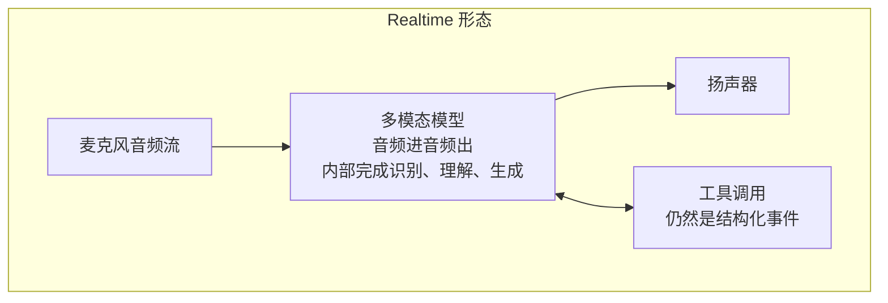

# 01 语音 Agent 的整体管线：两种形态

> 语音 Agent 不是"文本 Agent 前面加个语音识别"。声音是流，用户随时会插话，每一段延迟都会被听见。这一篇先把两种主流形态摆出来，后面几篇拆每一段。

## 学习目标

- 能画出 pipeline 形态（VAD → ASR → LLM → TTS）和 Realtime 形态（端到端双向流）的数据流
- 能说出两种形态各自的优势、代价，以及什么场景选哪个
- 能解释为什么"轮次"（turn）是语音 Agent 最核心的抽象

## 心智模型

## 要点

1. **Pipeline 形态每一段都是可替换的独立组件。** ASR、LLM、TTS 各选各的供应商，中间是文本，可以打日志、可以插规则、可以换模型。代价是延迟叠加，每一段的首字延迟都要算进去。
2. **Realtime 形态把识别、理解、生成放进一个模型，音频直接进出。** 延迟低，语气和情绪能保留，但中间没有文本可以拦截，工具调用和安全过滤要靠模型自己的结构化事件通道。目前 OpenAI Realtime API 和 Gemini Live API 是这一形态的代表。
3. **两种形态都要解决"轮次"问题：用户什么时候说完了。** 太早切断，用户话没说完；太晚，用户觉得机器人反应慢。LiveKit Agents 把这叫 turn detection，核心信号是 VAD 的静音时长加语义判断（这句话像不像说完了）。
4. **VAD 只回答"有声音吗"，不回答"说完了吗"。** 两者混用是最常见的设计错误。一个停顿 300ms 想词的用户会被 VAD 判为静音。
5. **ASR 的流式中间结果（interim）是降低延迟的关键。** 不等最终结果就开始让 LLM 预热或预取上下文，最终结果到了再确认。作者的语音机器人项目用这种方式把首字延迟砍掉了几百毫秒，代价是中间结果可能被推翻，预取的工作要能作废。
6. **TTS 也要流式。** LLM 吐出第一个句子就开始合成、开始播放，不等整段回答。句子边界切分（标点、长度）是工程细节，但直接决定体感。
7. **Agent 逻辑在两种形态里都是同一套。** 第 05～07 课的工具契约、循环、状态在语音场景一个字不改。变的是输入输出的模态和时间约束。
8. **文本 Agent 的"一问一答"在语音里不成立。** 用户会在机器人说话时插话（第 02 篇），会说半句停下，会连说两句。第 07 课的 double texting 在这里是常态而不是边界情况。
9. **选型：需要精细控制、多供应商、可审计，选 pipeline；追求最低延迟和自然感、接受黑盒，选 Realtime。** 混合形态也常见：Realtime 做对话，关键决策旁路一个文本模型复核。
10. **端侧还是云侧？** VAD 和唤醒词通常在设备上跑（低延迟、省流量、隐私），ASR/LLM/TTS 在云上。设备算力够时 ASR 也可以下沉。这条边界决定了网络断开时机器人还能做什么。

## 和主线的关系

- Agent 部分完全复用 [第 05 课](../../lessons/05-tool-calling/README.md)、[第 06 课](../../lessons/06-agent-loop/README.md)、[第 07 课](../../lessons/07-agent-state-and-runtime/README.md)。
- 流式输出的工程 → [第 02 课](../../lessons/02-model-api-structured-output-streaming/README.md)。
- 插话与 double texting → [第 07 课](../../lessons/07-agent-state-and-runtime/README.md) 和本 track 第 02 篇。

## 延伸阅读

- [LiveKit Agents 文档](https://docs.livekit.io/agents/)（访问日期 2026-09-04）：pipeline 形态的开源实现，术语（VAD、turn detection、interruption）以它为准。
- [OpenAI Realtime API 指南](https://platform.openai.com/docs/guides/realtime)（访问日期 2026-09-04）：Realtime 形态的代表。
- [Gemini Live API](https://ai.google.dev/gemini-api/docs/live)（访问日期 2026-09-04）：另一家的 Realtime 实现，对比事件模型的差异很有启发。

---

[← Track 目录](./README.md) · [02 →](./02-interruption-and-backpressure.md)
