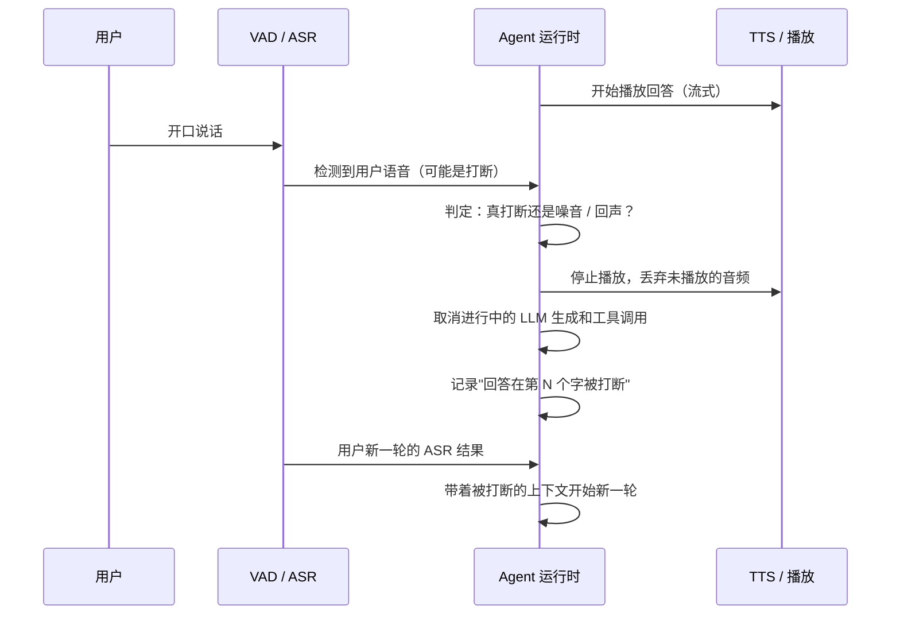

# 02 打断与背压：用户不会等你说完

> 文本聊天里用户发完消息就等着。语音里用户会在机器人说到一半时开口。处理不好，要么机器人自顾自说完，要么被自己的回声打断。这是语音 Agent 最考验工程的地方。

## 学习目标

- 能画出一次打断从检测到处理的完整时序
- 能说出打断时必须作废的三类进行中的工作
- 能解释背压在语音管线里出现在哪几段，以及不处理会怎样

## 心智模型

## 要点

1. **打断检测的第一个敌人是机器人自己的声音。** 扬声器的声音被麦克风收回去，VAD 会以为用户在说话。回声消除（AEC）在设备端做，做不好的话所有打断逻辑都是空谈。
2. **第二个敌人是噪音和无意义的应答。** 用户"嗯"一声不是打断。常见做法是打断要求持续语音超过一个阈值（比如 200～500ms），或者 ASR 出了有意义的词才算。
3. **打断时要作废三类工作：正在播放的音频、正在生成的 LLM 输出、正在执行的工具调用。** 前两个直接取消。第三个最麻烦：有副作用的工具不能"取消"，只能等它完成或标记状态未知（第 05 课的幂等和第 07 课的事件线程在这里派上用场）。
4. **被打断的回答要记进历史，并标出说到哪了。** 模型下一轮需要知道"我上一句只说了一半"，否则它会以为用户听到了完整回答。作者的语音机器人项目里，这个细节漏掉过一次，模型反复引用用户根本没听到的内容。
5. **背压出现在三个地方：** ASR 中间结果产生得比 Agent 处理得快；LLM 吐 token 比 TTS 合成快；TTS 合成比播放快。每一处都要有缓冲上限和丢弃策略，否则内存涨、延迟累积。
6. **TTS 到播放的背压最容易被忽略。** 合成完 30 秒的音频排队等播放，用户打断时这 30 秒都要丢掉，白花钱。按句子合成、只预合成一两句是常见做法。
7. **打断后的新一轮，模型的上下文要包含被打断的事实。** 一种做法是把被截断的回答标注为"[被打断于：……]"放进历史。这是第 08 课上下文构造在语音场景的特化。
8. **半双工（机器人说话时不听）是最简单的"打断处理"：不处理。** 儿童玩具和低端设备常这么做。体验差，但工程上诚实。全双工是目标，代价是上面所有复杂度。
9. **打断也可能是"用户想补充"而不是"用户想否定"。** 区分这两种意图需要看 ASR 内容，不能只看时序。这是语义层的事，运行时只负责先停下来。
10. **测试打断逻辑要靠回放和注入，不能靠真人反复试。** 录一批带插话的音频，回放进管线，检查每次打断的响应时间和作废是否干净。第 07 篇讲评测。

## 和主线的关系

- 取消进行中的工作 → [第 06 课](../../lessons/06-agent-loop/README.md) 的停止条件、[第 07 课](../../lessons/07-agent-state-and-runtime/README.md) 的 interrupt 策略。
- 副作用工具无法取消 → [第 05 课](../../lessons/05-tool-calling/README.md) 幂等键。
- 被打断的历史进上下文 → [第 08 课](../../lessons/08-context-engineering-for-agents/README.md)。

## 延伸阅读

- [LiveKit Agents · Turns 与 interruption](https://docs.livekit.io/agents/build/turns/)（访问日期 2026-09-04）：一个成熟框架对打断、endpointing、turn detection 的处理方式。
- [OpenAI Realtime API 指南](https://platform.openai.com/docs/guides/realtime)（访问日期 2026-09-04）：看它的服务端 VAD 与 interruption 事件设计。

---

[← 01](./01-voice-agent-pipeline.md) · [03 →](./03-latency-budget.md)
